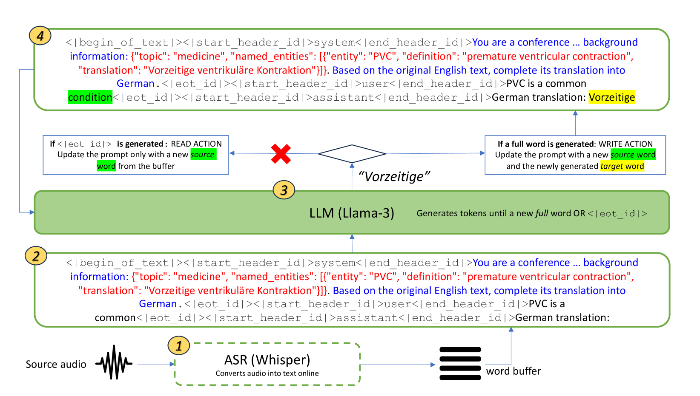
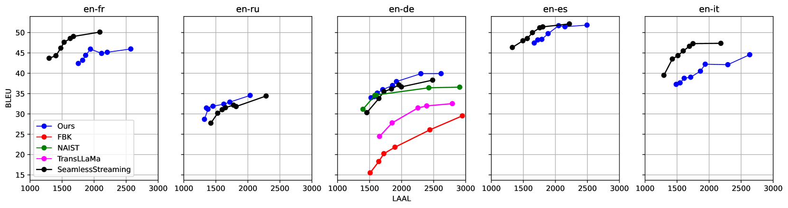

# 大型语言模型（LLMs）展现出零-shot上下文感知的同时翻译能力。

发布时间：2024年06月19日

`LLM应用

这篇论文摘要讨论了大型语言模型（LLMs）在零-shot同时机器翻译（SiMT）任务中的应用，特别是在开源LLMs中如何通过注入少量背景信息来提升性能。这表明LLMs在构建新一代的多语言、上下文敏感且术语精确的SiMT系统方面的潜力，无需繁重的训练或微调。因此，这篇论文属于LLM应用分类。` `机器翻译` `语言模型`

> LLMs Are Zero-Shot Context-Aware Simultaneous Translators

# 摘要

> Transformer的兴起极大地推动了机器翻译的发展，而大型语言模型（LLMs）因其广泛的通用性和在包括翻译在内的多种语言任务中的卓越表现而备受瞩目。我们的研究表明，开源LLMs在零-shot同时机器翻译（SiMT）任务中，性能与顶尖基准持平甚至更优。此外，通过LLMs简单注入少量背景信息，尤其是在处理复杂技术主题时，能显著提升性能。这表明LLMs有潜力构建新一代无需繁重训练或微调的大规模多语言、上下文敏感且术语精确的SiMT系统。

> The advent of transformers has fueled progress in machine translation. More recently large language models (LLMs) have come to the spotlight thanks to their generality and strong performance in a wide range of language tasks, including translation. Here we show that open-source LLMs perform on par with or better than some state-of-the-art baselines in simultaneous machine translation (SiMT) tasks, zero-shot. We also demonstrate that injection of minimal background information, which is easy with an LLM, brings further performance gains, especially on challenging technical subject-matter. This highlights LLMs' potential for building next generation of massively multilingual, context-aware and terminologically accurate SiMT systems that require no resource-intensive training or fine-tuning.

[Arxiv](https://arxiv.org/abs/2406.13476)