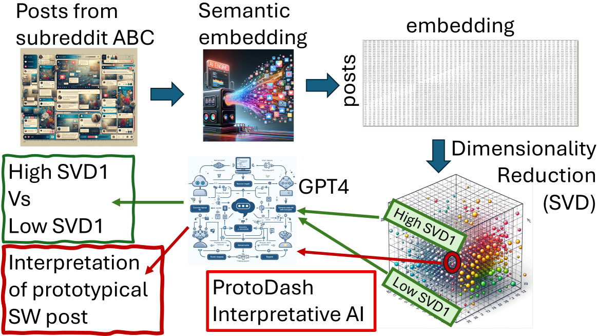
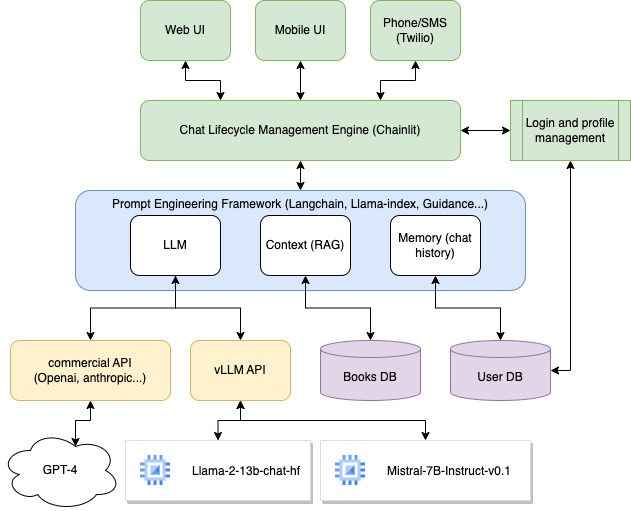
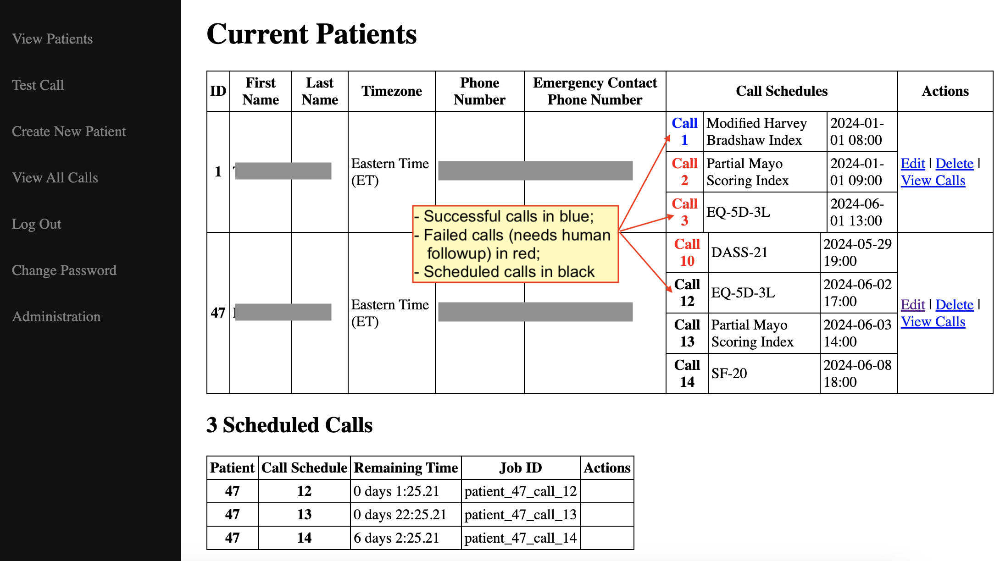
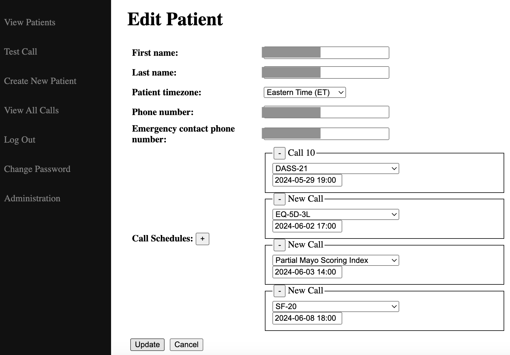
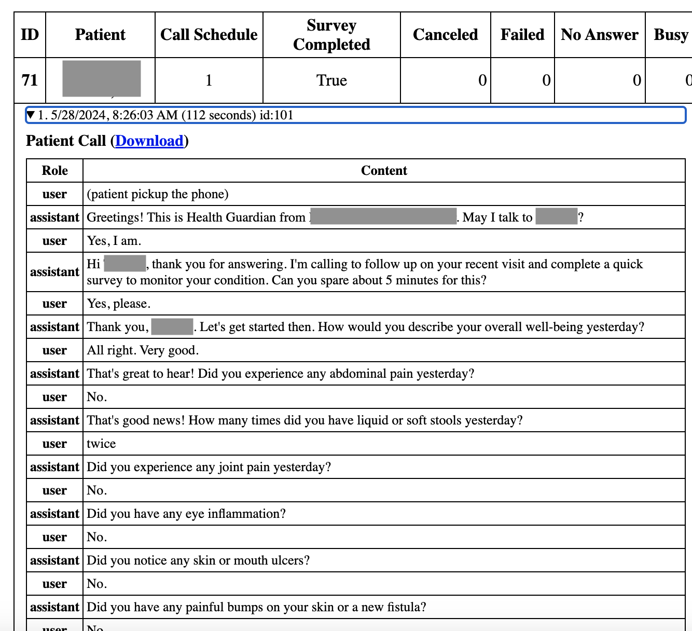
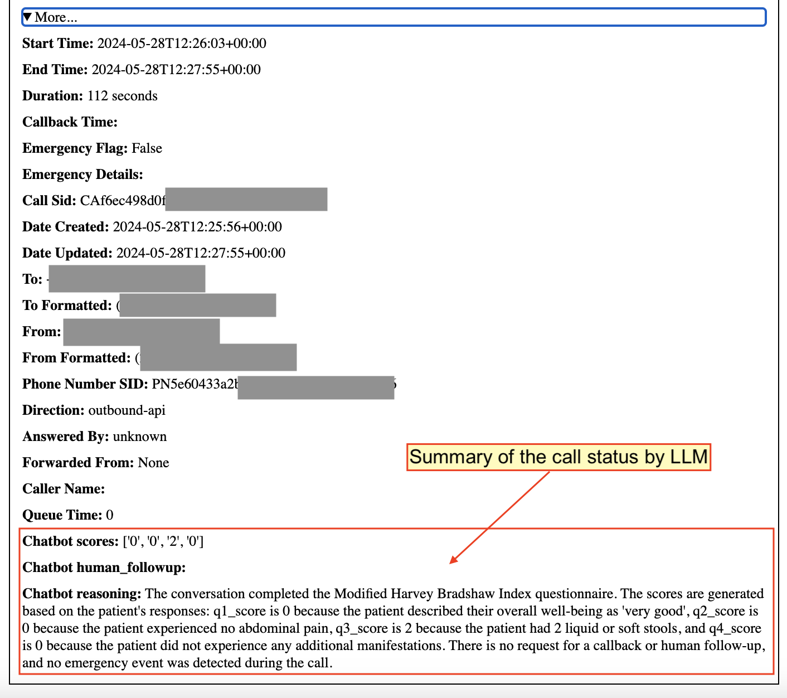

# 借助大型语言模型，对话式AI在数字健康领域展现出推动患者参与的强大力量。

发布时间：2024年06月19日

`LLM应用

这篇论文聚焦于大型语言模型（LLMs）在医疗领域的应用，特别是通过分析和生成对话来增强患者参与度。论文通过实际案例展示了LLMs在处理非结构化对话数据方面的能力，并探讨了在医疗领域负责任地开发和部署LLMs的伦理挑战和最佳实践。这些内容直接关联到LLMs的实际应用，特别是在医疗保健领域，因此将其归类为LLM应用。` `医疗保健` `对话式AI`

> Leveraging Large Language Models for Patient Engagement: The Power of Conversational AI in Digital Health

# 摘要

> 大型语言模型（LLMs）的迅猛发展为通过对话式AI提升患者在医疗保健中的参与度开辟了新天地。本文聚焦于LLMs在医疗领域的应用，特别是如何通过分析和生成对话来增强患者参与。我们通过四个实际案例展示了LLMs在处理非结构化对话数据方面的强大能力：从分析Reddit上的心理健康讨论，到为老年人定制认知参与的聊天机器人，再到总结医疗对话数据集，以及构建AI驱动的患者参与系统。这些案例不仅展示了LLMs如何从对话中提炼洞见和总结，还展示了它们如何引导患者进行目标明确的交流。利用LLMs进行对话分析和生成，为以患者为中心的研究开辟了新路径。然而，将LLMs融入医疗保健也带来了关于数据隐私、偏见、透明度和法规遵从性的伦理挑战。我们探讨了在医疗领域负责任地开发和部署LLMs的最佳实践和指南。要充分释放LLMs在数字健康领域的潜力，需要AI和医疗专业人士的紧密合作，共同应对技术挑战，确保这些工具的安全、有效和公平。

> The rapid advancements in large language models (LLMs) have opened up new opportunities for transforming patient engagement in healthcare through conversational AI. This paper presents an overview of the current landscape of LLMs in healthcare, specifically focusing on their applications in analyzing and generating conversations for improved patient engagement. We showcase the power of LLMs in handling unstructured conversational data through four case studies: (1) analyzing mental health discussions on Reddit, (2) developing a personalized chatbot for cognitive engagement in seniors, (3) summarizing medical conversation datasets, and (4) designing an AI-powered patient engagement system. These case studies demonstrate how LLMs can effectively extract insights and summarizations from unstructured dialogues and engage patients in guided, goal-oriented conversations. Leveraging LLMs for conversational analysis and generation opens new doors for many patient-centered outcomes research opportunities. However, integrating LLMs into healthcare raises important ethical considerations regarding data privacy, bias, transparency, and regulatory compliance. We discuss best practices and guidelines for the responsible development and deployment of LLMs in healthcare settings. Realizing the full potential of LLMs in digital health will require close collaboration between the AI and healthcare professionals communities to address technical challenges and ensure these powerful tools' safety, efficacy, and equity.

[Arxiv](https://arxiv.org/abs/2406.13659)