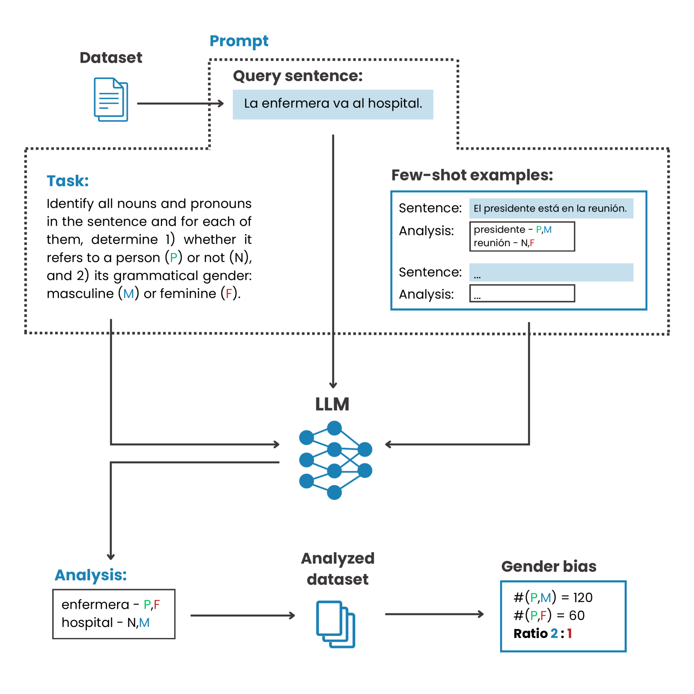

# 借助大型语言模型，探究性别化语言中的性别偏见

发布时间：2024年06月19日

`LLM应用

这篇论文主要关注的是利用大型语言模型（LLMs）来分析西班牙语文本中的性别偏见，特别是在性别语言如西班牙语中的应用。论文通过LLMs的上下文理解能力来识别和分类与人类实体相关的性别名词和代词，从而进行性别偏见的量化分析。这种方法的创新之处在于它针对特定语言（西班牙语）的性别偏见问题，提供了一种新的分析工具。因此，这篇论文属于LLM应用类别，因为它展示了LLMs在特定语言和文化背景下的实际应用，特别是在解决性别偏见这一社会问题上的应用。` `性别研究`

> Leveraging Large Language Models to Measure Gender Bias in Gendered Languages

# 摘要

> 在NLP领域，用于训练LLMs的文本语料库中的性别偏见可能加剧社会不平等，尤其在西班牙语或法语这类性别语言中，语法结构本身就蕴含性别，使得偏差分析更为复杂。现有的英语分析方法因语言差异而不足以应对这一挑战。本文创新性地利用LLMs的上下文理解能力，对西班牙语文本中的性别表现进行量化分析。通过LLMs识别并分类与人类实体相关的性别名词和代词，我们的方法提供了对性别偏见的深入分析。在四个主流基准数据集上的实证验证显示，性别差异显著，男性与女性的比例高达4:1至6:1。这些发现不仅验证了我们方法的有效性，也为其在NLP领域的应用提供了可能，推动了更公平语言技术的发展。

> Gender bias in text corpora used in various natural language processing (NLP) contexts, such as for training large language models (LLMs), can lead to the perpetuation and amplification of societal inequalities. This is particularly pronounced in gendered languages like Spanish or French, where grammatical structures inherently encode gender, making the bias analysis more challenging. Existing methods designed for English are inadequate for this task due to the intrinsic linguistic differences between English and gendered languages. This paper introduces a novel methodology that leverages the contextual understanding capabilities of LLMs to quantitatively analyze gender representation in Spanish corpora. By utilizing LLMs to identify and classify gendered nouns and pronouns in relation to their reference to human entities, our approach provides a nuanced analysis of gender biases. We empirically validate our method on four widely-used benchmark datasets, uncovering significant gender disparities with a male-to-female ratio ranging from 4:1 to 6:1. These findings demonstrate the value of our methodology for bias quantification in gendered languages and suggest its application in NLP, contributing to the development of more equitable language technologies.

[Arxiv](https://arxiv.org/abs/2406.13677)