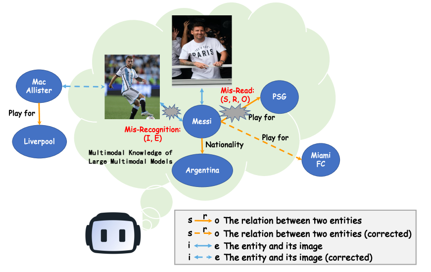
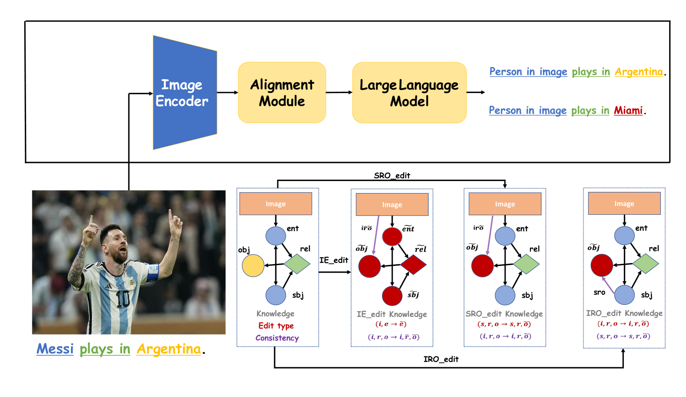

# MC-MKE：聚焦模态一致性的精细多模态知识编辑评测基准

发布时间：2024年06月19日

`RAG

理由：这篇论文主要关注多模态大型语言模型（MLLMs）中的多模态知识编辑问题，并设计了相应的编辑策略来纠正错误。它创建了一个基准（MC-MKE）来评估这些编辑方法的效果。这与RAG（Retrieval-Augmented Generation）的范畴相符，因为RAG模型通常涉及对多模态信息的处理和编辑，以提高生成内容的准确性和相关性。虽然论文涉及到了LLM的应用，但其核心贡献在于评估和改进多模态知识的编辑技术，这更偏向于RAG的研究领域。` `多模态知识编辑` `人工智能评估`

> MC-MKE: A Fine-Grained Multimodal Knowledge Editing Benchmark Emphasizing Modality Consistency

# 摘要

> 多模态大型语言模型（MLLMs）常因多模态知识的复杂性而产生非事实性或过时信息，导致误读和误识别。以往的评估未能系统地探究编辑技术如何纠正这些错误。为此，我们将多模态知识细分为视觉与文本元素，并针对不同错误类型设计了相应的编辑策略。我们创建了MC-MKE基准，专注于模态一致性的细粒度多模态知识编辑，以独立修正误读与误识别。通过在MC-MKE上测试三种编辑方法，我们发现它们在模态一致性上存在不足。本研究凸显了多模态知识编辑的挑战，并呼吁开发更有效的技术来应对这一任务。

> Multimodal large language models (MLLMs) are prone to non-factual or outdated knowledge issues, which can manifest as misreading and misrecognition errors due to the complexity of multimodal knowledge. Previous benchmarks have not systematically analyzed the performance of editing methods in correcting these two error types. To better represent and correct these errors, we decompose multimodal knowledge into its visual and textual components. Different error types correspond to different editing formats, which edits distinct part of the multimodal knowledge. We present MC-MKE, a fine-grained Multimodal Knowledge Editing benchmark emphasizing Modality Consistency. Our benchmark facilitates independent correction of misreading and misrecognition errors by editing the corresponding knowledge component. We evaluate three multimodal knowledge editing methods on MC-MKE, revealing their limitations, particularly in terms of modality consistency. Our work highlights the challenges posed by multimodal knowledge editing and motivates further research in developing effective techniques for this task.

[Arxiv](https://arxiv.org/abs/2406.13219)