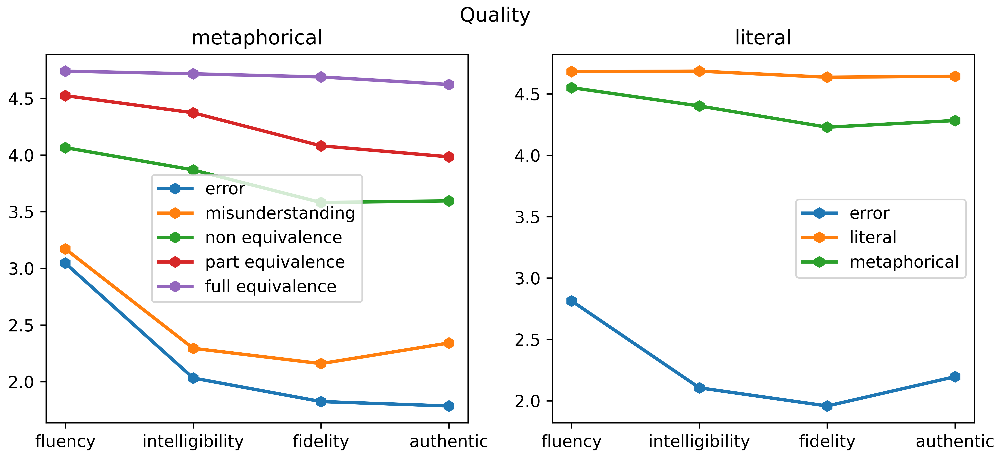
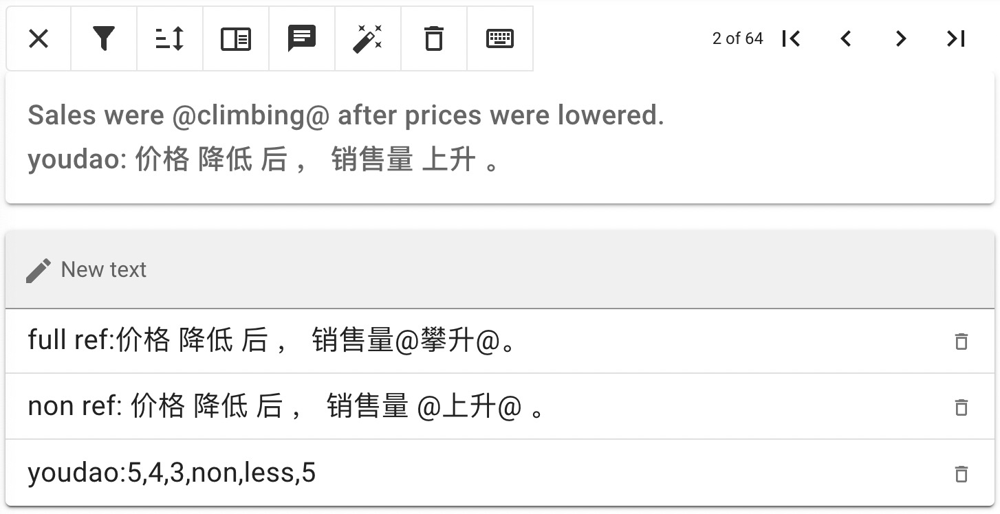

# MMTE：隐喻语言机器翻译质量评估的语料库与指标

发布时间：2024年06月19日

`LLM应用

这篇论文主要关注大型语言模型（LLM）在机器翻译领域的应用，特别是在比喻表达翻译质量的评估和改进上。论文提出了针对比喻语言翻译的评估指标，并创建了一个多语言平行隐喻语料库，这些都是LLM在实际应用中的具体表现和优化。因此，它属于LLM应用分类。` `机器翻译` `语言学`

> MMTE: Corpus and Metrics for Evaluating Machine Translation Quality of Metaphorical Language

# 摘要

> 随着大型语言模型的问世，机器翻译技术飞速发展，但其评估多侧重于流畅度和事实准确性，而忽视了比喻表达的质量。本文深入探讨了机器翻译中的比喻质量，并提出了一套专为比喻语言翻译设计的人类评估指标。此外，我们还创建了一个多语言平行隐喻语料库，通过后期编辑精心制作。我们的评估方案涵盖了机器翻译的四大维度：隐喻等价性、情感传达、真实感以及整体质量。研究显示，比喻表达的翻译在风格上与直译有着显著差异。

> Machine Translation (MT) has developed rapidly since the release of Large Language Models and current MT evaluation is performed through comparison with reference human translations or by predicting quality scores from human-labeled data. However, these mainstream evaluation methods mainly focus on fluency and factual reliability, whilst paying little attention to figurative quality. In this paper, we investigate the figurative quality of MT and propose a set of human evaluation metrics focused on the translation of figurative language. We additionally present a multilingual parallel metaphor corpus generated by post-editing. Our evaluation protocol is designed to estimate four aspects of MT: Metaphorical Equivalence, Emotion, Authenticity, and Quality. In doing so, we observe that translations of figurative expressions display different traits from literal ones.

[Arxiv](https://arxiv.org/abs/2406.13698)