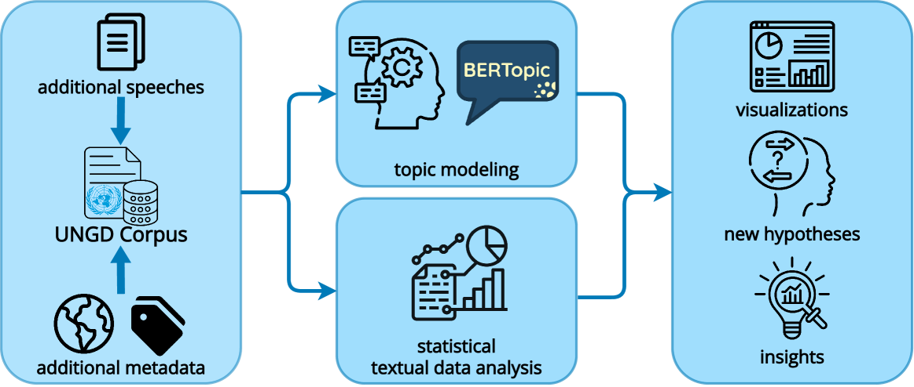

# 探秘联合国大会辩论之精髓

发布时间：2024年06月19日

`Agent

理由：这篇论文摘要描述了一个项目，该项目利用自然语言处理技术来分析联合国大会演讲，目的是揭示语义模式、情感倾向及主题结构，并构建一个包含丰富数据和分析工具的平台。这个项目的目标是帮助政治学家洞察国际关系和理解全球外交话语。这表明该项目涉及创建一个智能系统或代理（Agent），该系统能够处理和分析大量文本数据，以支持特定的研究和分析任务。因此，这个项目更符合Agent分类，而不是RAG、LLM应用或LLM理论。` `政治学` `国际关系`

> Mining United Nations General Assembly Debates

# 摘要

> 本项目利用自然语言处理技术，深入分析了联合国大会演讲，旨在通过高效处理海量文本数据，揭示语义模式、情感倾向及主题结构。我们致力于打造一个包含丰富数据和分析工具的平台，助力政治学家洞察国际关系，深入理解全球外交话语的微妙之处。

> This project explores the application of Natural Language Processing (NLP) techniques to analyse United Nations General Assembly (UNGA) speeches. Using NLP allows for the efficient processing and analysis of large volumes of textual data, enabling the extraction of semantic patterns, sentiment analysis, and topic modelling. Our goal is to deliver a comprehensive dataset and a tool (interface with descriptive statistics and automatically extracted topics) from which political scientists can derive insights into international relations and have the opportunity to have a nuanced understanding of global diplomatic discourse.

[Arxiv](https://arxiv.org/abs/2406.13553)