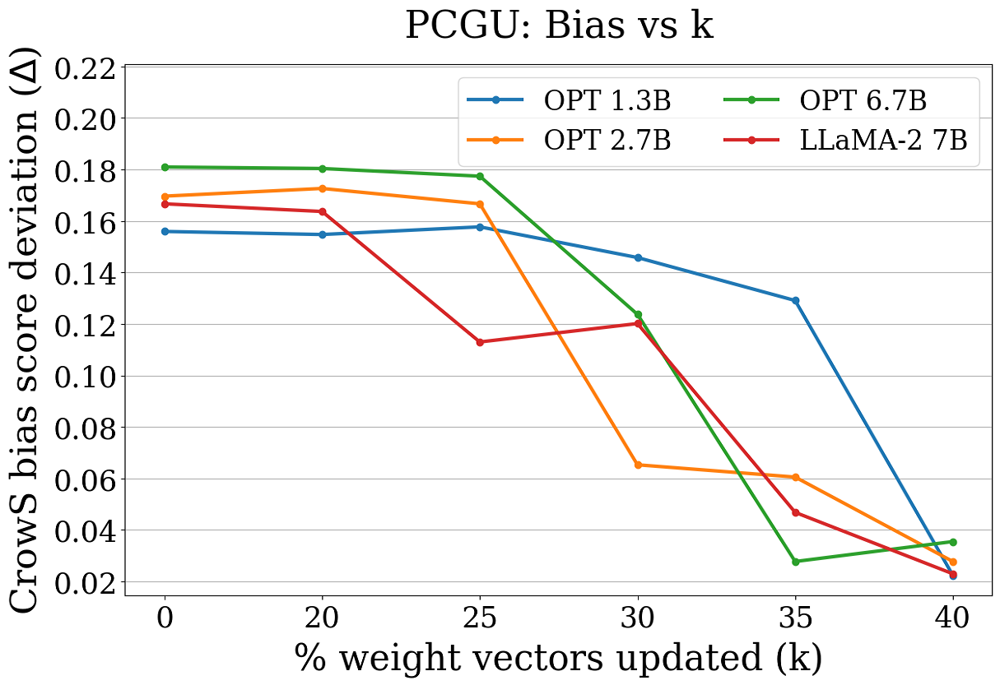
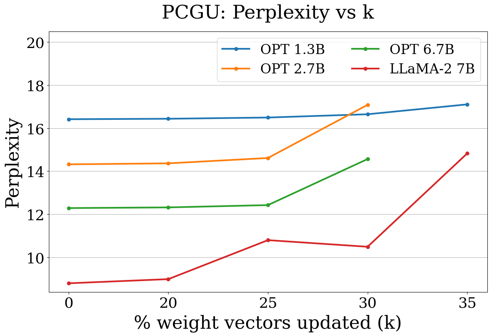
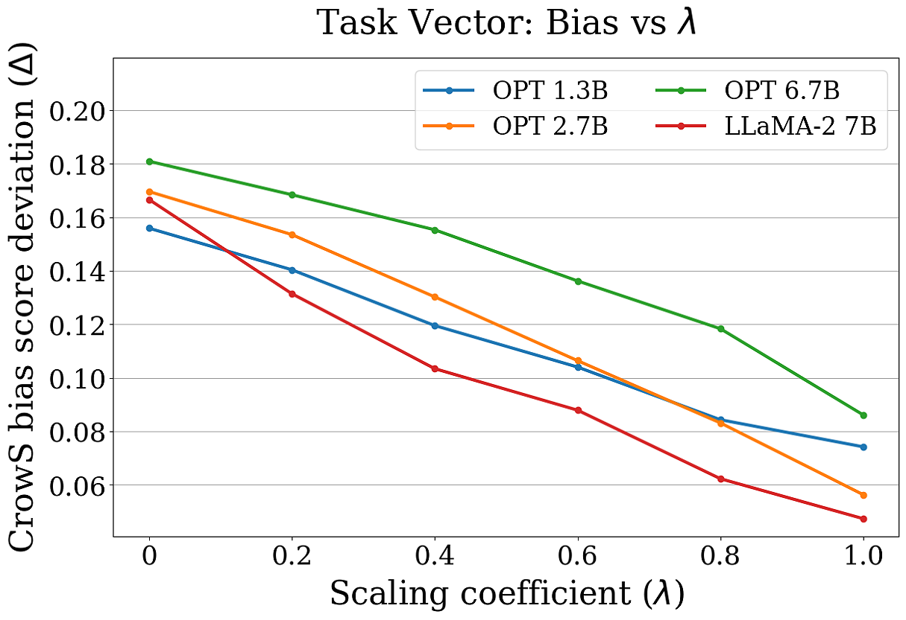
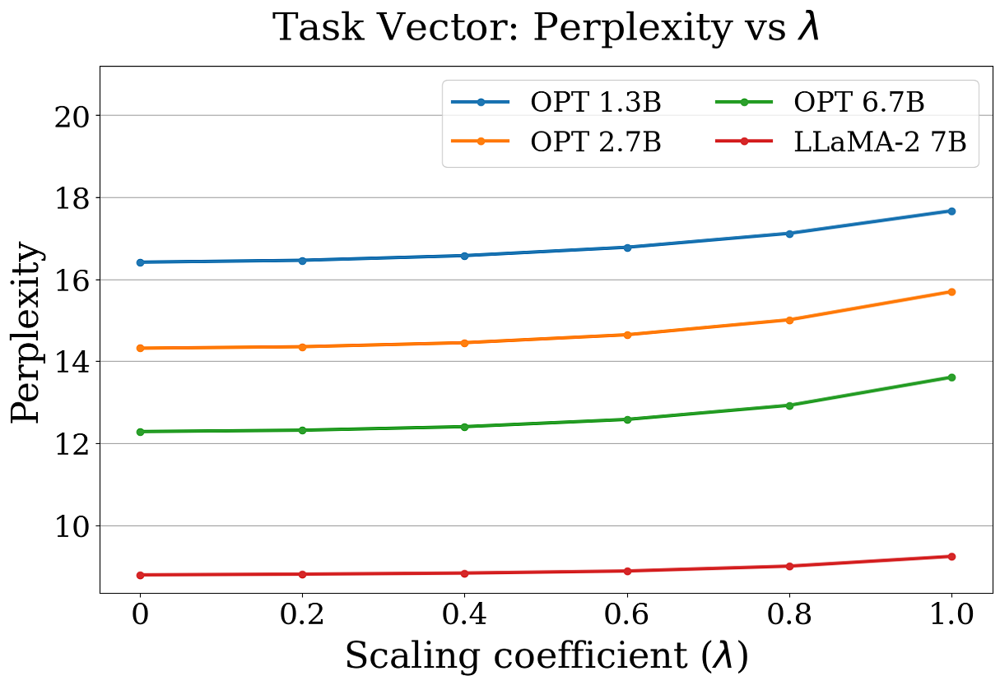

# 借助遗忘技术，我们致力于减轻语言模型中潜藏的社会偏见。

发布时间：2024年06月19日

`LLM应用

这篇论文主要探讨了如何通过机器遗忘技术减轻语言模型中的偏见，具体介绍了两种遗忘策略，并针对大型模型开发了分布式PCGU。这些研究旨在改进现有大型语言模型（如LLaMA-2和OPT）的性能，特别是在减少社会偏见方面。因此，这项工作属于LLM应用类别，因为它关注的是如何应用技术来改善现有语言模型的实际应用问题。` `人工智能` `社会偏见`

> Mitigating Social Biases in Language Models through Unlearning

# 摘要

> 随着语言模型（LMs）的广泛应用，减轻其偏见已成为当务之急。现有的方法多涉及数据预处理和模型微调，这些过程既耗时又计算成本高。因此，机器遗忘技术因其能在低成本下消除预训练或微调模型中的不良行为而受到关注。本研究中，我们探讨了两种遗忘策略：（1）应用于解码器模型的分区对比梯度遗忘（PCGU）和（2）通过任务向量实现的否定，旨在降低如LLaMA-2和OPT等先进开源LMs的社会偏见。我们还为大型模型开发了分布式PCGU。实证分析显示，通过任务向量进行否定的方法在去偏见方面表现更佳，且对模型性能和困惑度的影响最小。具体到LLaMA-27B模型，该方法成功将偏见分数降低了11.8%。

> Mitigating bias in language models (LMs) has become a critical problem due to the widespread deployment of LMs. Numerous approaches revolve around data pre-processing and fine-tuning of language models, tasks that can be both time-consuming and computationally demanding. Consequently, there is a growing interest in machine unlearning techniques given their capacity to induce the forgetting of undesired behaviors of the existing pre-trained or fine-tuned models with lower computational cost. In this work, we explore two unlearning methods, (1) Partitioned Contrastive Gradient Unlearning (PCGU) applied on decoder models and (2) Negation via Task Vector, to reduce social biases in state-of-the-art and open-source LMs such as LLaMA-2 and OPT. We also implement distributed PCGU for large models. It is empirically shown, through quantitative and qualitative analyses, that negation via Task Vector method outperforms PCGU in debiasing with minimum deterioration in performance and perplexity of the models. On LLaMA-27B, negation via Task Vector reduces the bias score by 11.8%

[Arxiv](https://arxiv.org/abs/2406.13551)