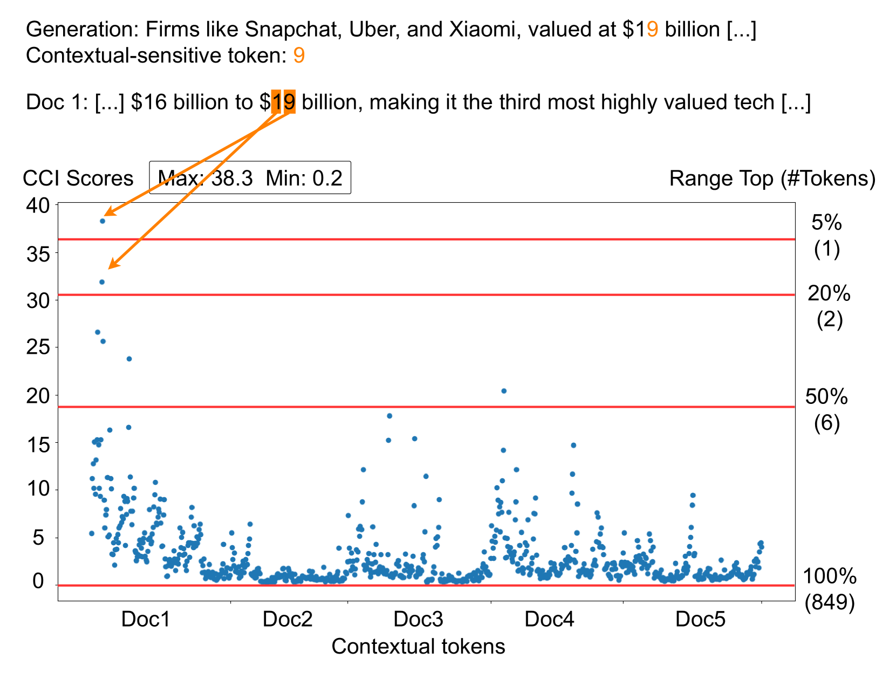

# 基于模型内部机制的答案归属，助力可信检索增强生成

发布时间：2024年06月19日

`RAG

理由：这篇论文主要关注的是检索增强生成（RAG）模型在问答领域中的可验证性和答案归属问题。论文提出了一种名为MIRAGE的新方法，该方法利用模型内部信息来实现忠实的答案归属，并通过显著性分析将答案标记与相关的检索文档关联。这与RAG模型的核心问题和改进方向紧密相关，因此归类为RAG。` `问答系统`

> Model Internals-based Answer Attribution for Trustworthy Retrieval-Augmented Generation

# 摘要

> 在问答领域，确保模型答案的可验证性是检索增强生成（RAG）面临的一项基本挑战。近期，自我引用提示被提出，旨在让大型语言模型（LLMs）在提供答案时附带引用支持文档。但这些模型往往难以遵循特定格式，错误引用不存在的来源，且未能准确反映其在生成过程中的上下文使用。为此，我们开发了MIRAGE——一种基于模型内部解释的RAG解释方法，它利用模型内部信息实现忠实的答案归属。MIRAGE能识别上下文敏感的答案标记，并通过显著性分析将其与预测中起作用的检索文档关联。我们在多语言抽取式QA数据集上测试了这一方法，结果显示与人类答案归属高度一致。在开放式QA任务中，MIRAGE不仅在引用质量和效率上与自我引用相媲美，还允许对归属参数进行更精细的调整。定性评估证实了MIRAGE归属的忠实性，并展示了模型内部在RAG答案归属中的巨大潜力。

> Ensuring the verifiability of model answers is a fundamental challenge for retrieval-augmented generation (RAG) in the question answering (QA) domain. Recently, self-citation prompting was proposed to make large language models (LLMs) generate citations to supporting documents along with their answers. However, self-citing LLMs often struggle to match the required format, refer to non-existent sources, and fail to faithfully reflect LLMs' context usage throughout the generation. In this work, we present MIRAGE --Model Internals-based RAG Explanations -- a plug-and-play approach using model internals for faithful answer attribution in RAG applications. MIRAGE detects context-sensitive answer tokens and pairs them with retrieved documents contributing to their prediction via saliency methods. We evaluate our proposed approach on a multilingual extractive QA dataset, finding high agreement with human answer attribution. On open-ended QA, MIRAGE achieves citation quality and efficiency comparable to self-citation while also allowing for a finer-grained control of attribution parameters. Our qualitative evaluation highlights the faithfulness of MIRAGE's attributions and underscores the promising application of model internals for RAG answer attribution.

[Arxiv](https://arxiv.org/abs/2406.13663)