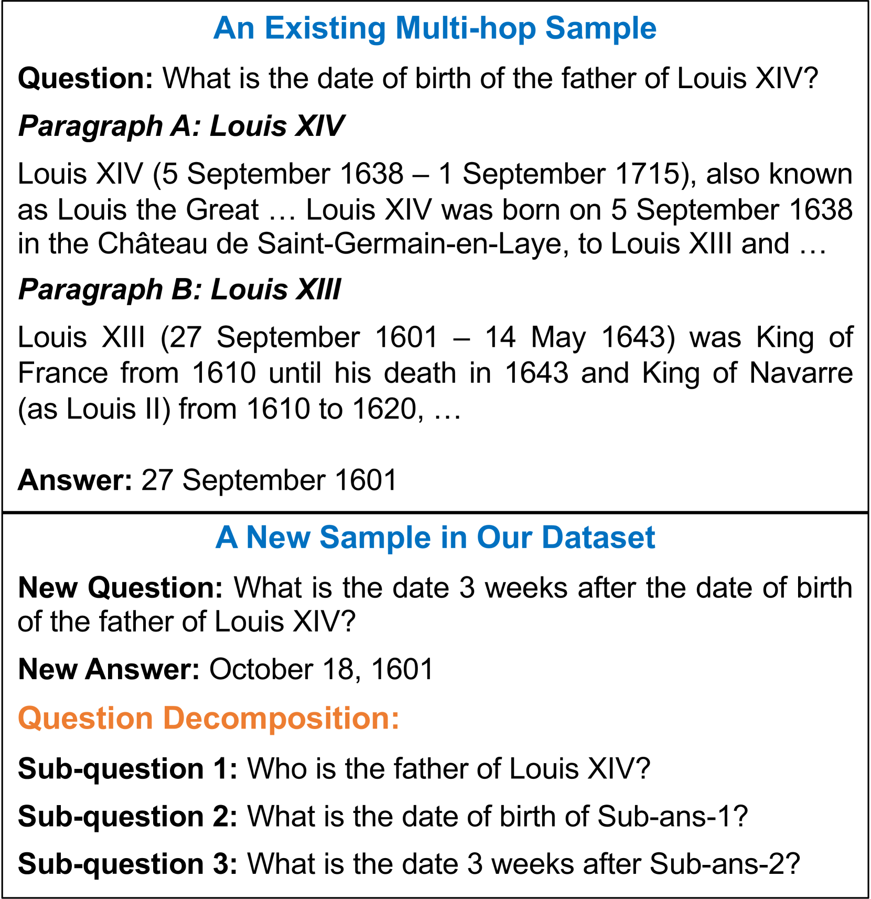
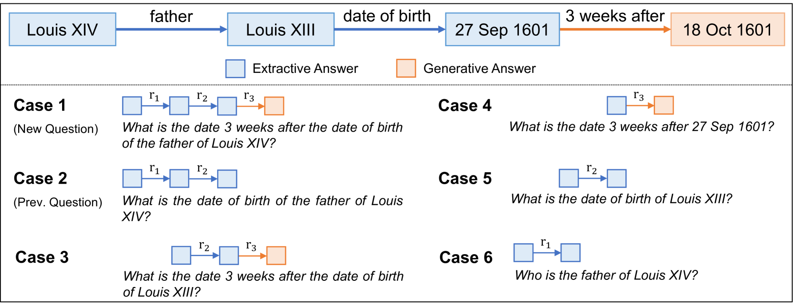
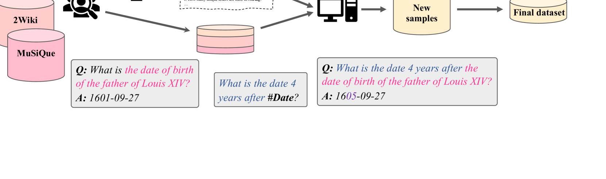
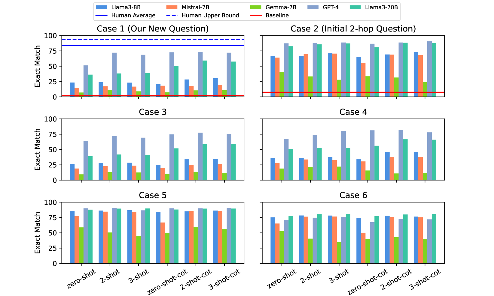
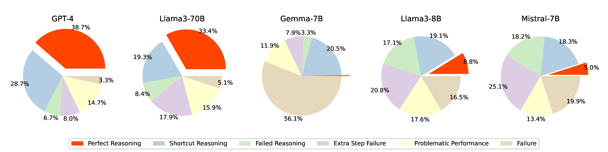
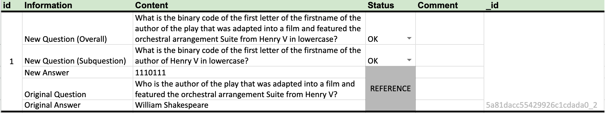

# MoreHopQA：超越多跳推理的深度探索

发布时间：2024年06月19日

`LLM应用

这篇论文介绍了一个新型的多跳数据集MoreHopQA，该数据集旨在推动模型进行真正的多跳推理而非依赖捷径。论文通过测试多个大型语言模型（如Mistral 7B、Gemma 7B、Llama 3和GPT-4）在该数据集上的表现，分析了模型在复杂推理任务中的局限性。这一研究直接关联到大型语言模型的应用层面，特别是在提高模型推理能力方面的实际应用和挑战。因此，将其归类为LLM应用是合适的。` `数据集构建`

> MoreHopQA: More Than Multi-hop Reasoning

# 摘要

> 当前的多跳数据集多依赖于直接从上下文中抽取答案，这往往使模型倾向于采用捷径而非真正的多跳推理。为此，我们推出了MoreHopQA，一个从抽取转向生成答案的新型多跳数据集。该数据集融合了HotpotQA、2WikiMultihopQA和MuSiQue，并引入了涉及常识、算术和符号推理的额外问题层，以增强推理深度。通过半自动化流程，我们生成了1,118个经过人工验证的样本。我们用此数据集测试了Mistral 7B、Gemma 7B、Llama 3（8B和70B）及GPT-4等大型语言模型，并设计了多种案例来剖析推理过程。结果表明，尽管模型在基础多跳问题上表现出色，但在我们设计的扩展问题上则显得力不从心，凸显了MoreHopQA的挑战性。进一步分析发现，虽然模型能正确回答问题，但仅有少数——GPT-4为38.7%，Llama3-70B为33.4%——能实现完美推理，即所有子问题均得到正确解答。评估代码和数据集已公开于https://github.com/Alab-NII/morehopqa。

> Most existing multi-hop datasets are extractive answer datasets, where the answers to the questions can be extracted directly from the provided context. This often leads models to use heuristics or shortcuts instead of performing true multi-hop reasoning. In this paper, we propose a new multi-hop dataset, MoreHopQA, which shifts from extractive to generative answers. Our dataset is created by utilizing three existing multi-hop datasets: HotpotQA, 2WikiMultihopQA, and MuSiQue. Instead of relying solely on factual reasoning, we enhance the existing multi-hop questions by adding another layer of questioning that involves one, two, or all three of the following types of reasoning: commonsense, arithmetic, and symbolic. Our dataset is created through a semi-automated process, resulting in a dataset with 1,118 samples that have undergone human verification. We then use our dataset to evaluate five different large language models: Mistral 7B, Gemma 7B, Llama 3 (8B and 70B), and GPT-4. We also design various cases to analyze the reasoning steps in the question-answering process. Our results show that models perform well on initial multi-hop questions but struggle with our extended questions, indicating that our dataset is more challenging than previous ones. Our analysis of question decomposition reveals that although models can correctly answer questions, only a portion - 38.7% for GPT-4 and 33.4% for Llama3-70B - achieve perfect reasoning, where all corresponding sub-questions are answered correctly. Evaluation code and data are available at https://github.com/Alab-NII/morehopqa

[Arxiv](https://arxiv.org/abs/2406.13397)