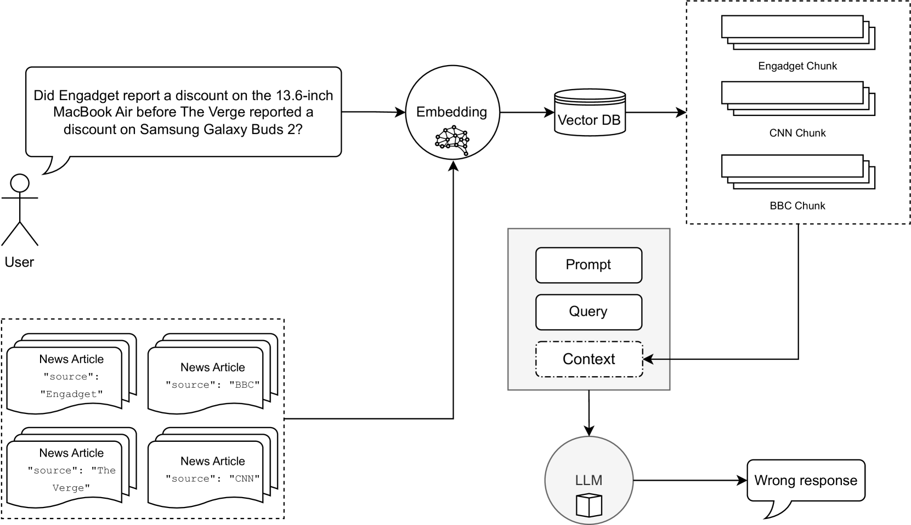
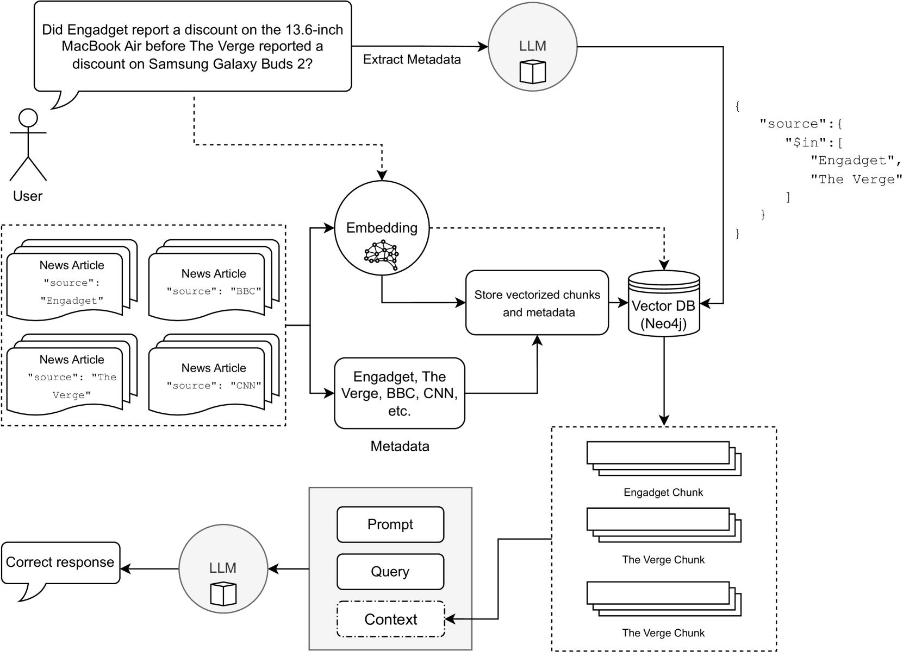

# Multi-Meta-RAG：借助大型语言模型提取的元数据优化数据库过滤，显著提升RAG在处理复杂多跳查询时的性能。

发布时间：2024年06月19日

`RAG

理由：这篇论文介绍了一种名为Multi-Meta-RAG的新策略，该策略旨在改进检索增强生成（RAG）技术，使大型语言模型（LLMs）能够更有效地从外部知识库中提取相关信息。这种策略通过使用LLM提取的元数据来精确筛选数据库，从而提高了检索效率。因此，这篇论文主要关注的是RAG技术的改进和应用，属于RAG分类。` `问答系统` `数据检索`

> Multi-Meta-RAG: Improving RAG for Multi-Hop Queries using Database Filtering with LLM-Extracted Metadata

# 摘要

> 检索增强生成（RAG）技术让大型语言模型（LLMs）能够从外部知识库中提取相关信息，解答未曾接触过的文档集上的查询。然而，面对需要跨越多重证据进行检索与推理的复杂问题时，传统RAG方法显得力不从心。为此，我们推出了Multi-Meta-RAG新策略，它通过LLM提取的元数据进行精准数据库筛选，显著提升了从多源数据中挑选出与问题紧密相关的文档的效率。尽管数据库筛选针对特定领域和格式的问题集，但我们的Multi-Meta-RAG在MultiHop-RAG基准测试中取得了显著进步。相关代码已公开于https://github.com/mxpoliakov/Multi-Meta-RAG。

> The retrieval-augmented generation (RAG) enables retrieval of relevant information from an external knowledge source and allows large language models (LLMs) to answer queries over previously unseen document collections. However, it was demonstrated that traditional RAG applications perform poorly in answering multi-hop questions, which require retrieving and reasoning over multiple elements of supporting evidence. We introduce a new method called Multi-Meta-RAG, which uses database filtering with LLM-extracted metadata to improve the RAG selection of the relevant documents from various sources, relevant to the question. While database filtering is specific to a set of questions from a particular domain and format, we found out that Multi-Meta-RAG greatly improves the results on the MultiHop-RAG benchmark. The code is available at https://github.com/mxpoliakov/Multi-Meta-RAG.

[Arxiv](https://arxiv.org/abs/2406.13213)