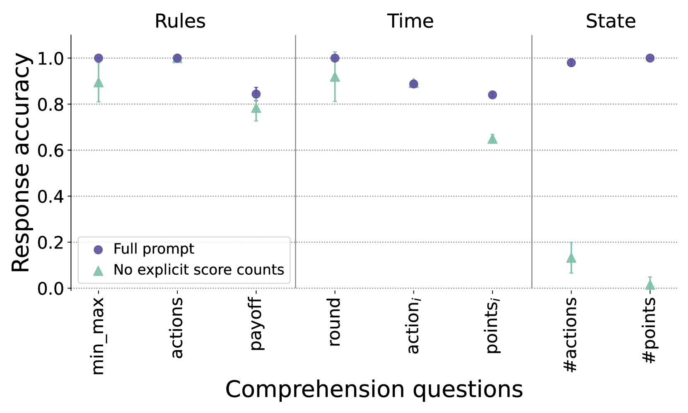
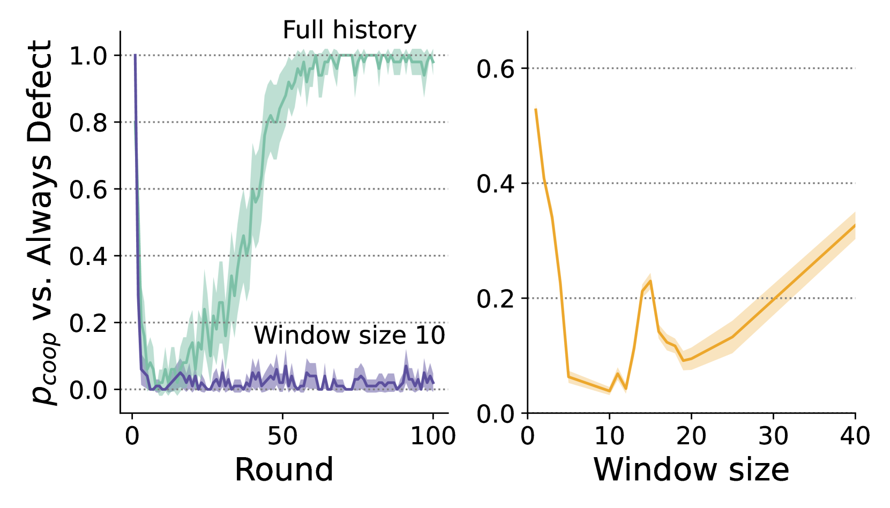
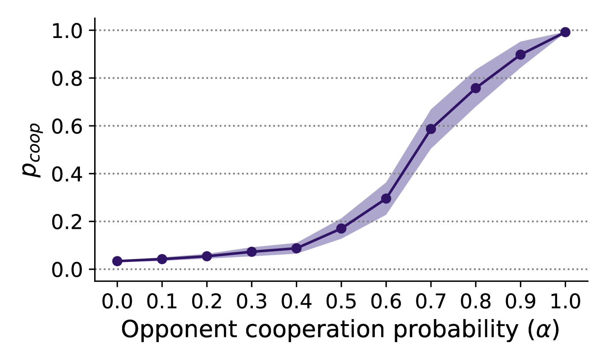
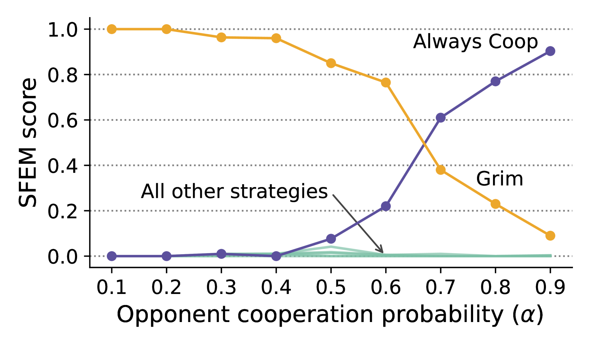
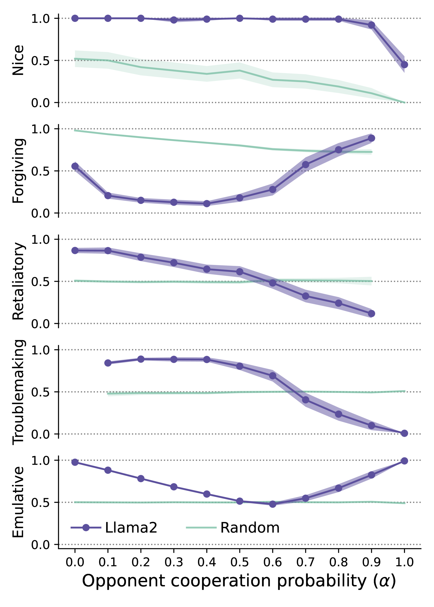

# 大型语言模型在囚徒困境中的表现：超越人类之举。

发布时间：2024年06月19日

`Agent

这篇论文主要研究了大型语言模型（LLMs）在模拟社会情境中的行为，特别是在博弈论实验中的表现。通过分析LLM在重复囚徒困境游戏中的合作策略，论文探讨了LLM如何响应社会刺激，并评估了其在社会情境中的行为规范和价值观。这种研究属于对AI代理行为的探索，因此应归类为Agent。` `博弈论` `人工智能`

> Nicer Than Humans: How do Large Language Models Behave in the Prisoner's Dilemma?

# 摘要

> 大型语言模型（LLMs）作为人工社会代理的行为研究尚处于起步阶段，我们对其如何响应基本社会刺激的了解仍有限。通过在经典博弈论实验中测试AI代理，我们为评估这些代理在典型社会情境中的行为规范和价值观提供了一个理论框架。本研究中，我们探讨了Llama2在面对不同敌对程度的随机对手时，在重复囚徒困境游戏中的合作策略。我们采用了一套系统方法来评估LLM对游戏规则的理解及其利用历史游戏记录进行决策的能力。通过模拟100轮游戏，并依据行为经济学文献分析LLM的决策，我们发现Llama2虽不主动背叛，但对合作持谨慎态度，仅在对手背叛率低于30%时，才表现出宽容且不报复的行为。相较于人类参与者，Llama2更倾向于合作。我们的研究为利用博弈论模拟指导LLM的审计和校准实践迈出了重要一步。

> The behavior of Large Language Models (LLMs) as artificial social agents is largely unexplored, and we still lack extensive evidence of how these agents react to simple social stimuli. Testing the behavior of AI agents in classic Game Theory experiments provides a promising theoretical framework for evaluating the norms and values of these agents in archetypal social situations. In this work, we investigate the cooperative behavior of Llama2 when playing the Iterated Prisoner's Dilemma against random adversaries displaying various levels of hostility. We introduce a systematic methodology to evaluate an LLM's comprehension of the game's rules and its capability to parse historical gameplay logs for decision-making. We conducted simulations of games lasting for 100 rounds, and analyzed the LLM's decisions in terms of dimensions defined in behavioral economics literature. We find that Llama2 tends not to initiate defection but it adopts a cautious approach towards cooperation, sharply shifting towards a behavior that is both forgiving and non-retaliatory only when the opponent reduces its rate of defection below 30%. In comparison to prior research on human participants, Llama2 exhibits a greater inclination towards cooperative behavior. Our systematic approach to the study of LLMs in game theoretical scenarios is a step towards using these simulations to inform practices of LLM auditing and alignment.

[Arxiv](https://arxiv.org/abs/2406.13605)