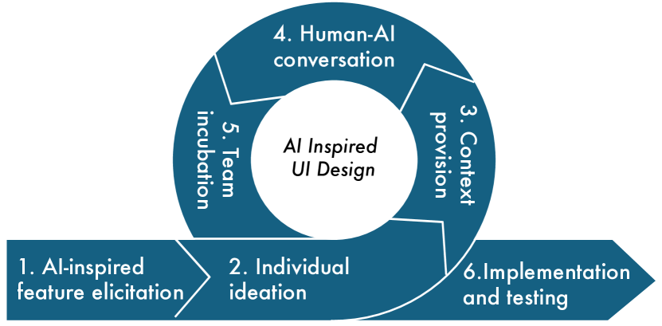
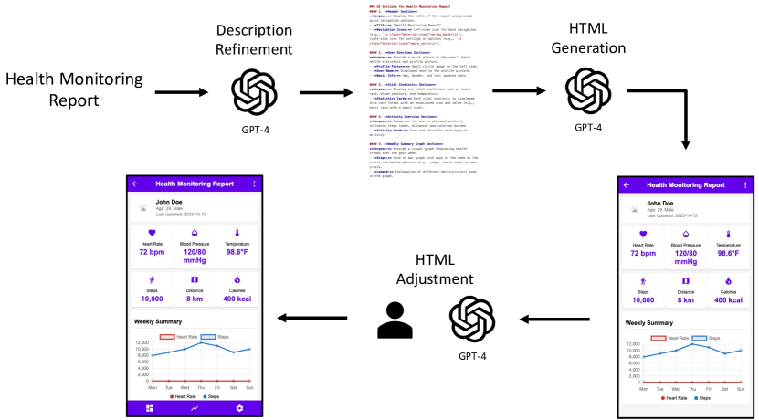
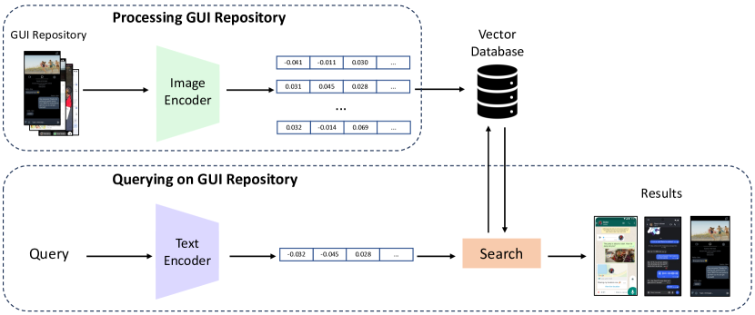

# AI驱动的UI设计探索

发布时间：2024年06月19日

`LLM应用

解析：这篇论文摘要主要讨论了如何利用大型语言模型（如GPT）和其他人工智能技术（如视觉语言模型VLM和扩散模型DM）来辅助移动应用的用户界面（UI）设计。这些技术被用作创意激发的工具，帮助设计师生成和调整UI设计，以及在设计过程中提供灵感和创意。因此，这篇论文的内容与大型语言模型的应用相关，而不是理论研究或Agent、RAG相关的研究。所以，将其分类为LLM应用是合适的。` `移动应用` `UI设计`

> On AI-Inspired UI-Design

# 摘要

> 图形用户界面（UI）是连接用户与设备的桥梁。本文探讨了三种利用人工智能（AI）助力移动应用UI设计的方法：首先，借助大型语言模型（如GPT），设计师能直接生成并调整UI；其次，视觉语言模型（VLM）帮助设计师在庞大的应用截图库中快速检索灵感；最后，通过训练扩散模型（DM），生成富有创意的应用UI设计图。我们强调，AI应作为激发创意的助手，而非取代设计的自动化工具。

> Graphical User Interface (or simply UI) is a primary mean of interaction between users and their device. In this paper, we discuss three major complementary approaches on how to use Artificial Intelligence (AI) to support app designers create better, more diverse, and creative UI of mobile apps. First, designers can prompt a Large Language Model (LLM) like GPT to directly generate and adjust one or multiple UIs. Second, a Vision-Language Model (VLM) enables designers to effectively search a large screenshot dataset, e.g. from apps published in app stores. The third approach is to train a Diffusion Model (DM) specifically designed to generate app UIs as inspirational images. We discuss how AI should be used, in general, to inspire and assist creative app design rather than automating it.

[Arxiv](https://arxiv.org/abs/2406.13631)