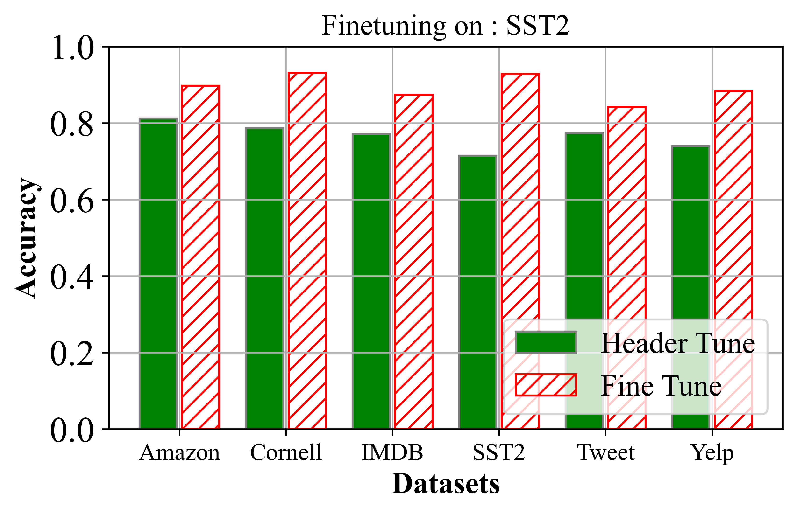

# 研究领域邻近微调模型集成在解决少量样本问题中的应用价值

发布时间：2024年06月19日

`LLM应用

这篇论文探讨了大型语言模型（LLMs）在特定领域数据微调后的应用，特别是在零-shot或少量-shot场景下的表现。论文介绍了DAFT-E框架，这是一种集成方法，通过使用一组针对少量-shot问题微调的领域邻近基础模型来提升性能。这种方法在处理少量-shot问题时表现尤为出色，不仅超越了单一领域邻近模型的性能，而且减少了特定领域微调数据的需求。因此，这篇论文的内容与LLM的实际应用紧密相关，属于LLM应用分类。` `机器学习`

> On the Utility of Domain-Adjacent Fine-Tuned Model Ensembles for Few-shot Problems

# 摘要

> 大型语言模型（LLMs）在特定领域数据微调后，能在多种下游任务中大放异彩。但在实际应用中，这类数据往往难以获取，因此零-shot或少量-shot方法应运而生，借助领域邻近模型来应对挑战。尽管市面上已有针对各类任务的微调模型，但要为特定任务挑选出最合适的领域邻近模型却并非易事。本文探讨了DAFT-E框架，它通过集成一组针对少量-shot问题微调的领域邻近基础模型，有效提升了性能。对于零-shot问题，该集成方法的准确性已接近单一最佳模型；而在处理少量-shot问题时，其性能更上一层楼，此时DEFT-E不仅超越了任何单一领域邻近模型，而且所需特定领域微调数据大幅减少。

> Large Language Models (LLMs) have been observed to perform well on a wide range of downstream tasks when fine-tuned on domain-specific data. However, such data may not be readily available in many applications, motivating zero-shot or few-shot approaches using domain-adjacent models. While several fine-tuned models for various tasks are available, finding an appropriate domain-adjacent model for a given task is often not straight forward. In this paper, we study DAFT-E, a framework that utilizes an Ensemble of Domain-Adjacent Fine-Tuned Foundation Models for few-shot problems. We show that for zero-shot problems, this ensembling method provides an accuracy performance close to that of the single best model. With few-shot problems, this performance improves further, at which point DEFT-E can outperform any single domain-adjacent model while requiring much less data for domain-specific fine-tuning.

[Arxiv](https://arxiv.org/abs/2406.13720)