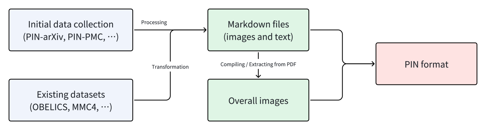

# PIN：专为配对与交错多模态文档设计的知识密集型数据集

发布时间：2024年06月19日

`LLM应用

这篇论文主要介绍了大型多模态模型（LMMs）在处理复杂视觉信息和解析多模态关联时遇到的挑战，并提出了一种新的数据集格式PIN（配对与交错多模态文档）来解决这些问题。PIN格式通过融合Markdown文档与详尽图像，为训练数据注入了密集的知识结构和灵活的训练策略，旨在提升LMMs的性能。因此，这篇论文更偏向于LLM的应用层面，即如何通过改进数据集格式来优化模型的训练和性能。` `数据集` `多模态学习`

> PIN: A Knowledge-Intensive Dataset for Paired and Interleaved Multimodal Documents

# 摘要

> 大型多模态模型（LMMs）近期的发展得益于丰富的多模态数据集，提升了其在复杂知识任务中的表现。尽管如此，感知与推理错误仍是阻碍其效能的难题，尤其在处理复杂视觉信息和解析多模态关联时。为此，我们创新性地推出了PIN（配对与交错多模态文档）数据集格式，旨在深化和拓宽多模态训练。PIN格式遵循三大核心原则：知识密集、可扩展性及多元训练模式支持。它巧妙融合Markdown文档与详尽图像，为训练数据注入密集知识结构与灵活训练策略。我们发布了PIN-14M，一个包含1400万样本的开源数据集，涵盖中英文广泛领域，特别聚焦于复杂的网络与科学内容。该数据集经过精心设计，确保数据质量与伦理合规，旨在推动高级训练策略，增强模型对多模态训练常见问题的抵抗力。初步成果显示，PIN格式有望显著提升LMM性能，未来计划进一步扩展并深入评估其对模型能力的具体影响。

> Recent advancements in Large Multimodal Models (LMMs) have leveraged extensive multimodal datasets to enhance capabilities in complex knowledge-driven tasks. However, persistent challenges in perceptual and reasoning errors limit their efficacy, particularly in interpreting intricate visual data and deducing multimodal relationships. Addressing these issues, we introduce a novel dataset format, PIN (Paired and INterleaved multimodal documents), designed to significantly improve both the depth and breadth of multimodal training. The PIN format is built on three foundational principles: knowledge intensity, scalability, and support for diverse training modalities. This innovative format combines markdown files and comprehensive images to enrich training data with a dense knowledge structure and versatile training strategies. We present PIN-14M, an open-source dataset comprising 14 million samples derived from a diverse range of Chinese and English sources, tailored to include complex web and scientific content. This dataset is constructed meticulously to ensure data quality and ethical integrity, aiming to facilitate advanced training strategies and improve model robustness against common multimodal training pitfalls. Our initial results, forming the basis of this technical report, suggest significant potential for the PIN format in refining LMM performance, with plans for future expansions and detailed evaluations of its impact on model capabilities.

[Arxiv](https://arxiv.org/abs/2406.13923)