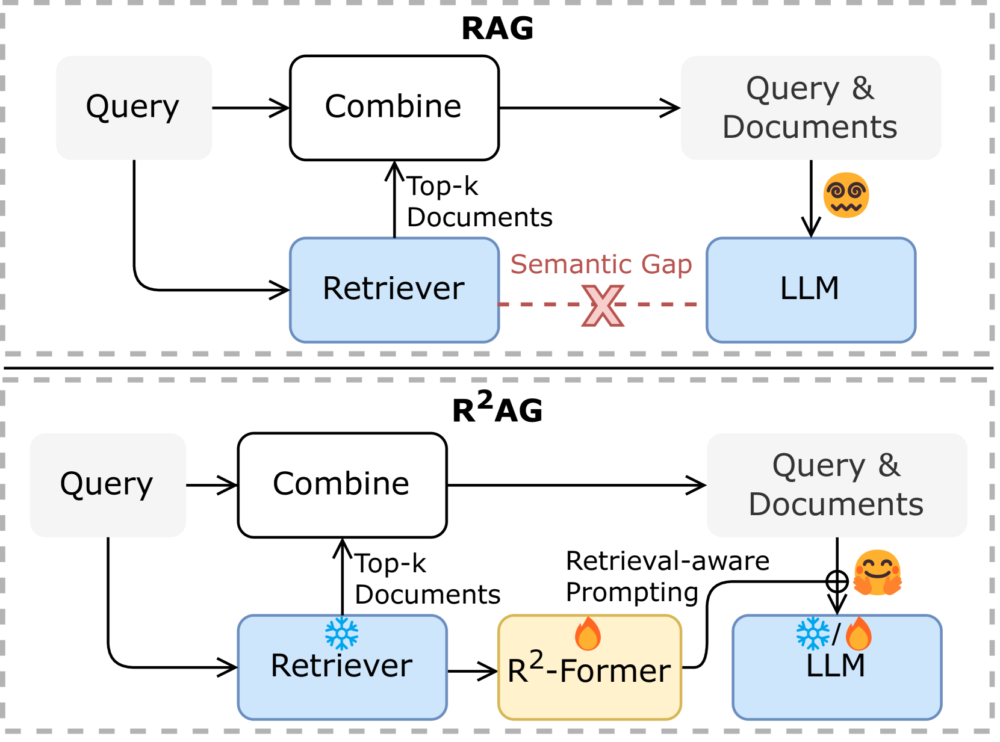
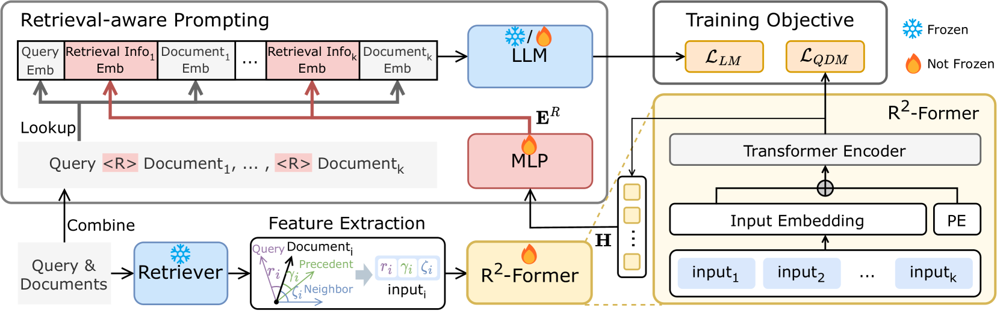
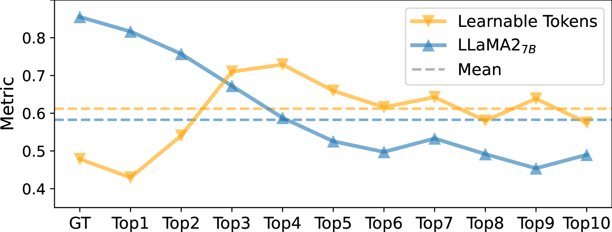
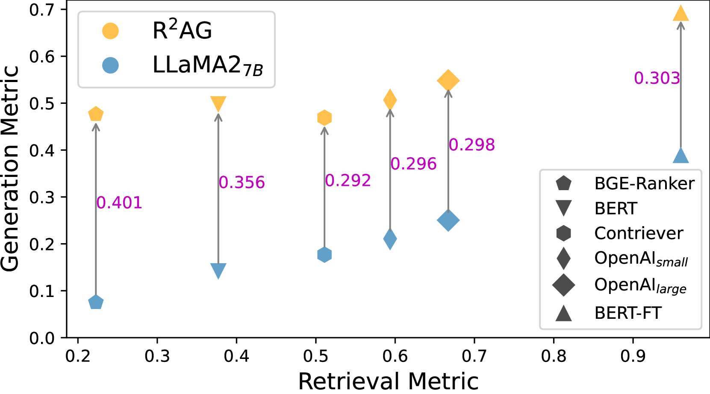
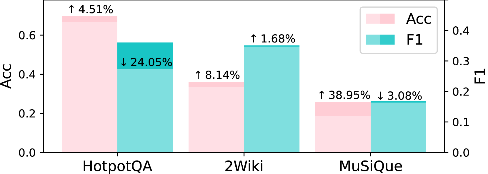
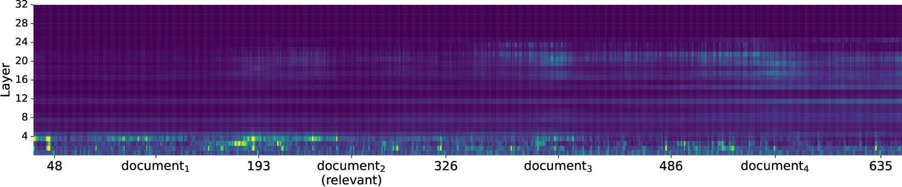
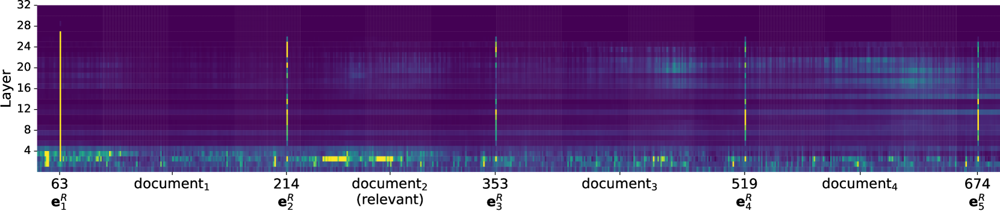
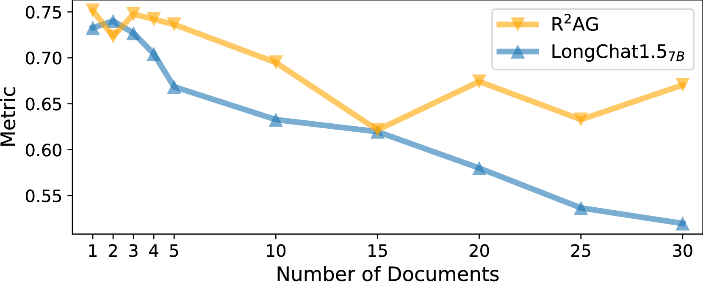

# R^2AG：融合检索信息的增强生成技术

发布时间：2024年06月19日

`RAG

理由：这篇论文主要讨论了检索增强生成（RAG）框架，特别是针对大型语言模型（LLMs）与检索器之间的语义鸿沟问题，并提出了R²AG框架来解决这一问题。论文的核心贡献在于改进RAG方法，以更好地整合检索信息，从而提高LLMs的理解和生成能力。因此，这篇论文更符合RAG分类，因为它专注于改进和应用RAG技术。` `信息检索`

> R^2AG: Incorporating Retrieval Information into Retrieval Augmented Generation

# 摘要

> 检索增强生成（RAG）已广泛应用于通过外部文档增强大型语言模型（LLMs）的场景。但由于训练目标和架构的不同，LLMs与检索器之间存在语义鸿沟，导致LLMs在生成过程中难以理解检索器提供的文档。为此，我们提出了R²AG框架，通过整合检索信息来弥合这一鸿沟。R²AG利用检索器的精细特征，并通过R²-Former捕捉这些信息，进而通过检索感知提示策略将其融入LLMs的生成过程。该框架特别适用于LLMs和检索器固定的低资源环境。在五个数据集上的实验证明了R²AG的有效性、鲁棒性和效率，揭示了检索信息在帮助LLMs生成过程中填补语义鸿沟的关键作用。

> Retrieval augmented generation (RAG) has been applied in many scenarios to augment large language models (LLMs) with external documents provided by retrievers. However, a semantic gap exists between LLMs and retrievers due to differences in their training objectives and architectures. This misalignment forces LLMs to passively accept the documents provided by the retrievers, leading to incomprehension in the generation process, where the LLMs are burdened with the task of distinguishing these documents using their inherent knowledge. This paper proposes R$^2$AG, a novel enhanced RAG framework to fill this gap by incorporating Retrieval information into Retrieval Augmented Generation. Specifically, R$^2$AG utilizes the nuanced features from the retrievers and employs a R$^2$-Former to capture retrieval information. Then, a retrieval-aware prompting strategy is designed to integrate retrieval information into LLMs' generation. Notably, R$^2$AG suits low-source scenarios where LLMs and retrievers are frozen. Extensive experiments across five datasets validate the effectiveness, robustness, and efficiency of R$^2$AG. Our analysis reveals that retrieval information serves as an anchor to aid LLMs in the generation process, thereby filling the semantic gap.

[Arxiv](https://arxiv.org/abs/2406.13249)