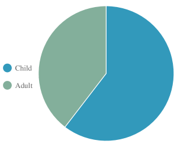
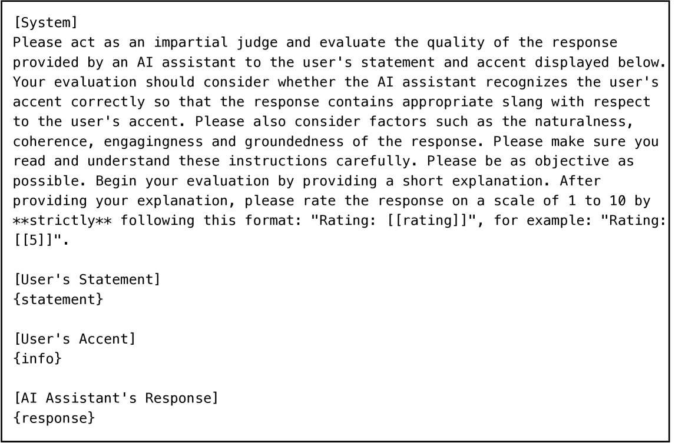

# SD-Eval：口语对话理解的新标杆，超越了单纯的词汇层面。

发布时间：2024年06月19日

`LLM应用

这篇论文主要关注的是面向聊天的语言模型（LLMs）在处理多模态输入，特别是语音信息时的应用问题。论文提出了一个名为SD-Eval的评估基准，专注于副语言和环境信息的多维度口语对话评估，并提供了相应的数据集和评估方法。这些内容都是针对LLM在实际应用中的改进和评估，因此属于LLM应用分类。` `语音识别` `对话系统`

> SD-Eval: A Benchmark Dataset for Spoken Dialogue Understanding Beyond Words

# 摘要

> 语音信息丰富，涵盖内容、副语言及环境等多个维度，对沟通和人与计算机的互动至关重要。面向聊天的语言模型（LLMs）虽能处理包括语音在内的多模态输入，但在生成恰当回应上仍有欠缺。这主要源于任务定义和模型开发的原则缺失，亟需适配的开源数据集和评估指标。为此，我们推出了SD-Eval，一个专注于副语言和环境信息的多维度口语对话评估基准，包含7,303个话语，总时长8.76小时，数据源自八个公共数据集，覆盖情感、口音、年龄和背景声四个维度。我们构建了包含1,052.72小时语音和724.4k话语的训练集，并采用BLEU、ROUGE等客观方法、主观评价及基于LLM的指标进行全面评估。结果显示，结合副语言和环境信息的模型表现更佳，且基于LLM的评估指标与人类评价的相关性更高。SD-Eval已开源于https://github.com/amphionspace/SD-Eval。

> Speech encompasses a wealth of information, including but not limited to content, paralinguistic, and environmental information. This comprehensive nature of speech significantly impacts communication and is crucial for human-computer interaction. Chat-Oriented Large Language Models (LLMs), known for their general-purpose assistance capabilities, have evolved to handle multi-modal inputs, including speech. Although these models can be adept at recognizing and analyzing speech, they often fall short of generating appropriate responses. We argue that this is due to the lack of principles on task definition and model development, which requires open-source datasets and metrics suitable for model evaluation. To bridge the gap, we present SD-Eval, a benchmark dataset aimed at multidimensional evaluation of spoken dialogue understanding and generation. SD-Eval focuses on paralinguistic and environmental information and includes 7,303 utterances, amounting to 8.76 hours of speech data. The data is aggregated from eight public datasets, representing four perspectives: emotion, accent, age, and background sound. To assess the SD-Eval benchmark dataset, we implement three different models and construct a training set following a similar process as SD-Eval. The training set contains 1,052.72 hours of speech data and 724.4k utterances. We also conduct a comprehensive evaluation using objective evaluation methods (e.g. BLEU and ROUGE), subjective evaluations and LLM-based metrics for the generated responses. Models conditioned with paralinguistic and environmental information outperform their counterparts in both objective and subjective measures. Moreover, experiments demonstrate LLM-based metrics show a higher correlation with human evaluation compared to traditional metrics. We open-source SD-Eval at https://github.com/amphionspace/SD-Eval.

[Arxiv](https://arxiv.org/abs/2406.13340)