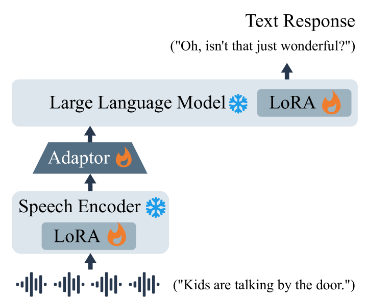

# SD-Eval：探索超越词汇的口语对话理解新基准

发布时间：2024年06月19日

`LLM应用

这篇论文主要关注的是面向聊天的语言模型（LLMs）在处理语音信息时的表现，特别是在生成恰当回应方面的不足。论文提出并开源了一个新的评估基准SD-Eval，专注于副语言与环境信息的多维度口语对话评估。这个评估基准的开发和应用是为了改进LLMs在多模态输入，尤其是语音输入方面的性能。因此，这篇论文的内容更偏向于LLM的应用层面，即如何通过特定的评估工具和数据集来提升LLMs在实际应用中的表现。` `人机交互` `语音识别`

> SD-Eval: A Benchmark Dataset for Spoken Dialogue Understanding Beyond Words

# 摘要

> 语音信息丰富，涵盖内容、副语言及环境等多个维度，对沟通与人机交互影响深远。面向聊天的语言模型（LLMs），虽能处理多模态输入，包括语音，但在生成恰当回应上常显不足。这源于任务定义与模型开发的原则缺失，亟需适配的开源数据集与评估指标。为此，我们推出SD-Eval，一个专注于副语言与环境信息的多维度口语对话评估基准，包含7,303条话语，总时长8.76小时，数据源自八个公开数据集，覆盖情感、口音、年龄及背景声四方面。我们构建了包含1,052.72小时语音、724.4k条话语的训练集，并运用BLEU、ROUGE等客观方法及主观评价、LLM指标对模型输出进行全面检验。结果显示，融入副语言与环境信息的模型表现更佳，且LLM指标与人类评价的相关性高于传统指标。SD-Eval已开源于https://github.com/amphionspace/SD-Eval。

> Speech encompasses a wealth of information, including but not limited to content, paralinguistic, and environmental information. This comprehensive nature of speech significantly impacts communication and is crucial for human-computer interaction. Chat-Oriented Large Language Models (LLMs), known for their general-purpose assistance capabilities, have evolved to handle multi-modal inputs, including speech. Although these models can be adept at recognizing and analyzing speech, they often fall short of generating appropriate responses. We argue that this is due to the lack of principles on task definition and model development, which requires open-source datasets and metrics suitable for model evaluation. To bridge the gap, we present SD-Eval, a benchmark dataset aimed at multidimensional evaluation of spoken dialogue understanding and generation. SD-Eval focuses on paralinguistic and environmental information and includes 7,303 utterances, amounting to 8.76 hours of speech data. The data is aggregated from eight public datasets, representing four perspectives: emotion, accent, age, and background sound. To assess the SD-Eval benchmark dataset, we implement three different models and construct a training set following a similar process as SD-Eval. The training set contains 1,052.72 hours of speech data and 724.4k utterances. We also conduct a comprehensive evaluation using objective evaluation methods (e.g. BLEU and ROUGE), subjective evaluations and LLM-based metrics for the generated responses. Models conditioned with paralinguistic and environmental information outperform their counterparts in both objective and subjective measures. Moreover, experiments demonstrate LLM-based metrics show a higher correlation with human evaluation compared to traditional metrics. We open-source SD-Eval at https://github.com/amphionspace/SD-Eval.

[Arxiv](https://arxiv.org/abs/2406.13340)