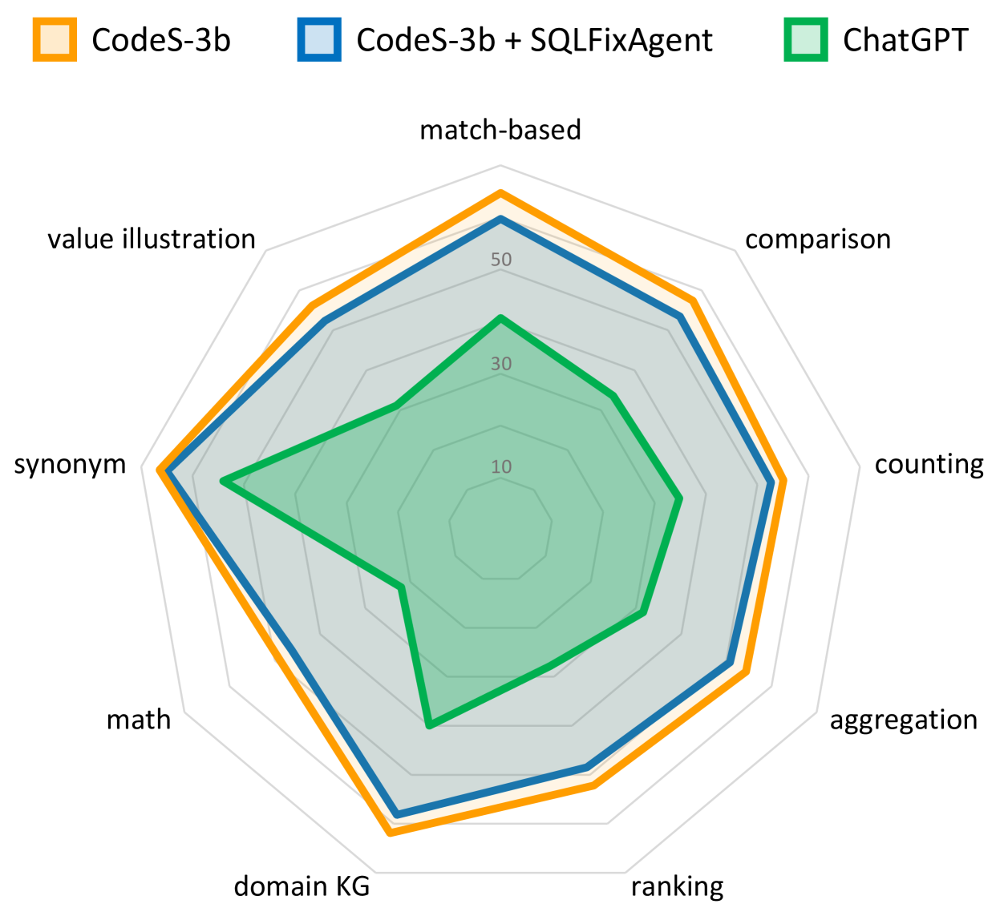

# SQLFixAgent：借助多代理协作，精准生成语义准确的SQL语句

发布时间：2024年06月19日

`Agent

解析：这篇论文介绍了一个名为SQLFixAgent的多代理协作框架，专门用于检测和修复文本到SQL任务中的错误。这个框架通过多个代理的协作来提高SQL查询的语义准确性。由于论文主要关注的是一个具体的代理系统及其在特定任务中的应用，因此它属于Agent分类。` `数据库管理` `人工智能`

> SQLFixAgent: Towards Semantic-Accurate SQL Generation via Multi-Agent Collaboration

# 摘要

> 尽管LLMs在文本到SQL任务中能生成语法正确的SQL，但它们在确保查询语义准确性方面仍显不足，常导致用户困惑和系统可用性降低。为此，我们开发了SQLFixAgent，一个创新的多代理协作框架，专门用于检测和修复错误的SQL。该框架由核心代理SQLRefiner和两个辅助代理SQLReviewer与QueryCrafter组成。SQLReviewer利用橡皮鸭调试技术识别语义不匹配，而QueryCrafter则生成多个候选修复方案。最终，SQLRefiner通过修复检索和记忆反射机制，选出最佳修复方案。在五个文本到SQL基准测试中，我们的方法不仅提升了基准模型的性能，尤其在Bird基准上执行准确性提高了超过3%，而且在令牌效率上也超越了其他先进方法，显示出更高的竞争力。

> While fine-tuned large language models (LLMs) excel in generating grammatically valid SQL in Text-to-SQL parsing, they often struggle to ensure semantic accuracy in queries, leading to user confusion and diminished system usability. To tackle this challenge, we introduce SQLFixAgent, an innovative multi-agent collaborative framework designed for detecting and repairing erroneous SQL. Our framework comprises a core agent, SQLRefiner, alongside two auxiliary agents: SQLReviewer and QueryCrafter. The SQLReviewer agent employs the rubber duck debugging method to identify potential semantic mismatches between SQL statement and user query. If the error is detected, the QueryCrafter agent generates multiple SQL statements as candidate repairs using a fine-tuned SQLTool. Subsequently, leveraging similar repair retrieval and failure memory reflexion, the SQLRefiner agent selects the most fitting SQL statement from the candidates as the final repair. We evaluated our proposed framework on five Text-to-SQL benchmarks. The experimental results show that our method consistently enhances the performance of the baseline model, specifically achieving an execution accuracy improvement of over 3\% on the Bird benchmark. Our framework also has a higher token efficiency compared to other advanced methods, making it more competitive.

[Arxiv](https://arxiv.org/abs/2406.13408)