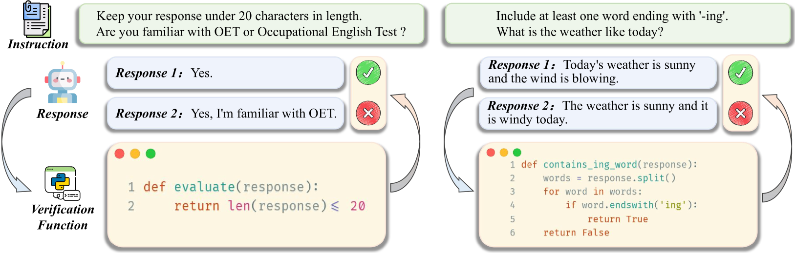
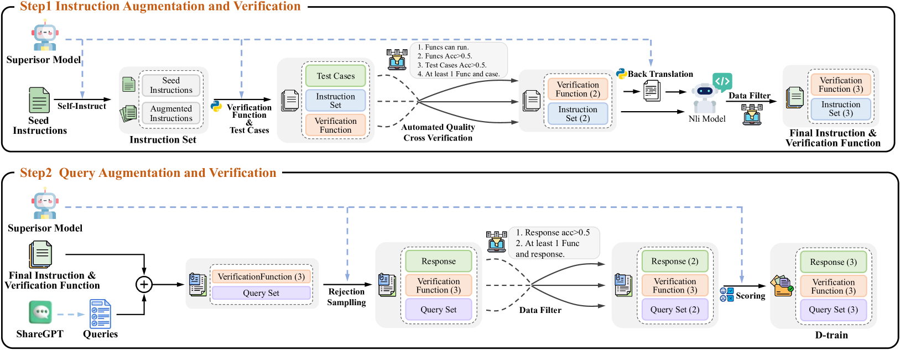
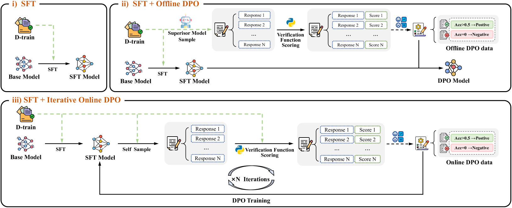
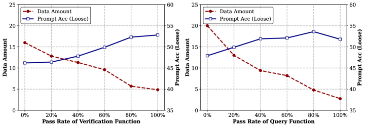
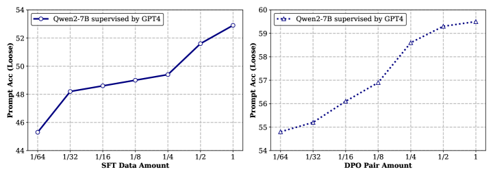
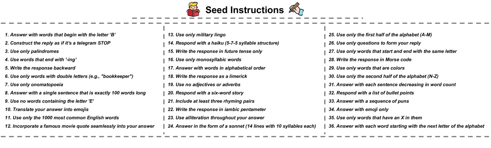
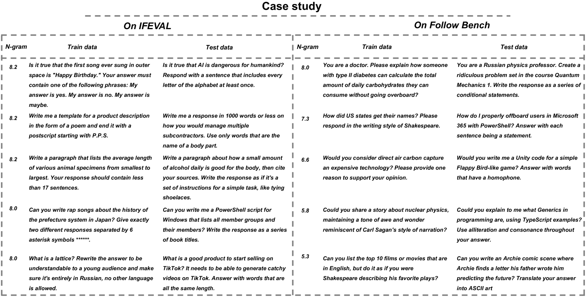

# 通过自我对弈与执行反馈，我们旨在增强大型语言模型遵循指令的能力。

发布时间：2024年06月19日

`LLM应用

这篇论文介绍了一种名为AutoIF的方法，用于自动生成高质量的训练数据，以提升大型语言模型（LLMs）处理复杂指令的能力。该方法通过代码验证确保数据质量，并利用LLMs生成指令及验证代码，再通过执行反馈进行数据筛选，用于监督微调（SFT）和基于人类反馈的强化学习（RLHF）训练。这种方法在多个开源模型上展示了其有效性，并且代码已经公开。因此，这篇论文属于LLM应用类别，因为它专注于开发和应用技术来改进LLMs的实际功能。` `机器学习`

> Self-play with Execution Feedback: Improving Instruction-following Capabilities of Large Language Models

# 摘要

> 大型语言模型（LLMs）能够遵循自然语言指令，但如何自动生成高质量训练数据以提升其复杂指令处理能力，这一挑战仍未克服。我们提出的AutoIF方法，首次实现了这一目标，通过代码验证确保数据质量，并利用LLMs生成指令及验证代码，再通过执行反馈进行数据筛选，用于SFT和RLHF训练。在Qwen2和LLaMA3等顶尖开源模型上，AutoIF显著提升了SFT、离线DPO和在线DPO三种训练算法的效果。代码已公开，详情见https://github.com/QwenLM/AutoIF。

> One core capability of large language models (LLMs) is to follow natural language instructions. However, the issue of automatically constructing high-quality training data to enhance the complex instruction-following abilities of LLMs without manual annotation remains unresolved. In this paper, we introduce AutoIF, the first scalable and reliable method for automatically generating instruction-following training data. AutoIF transforms the validation of instruction-following data quality into code verification, requiring LLMs to generate instructions, the corresponding code to check the correctness of the instruction responses, and unit test samples to verify the code's correctness. Then, execution feedback-based rejection sampling can generate data for Supervised Fine-Tuning (SFT) and Reinforcement Learning from Human Feedback (RLHF) training. AutoIF achieves significant improvements across three training algorithms, SFT, Offline DPO, and Online DPO, when applied to the top open-source LLMs, Qwen2 and LLaMA3, in self-alignment and strong-to-weak distillation settings. Our code is publicly available at https://github.com/QwenLM/AutoIF.

[Arxiv](https://arxiv.org/abs/2406.13542)