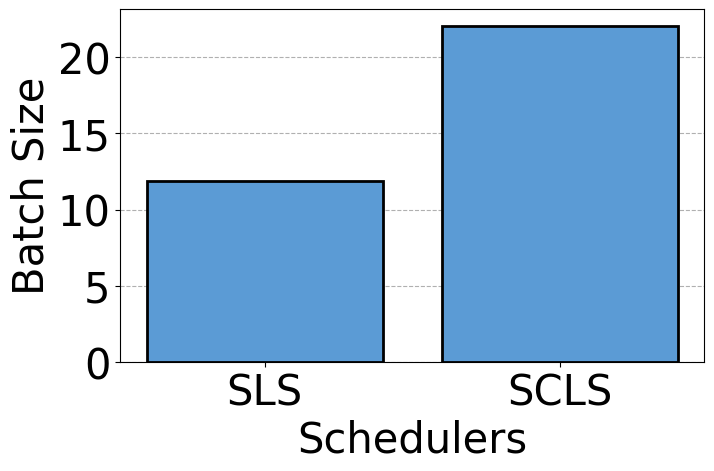
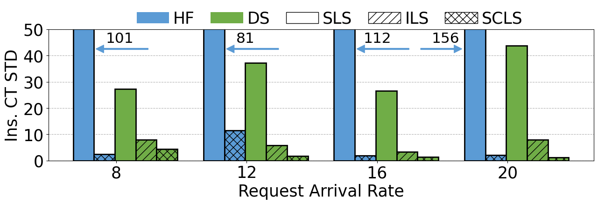
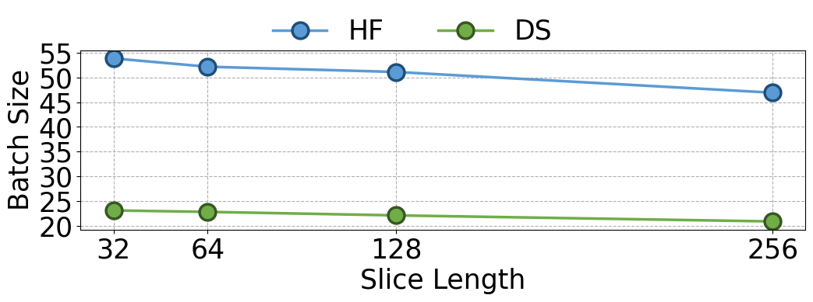

# 大型语言模型服务中的切片级调度：追求高吞吐量与负载均衡

发布时间：2024年06月19日

`LLM应用

这篇论文主要讨论了大型语言模型（LLMs）在生成文本时的内存消耗和调度问题，并提出了一种新的调度策略——切片级调度（SCLS），以优化内存使用和提高计算效率。这种研究直接应用于LLM的实际操作和优化中，因此属于LLM应用分类。` `云计算` `人工智能`

> Slice-Level Scheduling for High Throughput and Load Balanced LLM Serving

# 摘要

> 大型语言模型（LLMs）逐令牌迭代生成文本，随着生成序列的增长，内存消耗也随之上升。生成长度的不可预测性使得难以预估处理请求所需的时间和内存，这对请求调度构成了挑战。传统序列级调度（SLS）采用先到先服务（FCFS）的静态批处理方式，导致短序列请求等待长序列请求完成，降低了计算效率。为防内存溢出（OOM），SLS采用小批量处理，限制了吞吐量。新近的迭代级调度（ILS）通过连续批处理及时响应完成请求并动态加入新请求，提升了效率。但许多ILS调度器为保持快速推理而限制并行请求数，牺牲了吞吐量。此外，现有调度器未能平衡多个LLM实例间的工作负载。为此，我们提出切片级调度（SCLS），将最大生成长度分割成切片，按切片批处理，精确控制服务时间和内存使用，为高效调度奠定基础。实验表明，SCLS相比SLS和ILS，吞吐量提升高达315.8%，并通过创新的批处理和卸载算法显著减轻了负载不平衡。

> Large language models (LLMs) iteratively generate text token by token, with memory usage increasing with the length of generated token sequences. The unpredictability of generation lengths makes it difficult to estimate the time and memory needed to process requests, posing a challenge for effective request scheduling. Conventional sequence-level scheduling (SLS) serves requests in a first-come first-served (FCFS) manner with static batching where requests with short generation lengths are delayed until those with long ones have finished generation, which hurts computational efficiency. Besides, to avoid out-of-memory (OOM) errors, SLS batches requests with a small batch size, which limits throughput. Recently proposed iteration-level scheduling (ILS) enhances computational efficiency with continuous batching to return completed requests timely and dynamically add new requests for processing. However, many ILS schedulers limit the number of parallel-processing requests to avoid OOM errors while achieving a fast inference speed, which compromises throughput. Moreover, existing SLS and ILS schedulers fail to balance the workload across multiple deployed LLM instances. To tackle these challenges, we propose slice-level scheduling (SCLS). By splitting the predefined maximal generation length limit into slices and serving batches slice by slice, it provides a precise range of serving time and memory usage for batched requests, laying the foundation for effective scheduling. Experiments confirm that compared with SLS and ILS schedulers, SCLS can improve throughput by up to 315.8% and greatly mitigate load imbalance with proposed batching and offloading algorithms.

[Arxiv](https://arxiv.org/abs/2406.13511)