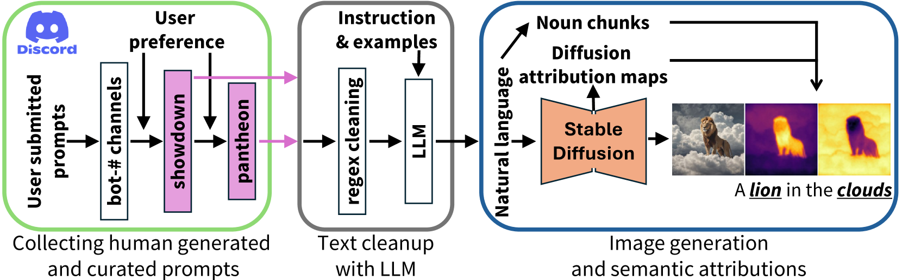
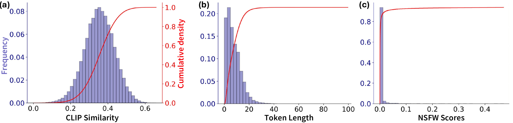
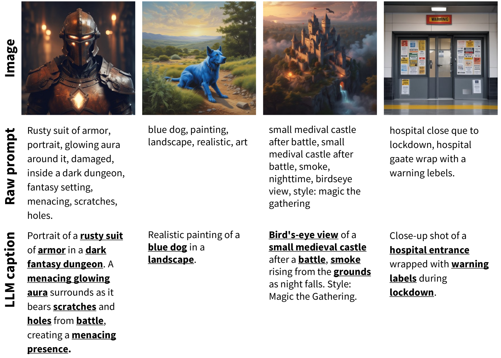
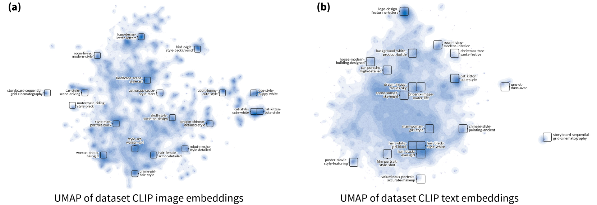
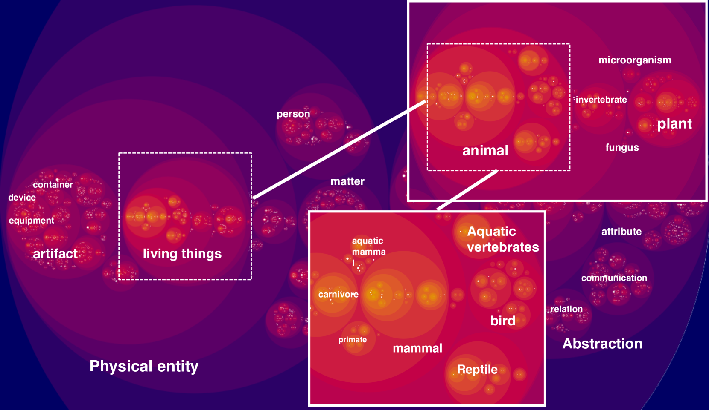

# StableSemantics：自然图像中语义表示的合成语言-视觉数据集

发布时间：2024年06月19日

`Agent

理由：这篇论文主要关注的是计算机视觉领域中的视觉场景语义理解，特别是通过文本到图像框架的模型来提升物体识别和场景理解能力。虽然这些模型可能涉及到大型语言模型（LLM）的应用，但论文的核心在于开发和利用一个特定的数据集（StableSemantics）来推动视觉语义理解技术的发展，这更符合Agent类别的定义，即专注于开发和使用模型或系统来解决特定问题或任务。此外，论文中提到的跨注意力机制和数据集的构建，都是为了增强模型的场景理解和物体识别能力，这进一步支持了将其归类为Agent。` `计算机视觉` `数据集`

> StableSemantics: A Synthetic Language-Vision Dataset of Semantic Representations in Naturalistic Images

# 摘要

> 在计算机视觉领域，理解视觉场景的语义是一项基础性挑战。难点在于，尽管物体在语义上相似或功能相近，它们的视觉表现却可能大相径庭，这给精确识别与分类带来了难题。得益于文本到图像框架的最新进展，我们现在拥有了能够捕捉自然场景统计特性的模型。这些模型不仅考虑了物体的视觉多样性，还考虑了复杂物体共现模式及多样光照条件等噪声因素。借助大规模数据集和跨注意力机制，这些模型能够生成细节丰富、上下文关联紧密的场景描述。这一突破为在复杂多变的环境中提升物体识别和场景理解能力开辟了新路径。我们的研究推出了StableSemantics数据集，它包含了22.4万个精心策划的提示、超过200万张合成图像以及对应每个名词块的1000万个注意力图。我们利用了人类生成的、与视觉上引人入胜的稳定扩散生成相对应的提示，每个短语生成10次，并提取了每张图像的跨注意力图。我们分析了生成图像的语义分布，研究了图像中物体的分布情况，并在我们的数据集上对标题生成和开放词汇分割方法进行了基准测试。据我们所知，我们是首个发布具有语义归属的扩散数据集的团队。我们期待StableSemantics能够推动视觉语义理解技术的发展，并为构建更先进、更高效的视觉模型奠定基础。更多信息，请访问：https://stablesemantics.github.io/StableSemantics。

> Understanding the semantics of visual scenes is a fundamental challenge in Computer Vision. A key aspect of this challenge is that objects sharing similar semantic meanings or functions can exhibit striking visual differences, making accurate identification and categorization difficult. Recent advancements in text-to-image frameworks have led to models that implicitly capture natural scene statistics. These frameworks account for the visual variability of objects, as well as complex object co-occurrences and sources of noise such as diverse lighting conditions. By leveraging large-scale datasets and cross-attention conditioning, these models generate detailed and contextually rich scene representations. This capability opens new avenues for improving object recognition and scene understanding in varied and challenging environments. Our work presents StableSemantics, a dataset comprising 224 thousand human-curated prompts, processed natural language captions, over 2 million synthetic images, and 10 million attention maps corresponding to individual noun chunks. We explicitly leverage human-generated prompts that correspond to visually interesting stable diffusion generations, provide 10 generations per phrase, and extract cross-attention maps for each image. We explore the semantic distribution of generated images, examine the distribution of objects within images, and benchmark captioning and open vocabulary segmentation methods on our data. To the best of our knowledge, we are the first to release a diffusion dataset with semantic attributions. We expect our proposed dataset to catalyze advances in visual semantic understanding and provide a foundation for developing more sophisticated and effective visual models. Website: https://stablesemantics.github.io/StableSemantics

[Arxiv](https://arxiv.org/abs/2406.13735)