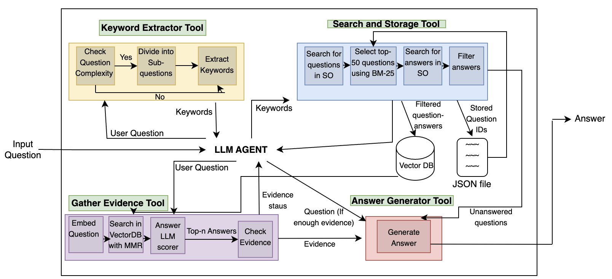

# StackRAG Agent：利用检索增强生成技术提升开发者答案质量

发布时间：2024年06月19日

`RAG

理由：这篇论文介绍了一种名为StackRAG的工具，它是基于大型语言模型（LLMs）的检索增强生成工具。该工具结合了Stack Overflow的知识库和LLMs的生成能力，旨在提高答案的准确性和相关性。这种结合检索和生成的方法符合RAG（Retrieval-Augmented Generation）的定义，因此将其分类为RAG。` `软件开发` `知识检索`

> StackRAG Agent: Improving Developer Answers with Retrieval-Augmented Generation

# 摘要

> 开发者常为寻找问题答案而耗时，Stack Overflow与大型语言模型（LLMs）如ChatGPT成为他们的得力助手。但单独使用各有短板：搜索答案费时费力，而LLMs可能给出不靠谱的答案。为此，我们推出了StackRAG，这一基于LLMs的检索增强生成工具，巧妙融合了Stack Overflow的知识与LLMs的生成能力，确保答案的准确性与相关性。初步测试表明，StackRAG生成的答案既准确又实用。

> Developers spend much time finding information that is relevant to their questions. Stack Overflow has been the leading resource, and with the advent of Large Language Models (LLMs), generative models such as ChatGPT are used frequently. However, there is a catch in using each one separately. Searching for answers is time-consuming and tedious, as shown by the many tools developed by researchers to address this issue. On the other, using LLMs is not reliable, as they might produce irrelevant or unreliable answers (i.e., hallucination). In this work, we present StackRAG, a retrieval-augmented Multiagent generation tool based on LLMs that combines the two worlds: aggregating the knowledge from SO to enhance the reliability of the generated answers. Initial evaluations show that the generated answers are correct, accurate, relevant, and useful.

[Arxiv](https://arxiv.org/abs/2406.13840)