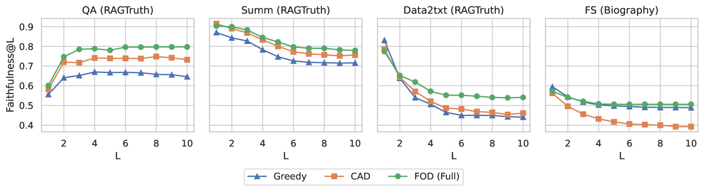
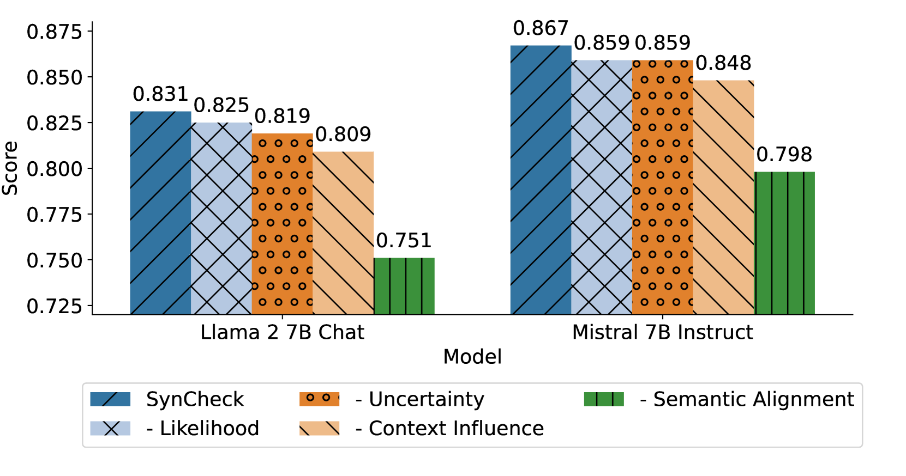
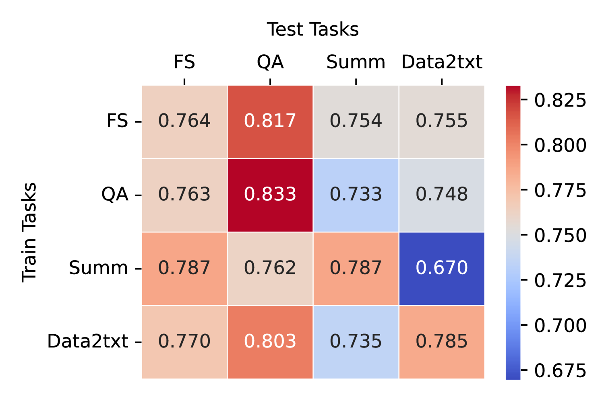
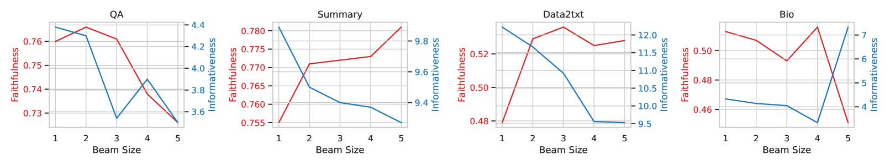
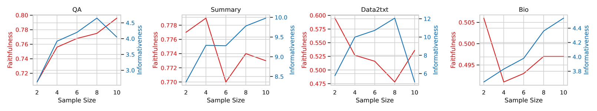

# 实时忠实度监控，确保检索增强生成的可靠性

发布时间：2024年06月19日

`RAG

理由：这篇论文主要关注的是检索增强型语言模型（RALMs）的忠实性问题，并提出了SynCheck监控工具和FOD解码策略来提高模型的忠实性。这些工作集中在增强模型的检索和生成能力，以确保生成的内容更加可靠和忠实于原始上下文。这与RAG（Retrieval-Augmented Generation）模型的目标和应用紧密相关，即通过检索机制增强语言模型的生成能力。因此，将其分类为RAG是合适的。` `内容监控`

> Synchronous Faithfulness Monitoring for Trustworthy Retrieval-Augmented Generation

# 摘要

> 检索增强型语言模型（RALMs）在处理知识密集型任务时表现出色，但其生成的内容可能包含无根据的信息或与检索上下文矛盾，引发信任危机。为此，我们提出了SynCheck，一种轻量级监控工具，它通过分析序列可能性、不确定性、上下文影响及语义对齐等解码动态，实时识别不忠实句子。SynCheck通过整合互补信号，实现了对忠实性错误的快速准确检测，AUROC提升至0.85，超越了现有最佳方法4%。在此基础上，我们开发了FOD，一种以忠实性为核心的解码策略，它利用束搜索优化长格式生成任务，实证显示，FOD在忠实性上较传统方法提升了超过10%。

> Retrieval-augmented language models (RALMs) have shown strong performance and wide applicability in knowledge-intensive tasks. However, there are significant trustworthiness concerns as RALMs are prone to generating unfaithful outputs, including baseless information or contradictions with the retrieved context. This paper proposes SynCheck, a lightweight monitor that leverages fine-grained decoding dynamics including sequence likelihood, uncertainty quantification, context influence, and semantic alignment to synchronously detect unfaithful sentences. By integrating efficiently measurable and complementary signals, SynCheck enables accurate and immediate feedback and intervention, achieving 0.85 AUROC in detecting faithfulness errors across six long-form retrieval-augmented generation tasks, improving prior best method by 4%. Leveraging SynCheck, we further introduce FOD, a faithfulness-oriented decoding algorithm guided by beam search for long-form retrieval-augmented generation. Empirical results demonstrate that FOD outperforms traditional strategies such as abstention, reranking, or contrastive decoding significantly in terms of faithfulness, achieving over 10% improvement across six datasets.

[Arxiv](https://arxiv.org/abs/2406.13692)