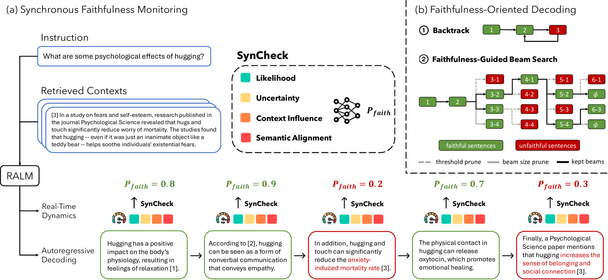

# 同步忠诚度监控：确保检索增强生成的可靠性

发布时间：2024年06月19日

`RAG

理由：这篇论文主要讨论了检索增强型语言模型（RALMs）的问题，并提出了一种名为SynCheck的监控工具和一种基于束搜索的忠实性导向解码算法（FOD），以提高生成内容的可信度和忠实性。这些工作集中在改进检索增强生成（RAG）技术，因此归类为RAG。` `内容监控`

> Synchronous Faithfulness Monitoring for Trustworthy Retrieval-Augmented Generation

# 摘要

> 检索增强型语言模型（RALMs）在处理知识密集型任务时表现出色，但其生成的内容往往缺乏可信度，容易包含无根据的信息或与检索上下文相矛盾。为此，我们提出了SynCheck，一种轻量级监控工具，它通过分析序列可能性、不确定性、上下文影响及语义对齐等解码动态，实时识别不忠实句子。SynCheck通过整合高效的信号，实现了对忠实性错误的即时检测和干预，AUROC提升了4%，达到0.85。在此基础上，我们还开发了FOD，一种基于束搜索的忠实性导向解码算法，专门用于长格式检索增强生成。实证数据显示，FOD在忠实性方面的表现远超传统策略，如弃权、重排序或对比解码，平均提升了10%以上。

> Retrieval-augmented language models (RALMs) have shown strong performance and wide applicability in knowledge-intensive tasks. However, there are significant trustworthiness concerns as RALMs are prone to generating unfaithful outputs, including baseless information or contradictions with the retrieved context. This paper proposes SynCheck, a lightweight monitor that leverages fine-grained decoding dynamics including sequence likelihood, uncertainty quantification, context influence, and semantic alignment to synchronously detect unfaithful sentences. By integrating efficiently measurable and complementary signals, SynCheck enables accurate and immediate feedback and intervention, achieving 0.85 AUROC in detecting faithfulness errors across six long-form retrieval-augmented generation tasks, improving prior best method by 4%. Leveraging SynCheck, we further introduce FOD, a faithfulness-oriented decoding algorithm guided by beam search for long-form retrieval-augmented generation. Empirical results demonstrate that FOD outperforms traditional strategies such as abstention, reranking, or contrastive decoding significantly in terms of faithfulness, achieving over 10% improvement across six datasets.

[Arxiv](https://arxiv.org/abs/2406.13692)