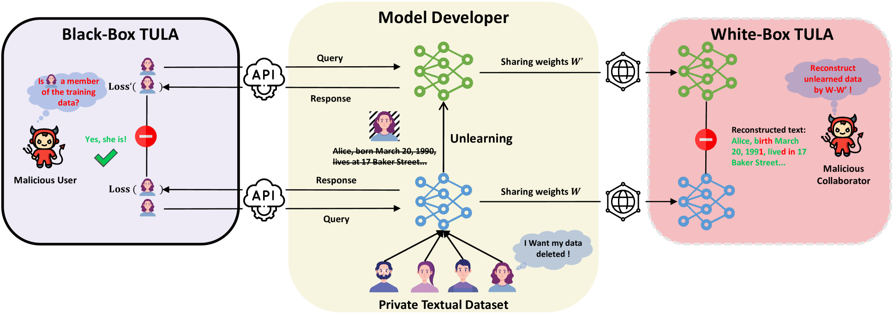
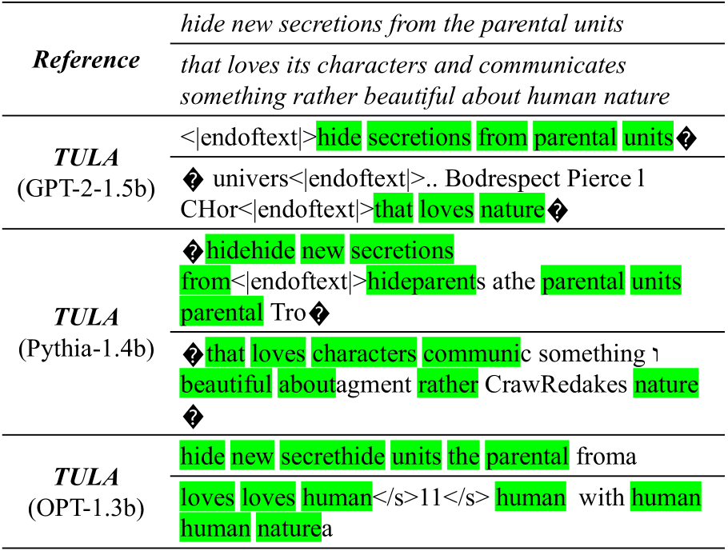
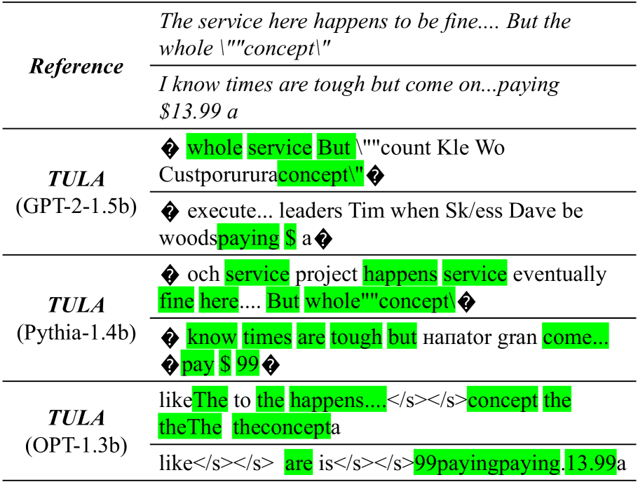

# 文本去学习误导性地让人感觉知识已被遗忘

发布时间：2024年06月19日

`LLM理论

这篇论文主要探讨了语言模型中的机器遗忘技术可能带来的反效果，并提出了一种新型的攻击方法——文本遗忘泄露攻击（TULA）。研究内容涉及语言模型的安全性和隐私保护机制，特别是在模型遗忘敏感信息的过程中可能出现的知识泄露问题。因此，这篇论文更偏向于对大型语言模型（LLM）理论层面的探讨，而不是具体的应用、Agent行为或RAG（Retrieval-Augmented Generation）技术。` `数据安全` `人工智能`

> Textual Unlearning Gives a False Sense of Unlearning

# 摘要

> 语言模型易受训练数据“记忆”影响，包括大量私密或受版权保护的内容。为保护被遗忘权，机器遗忘技术应运而生，旨在帮助模型高效遗忘敏感信息，降低知识泄露风险。然而，这一机制是否可能事与愿违？本文提出了一种名为文本遗忘泄露攻击（TULA）的新型攻击，攻击者通过对比遗忘前后模型，即可推断出遗忘数据的相关信息。我们还探讨了TULA在黑盒和白盒环境下的变种。实验结果显示，机器遗忘技术反而加剧了知识泄露风险，尤其在黑盒环境下，TULA使攻击者推断遗忘数据成员信息的能力提升了20%以上；在白盒环境下，甚至能以60%以上的准确率重建遗忘数据。我们的研究首次揭示了机器遗忘在语言模型中可能带来的反效果，为开发更安全的遗忘机制提供了启示。

> Language models (LMs) are susceptible to "memorizing" training data, including a large amount of private or copyright-protected content. To safeguard the right to be forgotten (RTBF), machine unlearning has emerged as a promising method for LMs to efficiently "forget" sensitive training content and mitigate knowledge leakage risks. However, despite its good intentions, could the unlearning mechanism be counterproductive? In this paper, we propose the Textual Unlearning Leakage Attack (TULA), where an adversary can infer information about the unlearned data only by accessing the models before and after unlearning. Furthermore, we present variants of TULA in both black-box and white-box scenarios. Through various experimental results, we critically demonstrate that machine unlearning amplifies the risk of knowledge leakage from LMs. Specifically, TULA can increase an adversary's ability to infer membership information about the unlearned data by more than 20% in black-box scenario. Moreover, TULA can even reconstruct the unlearned data directly with more than 60% accuracy with white-box access. Our work is the first to reveal that machine unlearning in LMs can inversely create greater knowledge risks and inspire the development of more secure unlearning mechanisms.

[Arxiv](https://arxiv.org/abs/2406.13348)