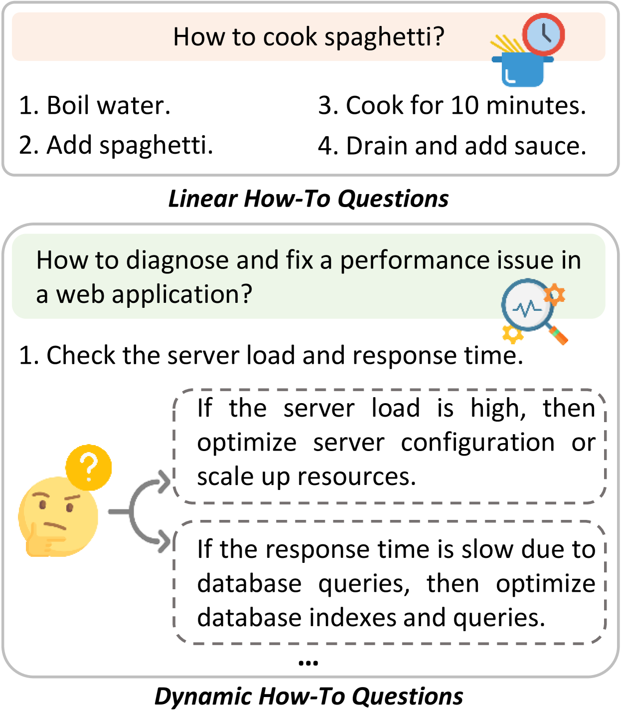
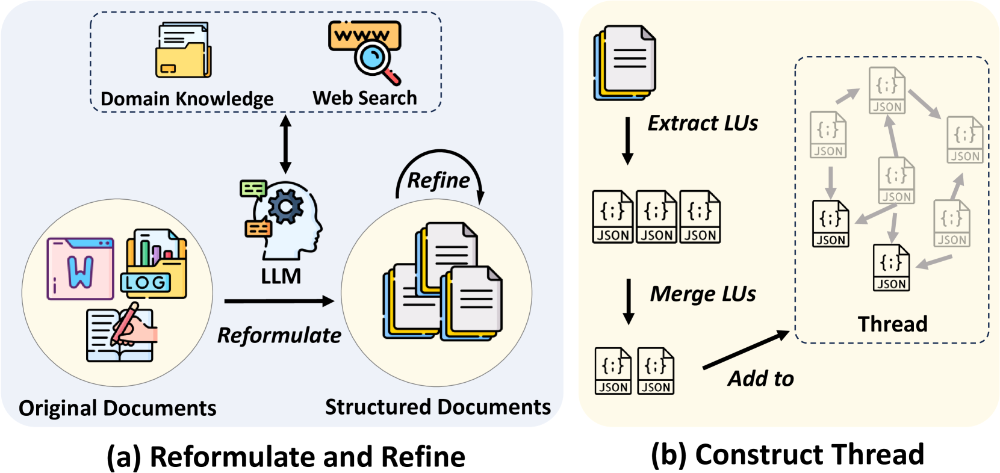
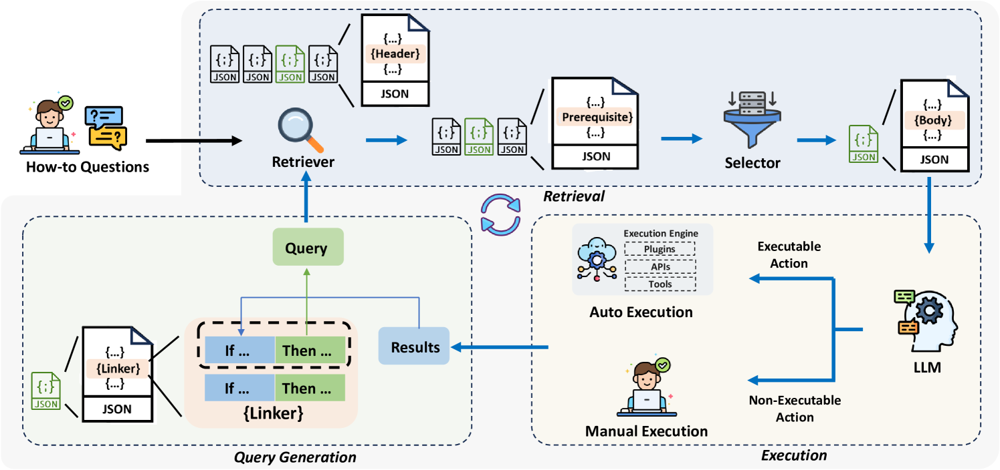
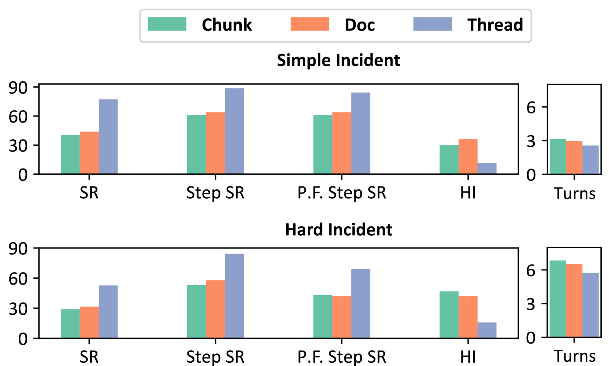

# 探讨：逻辑驱动的数据架构，专为“如何做”问答设计，结合检索增强生成技术，优化解答流程。

发布时间：2024年06月19日

`RAG

这篇论文主要介绍了基于检索增强生成（RAG）技术的问题回答系统在处理非事实性问题，特别是“如何做”类问题时的改进。通过引入一种名为Thread的创新数据组织方式，该系统能够更好地利用文档间的内在联系，重组信息为逻辑单元，从而在开放领域及工业应用中显著提升了处理这类问题的能力。因此，这篇论文应归类于RAG。` `工业应用` `问答系统`

> Thread: A Logic-Based Data Organization Paradigm for How-To Question Answering with Retrieval Augmented Generation

# 摘要

> 目前，借助检索增强生成技术的问题回答系统在解答事实性问题上游刃有余，然而，面对非事实性问题，尤其是那些需要详尽步骤指导和解释的“如何做”查询时，它们显得力不从心。本文推出的Thread，作为一种创新的数据组织方式，通过文档间的内在联系，将信息重组为逻辑单元。在开放领域及工业应用的广泛测试中，Thread在基于RAG的问答系统中大放异彩，显著提升了对“如何做”类问题的处理能力。

> Current question answering systems leveraging retrieval augmented generation perform well in answering factoid questions but face challenges with non-factoid questions, particularly how-to queries requiring detailed step-by-step instructions and explanations. In this paper, we introduce Thread, a novel data organization paradigm that transforms documents into logic units based on their inter-connectivity. Extensive experiments across open-domain and industrial scenarios demonstrate that Thread outperforms existing data organization paradigms in RAG-based QA systems, significantly improving the handling of how-to questions.

[Arxiv](https://arxiv.org/abs/2406.13372)