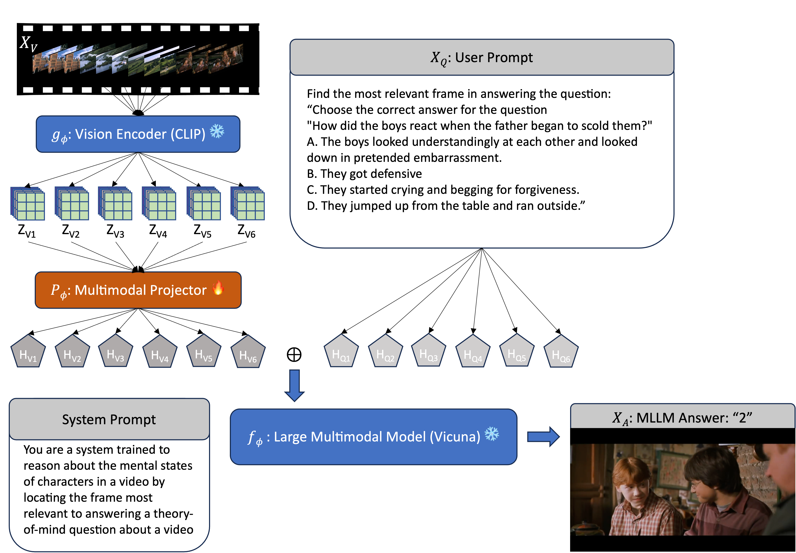

# 透过心智之眼：借助多模态视频大型语言模型洞察人心

发布时间：2024年06月19日

`LLM应用

这篇论文探讨了大型语言模型（LLMs）在多模态环境中进行心智理论（ToM）推理的能力，特别是在视频分析中应用这种推理。研究通过构建一个结合视频与文本的多模态LLM管道，并利用关键帧提取来解答涉及社会与情感推理的问题，展示了LLMs如何在这种复杂场景中进行推理。这种应用不仅扩展了LLMs的功能，还揭示了其在理解和模拟人类情感与社会推理方面的潜力。因此，这篇论文属于LLM应用分类。` `情感分析` `社会科学`

> Through the Theory of Mind's Eye: Reading Minds with Multimodal Video Large Language Models

# 摘要

> 大型多模态模型能否拥有类似人类的情感与社会推理能力？若能，其机制又是如何？最新研究表明，大型语言模型（LLMs）已展现出心智理论（ToM）推理的新能力。这些模型能通过解析涉及人类信念、欲望及意图等心理状态的文本任务，进行人物心理推理。但人类在现实世界中的推理常基于时间线上动态变化的场景。鉴于此，我们视视频为探索时空 ToM 推理能力的新媒介。我们针对富含社会与情感推理元素的视频，提出具体探查问题。我们构建了一个结合视频与文本的多模态 LLM 管道，用于 ToM 推理，并通过提取关键帧来解答 ToM 问题，揭示了多模态 LLMs 如何进行 ToM 推理的奥秘。

> Can large multimodal models have a human-like ability for emotional and social reasoning, and if so, how does it work? Recent research has discovered emergent theory-of-mind (ToM) reasoning capabilities in large language models (LLMs). LLMs can reason about people's mental states by solving various text-based ToM tasks that ask questions about the actors' ToM (e.g., human belief, desire, intention). However, human reasoning in the wild is often grounded in dynamic scenes across time. Thus, we consider videos a new medium for examining spatio-temporal ToM reasoning ability. Specifically, we ask explicit probing questions about videos with abundant social and emotional reasoning content. We develop a pipeline for multimodal LLM for ToM reasoning using video and text. We also enable explicit ToM reasoning by retrieving key frames for answering a ToM question, which reveals how multimodal LLMs reason about ToM.

[Arxiv](https://arxiv.org/abs/2406.13763)