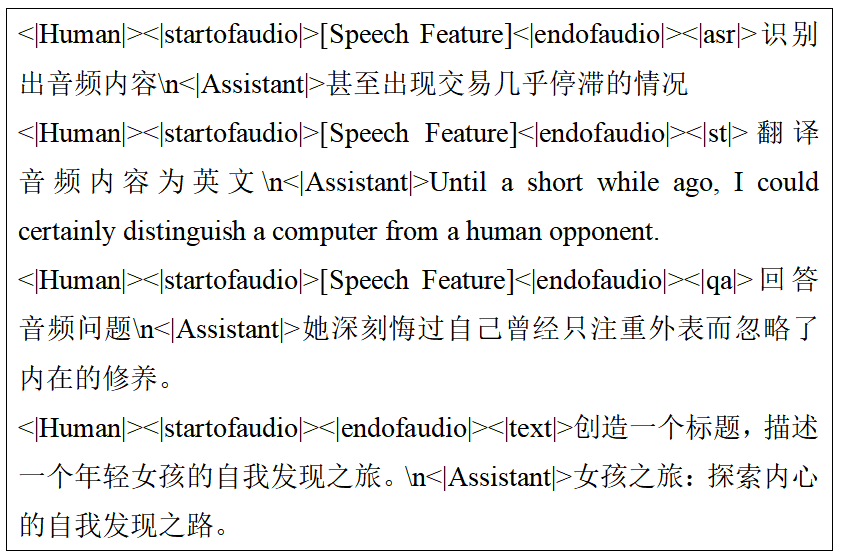

# 语音转文字大型语言模型的可转移对齐模块

发布时间：2024年06月19日

`LLM应用

这篇论文探讨了大型语言模型（LLMs）和语音基础模型在语音-文本双模态技术中的应用，特别是在口语翻译（ST）和问题回答（SQA）任务中的应用。文中提到的使用Whisper编码器和预训练的Yi-6B模型，以及在推理阶段对模型的调整，都是具体的技术应用实例。此外，论文还讨论了模态对齐的问题，并通过奇异值分解（SVD）分析了对齐子空间，这些都是LLM在实际应用中的具体表现。因此，这篇论文应归类为LLM应用。` `语音识别` `机器翻译`

> Transferable speech-to-text large language model alignment module

# 摘要

> 借助大型语言模型（LLMs）和语音基础模型的强大功能，最新的语音-文本双模态技术已能以更简洁的架构，同时处理口语翻译（ST）和问题回答（SQA）等复杂任务。本文中，我们运用了Whisper编码器及预训练的Yi-6B，实证研究表明，仅需单层模块和数百小时的语音-文本多任务数据，即可实现模态对齐。我们还尝试在推理阶段将Yi-6B替换为与人类偏好对齐的Yi-6B-Chat版本，发现其对齐能力同样有效。此外，通过奇异值分解（SVD）揭示的对齐子空间表明，线性对齐子空间较为稀疏，这为添加声纹或视频等其他特征以扩展模态提供了可能。

> By leveraging the power of Large Language Models(LLMs) and speech foundation models, state of the art speech-text bimodal works can achieve challenging tasks like spoken translation(ST) and question answering(SQA) altogether with much simpler architectures. In this paper, we utilize the capability of Whisper encoder and pre-trained Yi-6B. Empirical results reveal that modal alignment can be achieved with one layer module and hundred hours of speech-text multitask corpus. We further swap the Yi-6B with human preferences aligned version of Yi-6B-Chat during inference, and discover that the alignment capability is applicable as well. In addition, the alignment subspace revealed by singular value decomposition(SVD) also implies linear alignment subspace is sparse, which leaves the possibility to concatenate other features like voice-print or video to expand modality.

[Arxiv](https://arxiv.org/abs/2406.13357)