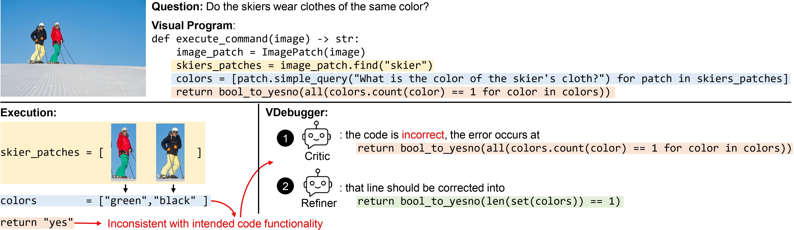
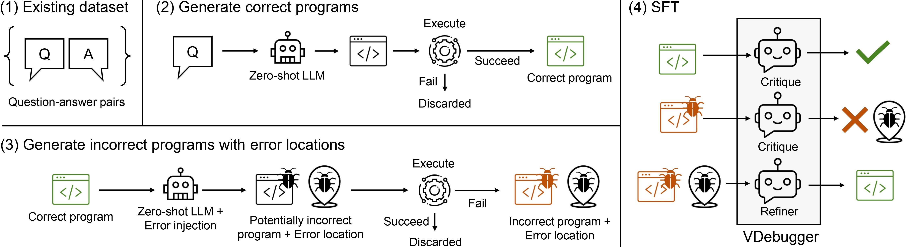
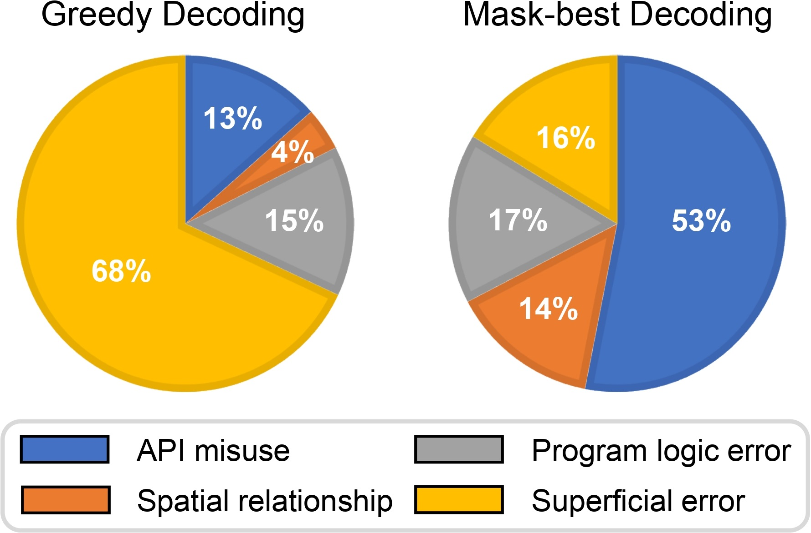
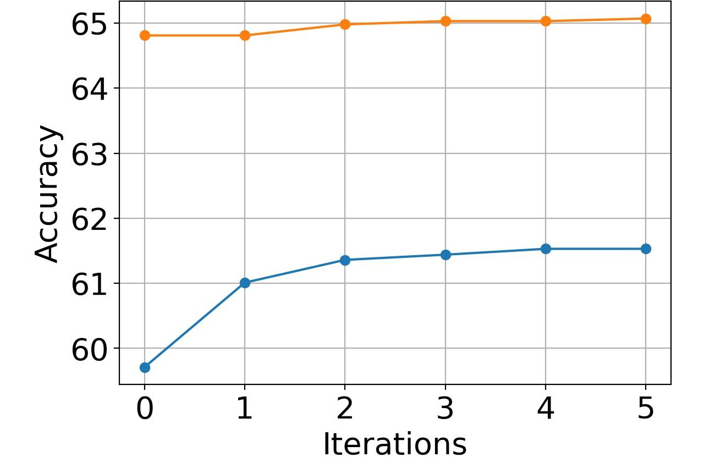
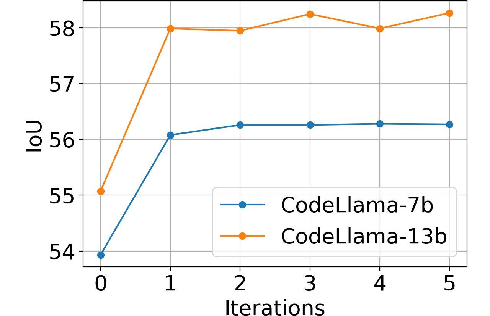
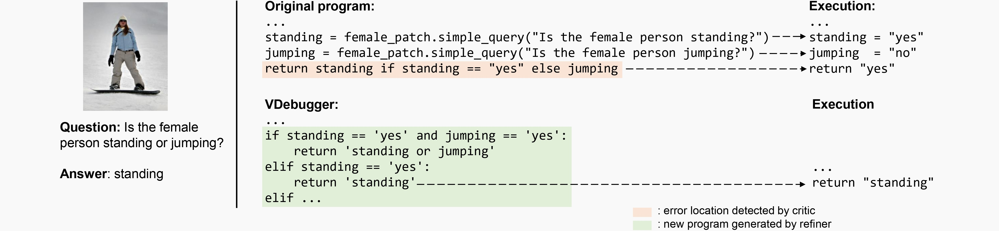
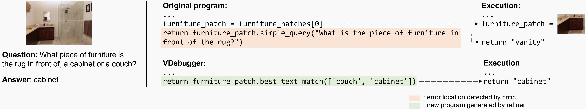
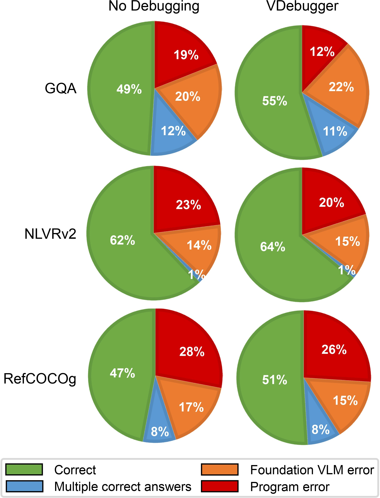
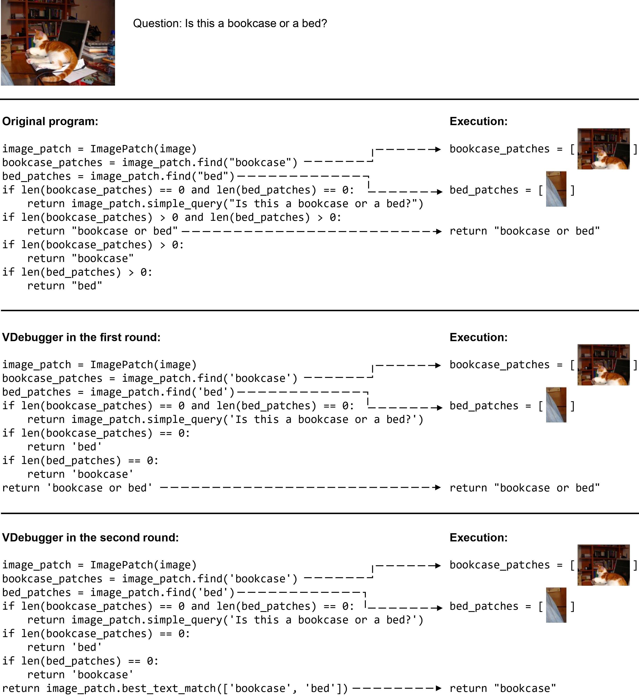

# VDebugger：驾驭执行反馈，精进视觉程序调试之道

发布时间：2024年06月19日

`LLM应用

这篇论文介绍了一种名为VDebugger的创新框架，用于调试大型语言模型生成的视觉程序，这些程序设计用于解决视觉推理难题。论文中提到，这些视觉程序常常因为逻辑错误而导致失败，而VDebugger通过逐步执行追踪来定位和修复这些错误，从而提高程序的透明度和准确性。此外，VDebugger的训练数据是通过自动化流程生成的，使用了独特的掩码-最佳解码技术。论文还提供了在多个数据集上的测试结果，证明了VDebugger的有效性，并指出其在未见过的任务上也能带来性能提升。因此，这篇论文属于LLM应用类别，因为它专注于开发和应用技术来改进大型语言模型在特定任务（视觉推理）中的表现。` `视觉推理` `自动化测试`

> VDebugger: Harnessing Execution Feedback for Debugging Visual Programs

# 摘要

> 大型语言模型生成的视觉程序，专为解决视觉推理难题而设计，通过分解复杂问题并调用特定模型逐个击破。但这些程序常陷入逻辑错误的泥潭，初步评估揭示，高达58%的错误源自逻辑失误。调试这些复杂的视觉程序，成为视觉推理的一大障碍。为此，我们推出了VDebugger，这一创新框架通过逐步执行追踪，精准定位并修复视觉程序中的错误。VDebugger借助细致的执行反馈，不仅纠正错误，还提升了程序的透明度和准确性。训练数据通过自动化流程生成，采用独特的掩码-最佳解码技术，巧妙地将错误注入正确程序中。在六个数据集上的测试证实了VDebugger的效力，下游任务准确性提升高达3.2%。进一步的实验显示，VDebugger在未见过的COVR任务上，亦能带来2.3%的显著提升。代码、数据及模型已在https://github.com/shirley-wu/vdebugger/公开，供大家探索。

> Visual programs are executable code generated by large language models to address visual reasoning problems. They decompose complex questions into multiple reasoning steps and invoke specialized models for each step to solve the problems. However, these programs are prone to logic errors, with our preliminary evaluation showing that 58% of the total errors are caused by program logic errors. Debugging complex visual programs remains a major bottleneck for visual reasoning. To address this, we introduce VDebugger, a novel critic-refiner framework trained to localize and debug visual programs by tracking execution step by step. VDebugger identifies and corrects program errors leveraging detailed execution feedback, improving interpretability and accuracy. The training data is generated through an automated pipeline that injects errors into correct visual programs using a novel mask-best decoding technique. Evaluations on six datasets demonstrate VDebugger's effectiveness, showing performance improvements of up to 3.2% in downstream task accuracy. Further studies show VDebugger's ability to generalize to unseen tasks, bringing a notable improvement of 2.3% on the unseen COVR task. Code, data and models are made publicly available at https://github.com/shirley-wu/vdebugger/

[Arxiv](https://arxiv.org/abs/2406.13444)