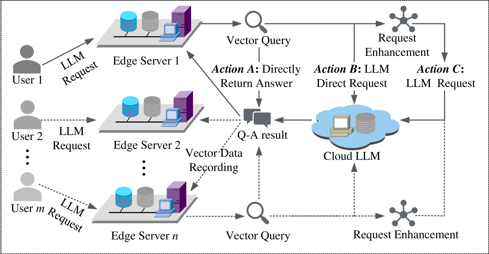
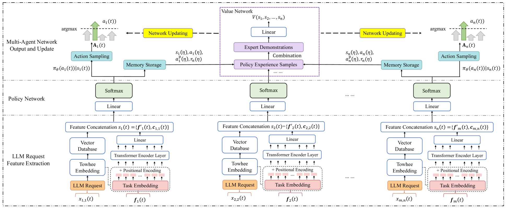
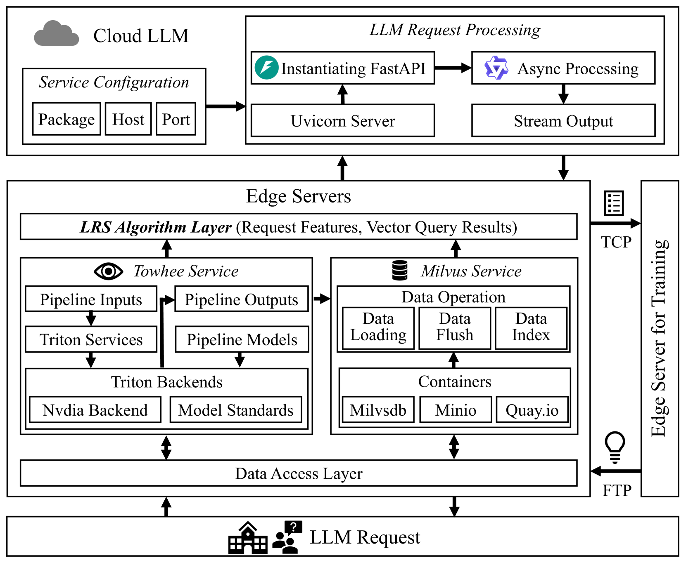
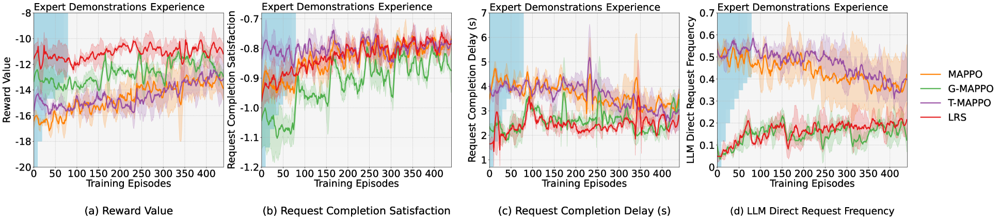
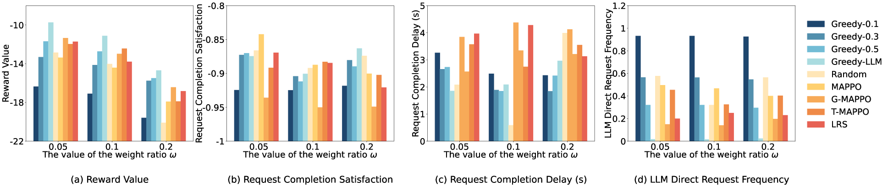
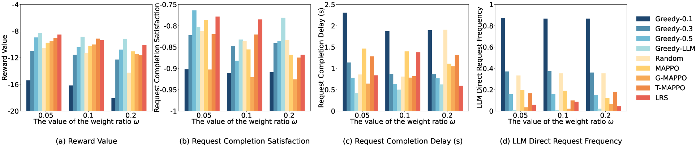
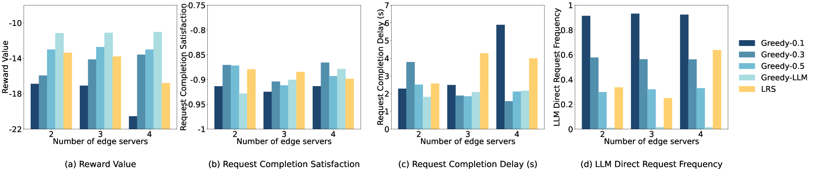
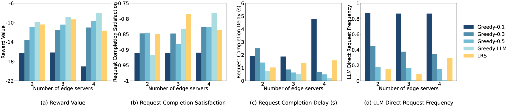
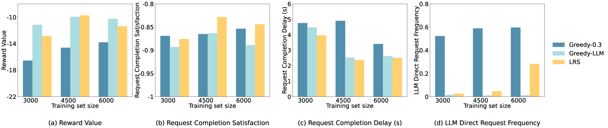
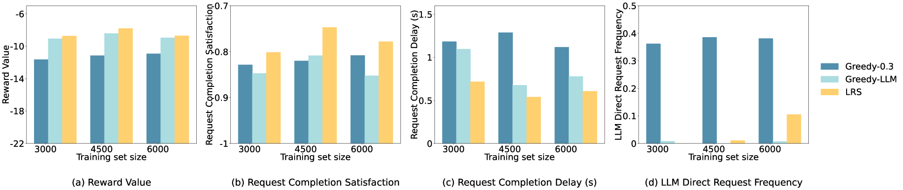

# VELO：一种借助向量数据库的云-边缘协作，旨在优化大型语言模型服务质量的框架

发布时间：2024年06月19日

`Agent

理由：这篇论文主要介绍了一种名为VELO的框架，该框架通过在边缘网络中利用向量数据库缓存LLM请求结果来减少延迟和成本。特别值得注意的是，该框架采用了多智能体强化学习（MARL）算法来优化决策过程，这涉及到智能体的使用和决策制定，因此更符合Agent分类的定义。虽然论文中涉及了LLM的应用，但其核心创新点在于智能体系统的应用和优化，而不是LLM本身的理论或应用。` `云计算` `边缘计算`

> VELO: A Vector Database-Assisted Cloud-Edge Collaborative LLM QoS Optimization Framework

# 摘要

> 大型语言模型（LLM）在多个领域广泛应用，但其在云数据中心的部署常伴随着高延迟和高成本，影响边缘网络的服务质量（QoS）。本文提出了一种创新的VELO框架，通过在边缘利用向量数据库缓存LLM请求结果，有效减少了响应延迟和成本。VELO框架无需修改LLM内部结构，适用于多种LLM，并通过多智能体强化学习（MARL）算法优化决策过程，决定何时从云端请求LLM或直接从边缘数据库返回结果。此外，我们还改进了MARL的策略网络，并引入了专家演示以加速训练。实验证明，VELO框架显著提升了边缘用户使用LLM时的满意度和效率。

> The Large Language Model (LLM) has gained significant popularity and is extensively utilized across various domains. Most LLM deployments occur within cloud data centers, where they encounter substantial response delays and incur high costs, thereby impacting the Quality of Services (QoS) at the network edge. Leveraging vector database caching to store LLM request results at the edge can substantially mitigate response delays and cost associated with similar requests, which has been overlooked by previous research. Addressing these gaps, this paper introduces a novel Vector database-assisted cloud-Edge collaborative LLM QoS Optimization (VELO) framework. Firstly, we propose the VELO framework, which ingeniously employs vector database to cache the results of some LLM requests at the edge to reduce the response time of subsequent similar requests. Diverging from direct optimization of the LLM, our VELO framework does not necessitate altering the internal structure of LLM and is broadly applicable to diverse LLMs. Subsequently, building upon the VELO framework, we formulate the QoS optimization problem as a Markov Decision Process (MDP) and devise an algorithm grounded in Multi-Agent Reinforcement Learning (MARL) to decide whether to request the LLM in the cloud or directly return the results from the vector database at the edge. Moreover, to enhance request feature extraction and expedite training, we refine the policy network of MARL and integrate expert demonstrations. Finally, we implement the proposed algorithm within a real edge system. Experimental findings confirm that our VELO framework substantially enhances user satisfaction by concurrently diminishing delay and resource consumption for edge users utilizing LLMs.

[Arxiv](https://arxiv.org/abs/2406.13399)