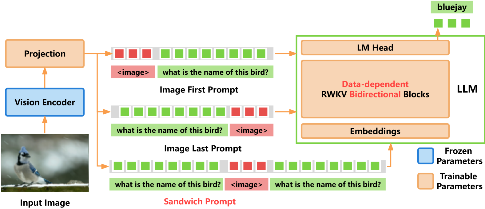

# 视觉RWKV：揭秘循环神经网络在视觉语言模型中的应用

发布时间：2024年06月19日

`LLM应用

这篇论文介绍了VisualRWKV，这是一种将线性RNN模型应用于多模态学习任务的创新方法，特别是在视觉语言模型（VLMs）的背景下。它利用了预训练的RWKV语言模型，并引入了新的机制来提升视觉序列处理能力。虽然涉及到了语言模型的应用，但主要关注的是视觉语言模型的具体实现和性能提升，因此属于LLM应用类别。` `多模态学习` `计算机视觉`

> VisualRWKV: Exploring Recurrent Neural Networks for Visual Language Models

# 摘要

> 随着大型语言模型的成功，视觉语言模型（VLMs）迅速进步，但鲜有研究将高效的线性循环神经网络（RNNs）架构融入其中。本研究推出的VisualRWKV，是首个利用线性RNN模型于多模态学习任务的尝试，借助预训练的RWKV语言模型。我们创新性地引入了数据依赖的循环和三明治提示，以及二维图像扫描机制，以提升视觉序列处理能力。实验结果显示，VisualRWKV在多个基准上与基于Transformer的模型如LLaVA-1.5并驾齐驱。为推动后续研究，我们已在GitHub上公开了模型检查点和代码：\href{https://github.com/howard-hou/VisualRWKV}{https://github.com/howard-hou/VisualRWKV}。

> Visual Language Models (VLMs) have rapidly progressed with the recent success of large language models. However, there have been few attempts to incorporate efficient linear Recurrent Neural Networks (RNNs) architectures into VLMs. In this study, we introduce VisualRWKV, the first application of a linear RNN model to multimodal learning tasks, leveraging the pre-trained RWKV language model. We propose a data-dependent recurrence and sandwich prompts to enhance our modeling capabilities, along with a 2D image scanning mechanism to enrich the processing of visual sequences. Extensive experiments demonstrate that VisualRWKV achieves competitive performance compared to Transformer-based models like LLaVA-1.5 on various benchmarks. To facilitate further research and analysis, we have made the checkpoints and the associated code publicly accessible at the following GitHub repository: \href{https://github.com/howard-hou/VisualRWKV}{https://github.com/howard-hou/VisualRWKV}.

[Arxiv](https://arxiv.org/abs/2406.13362)