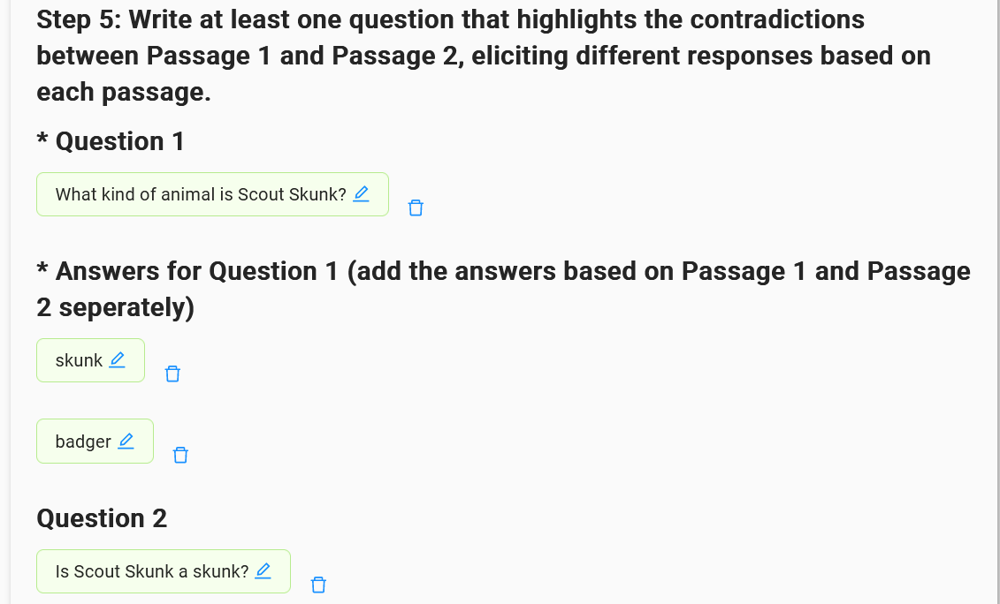

# WikiContradict：大型语言模型在维基百科知识冲突中的评估基准

发布时间：2024年06月19日

`RAG

理由：这篇论文主要探讨了检索增强生成（RAG）技术在处理大型语言模型（LLMs）中的知识冲突问题，特别是在面对矛盾信息时的表现。论文通过创建一个名为WikiContradict的基准，评估了LLMs在处理知识冲突时的性能，并开发了一个自动化模型来评估LLM的性能。这些研究内容直接关联到RAG技术的应用和改进，因此归类为RAG。` `问答系统` `知识评估`

> WikiContradict: A Benchmark for Evaluating LLMs on Real-World Knowledge Conflicts from Wikipedia

# 摘要

> 检索增强生成（RAG）作为一种有前景的解决方案，旨在缓解大型语言模型（LLMs）的局限性，如幻觉和信息过时。然而，LLMs如何处理来自同一来源且同等可信的矛盾检索段落中的知识冲突，这一问题仍未明朗。本研究针对维基百科中的矛盾段落，对LLM生成的答案进行了全面评估，维基百科被视为大多数LLMs的高质量预训练资源。我们推出了WikiContradict，一个包含253个高质量人工标注实例的基准，专门用于评估LLM在面对现实世界知识冲突时的表现。我们在多种QA场景下，对闭源和开源LLMs进行了广泛测试，包括单一和矛盾段落的RAG。通过在WikiContradict子集上对5个LLM进行超过3,500次的人工评估，我们揭示了这些模型在处理知识冲突时的行为和局限性。例如，面对两个矛盾事实的段落，所有模型都难以准确反映上下文的冲突性质，尤其是对于需要推理的隐含冲突。为了降低人工评估的成本，我们开发了一个自动化模型，利用强大的开源语言模型评估LLM性能，实现了0.8的F分数。我们使用这一自动化指标，对七个LLM在所有WikiContradict实例中的超过1,500个答案进行了评估。为了推动未来研究，我们公开了WikiContradict：https://ibm.biz/wikicontradict。

> Retrieval-augmented generation (RAG) has emerged as a promising solution to mitigate the limitations of large language models (LLMs), such as hallucinations and outdated information. However, it remains unclear how LLMs handle knowledge conflicts arising from different augmented retrieved passages, especially when these passages originate from the same source and have equal trustworthiness. In this work, we conduct a comprehensive evaluation of LLM-generated answers to questions that have varying answers based on contradictory passages from Wikipedia, a dataset widely regarded as a high-quality pre-training resource for most LLMs. Specifically, we introduce WikiContradict, a benchmark consisting of 253 high-quality, human-annotated instances designed to assess LLM performance when augmented with retrieved passages containing real-world knowledge conflicts. We benchmark a diverse range of both closed and open-source LLMs under different QA scenarios, including RAG with a single passage, and RAG with 2 contradictory passages. Through rigorous human evaluations on a subset of WikiContradict instances involving 5 LLMs and over 3,500 judgements, we shed light on the behaviour and limitations of these models. For instance, when provided with two passages containing contradictory facts, all models struggle to generate answers that accurately reflect the conflicting nature of the context, especially for implicit conflicts requiring reasoning. Since human evaluation is costly, we also introduce an automated model that estimates LLM performance using a strong open-source language model, achieving an F-score of 0.8. Using this automated metric, we evaluate more than 1,500 answers from seven LLMs across all WikiContradict instances. To facilitate future work, we release WikiContradict on: https://ibm.biz/wikicontradict.

[Arxiv](https://arxiv.org/abs/2406.13805)