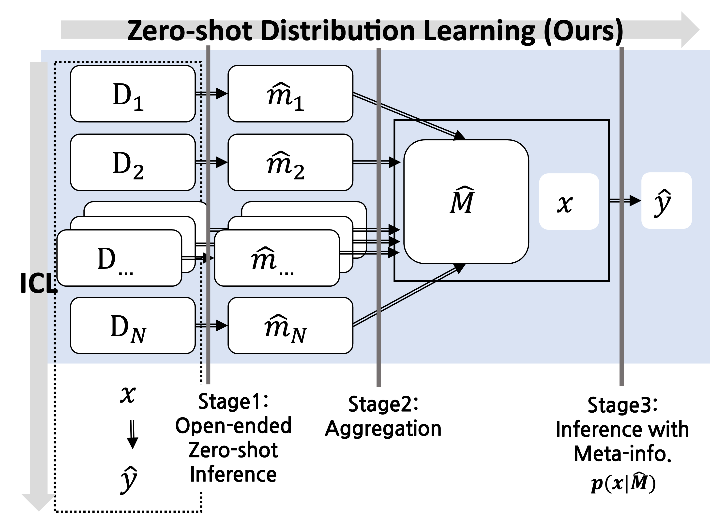

# ZeroDL：借助大型语言模型，实现文本聚类的零-shot分布学习新境界

发布时间：2024年06月19日

`LLM应用

这篇论文探讨了如何通过观察大型语言模型（LLMs）在开放式零样本推理中的表现，来优化特定任务的情境学习（ICL）。这种方法涉及汇总LLM的推理结果，并将这些元信息融入实际任务中，以提高任务性能。论文在文本聚类任务中验证了这一方法的有效性，并强调了情境化在LLM应用中的重要性。因此，这篇论文属于LLM应用分类。` `文本聚类`

> ZeroDL: Zero-shot Distribution Learning for Text Clustering via Large Language Models

# 摘要

> 大型语言模型（LLMs）的最新进展极大地推动了自然语言处理（NLP）任务的解决，其中情境学习（ICL）是LLMs理解任务细节的关键。本文提出了一种既简单又高效的方法，通过观察LLM如何描述目标数据集（开放式零样本推理），汇总其推理结果，并将这些元信息融入实际任务，从而针对特定LLM优化任务情境。我们在文本聚类任务中验证了此方法的有效性，并通过具体示例阐明了情境化的重要性。

> The recent advancements in large language models (LLMs) have brought significant progress in solving NLP tasks. Notably, in-context learning (ICL) is the key enabling mechanism for LLMs to understand specific tasks and grasping nuances. In this paper, we propose a simple yet effective method to contextualize a task toward a specific LLM, by (1) observing how a given LLM describes (all or a part of) target datasets, i.e., open-ended zero-shot inference, and (2) aggregating the open-ended inference results by the LLM, and (3) finally incorporate the aggregated meta-information for the actual task. We show the effectiveness of this approach in text clustering tasks, and also highlight the importance of the contextualization through examples of the above procedure.

[Arxiv](https://arxiv.org/abs/2406.13342)