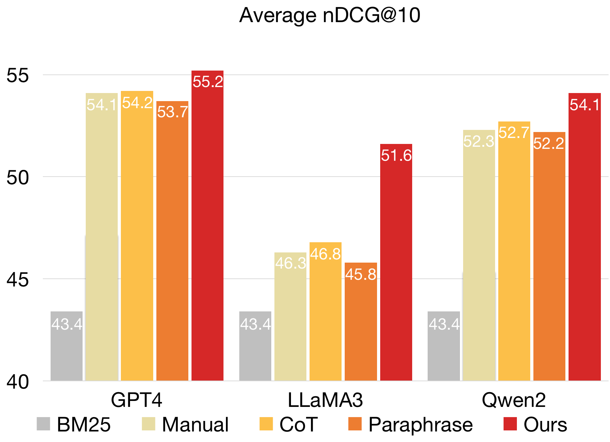
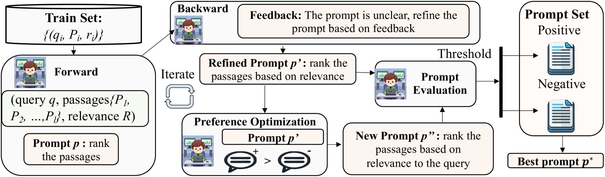
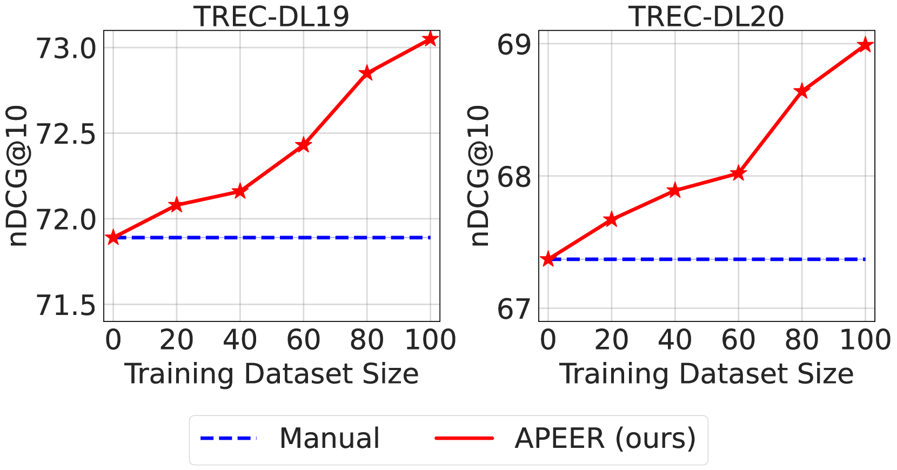
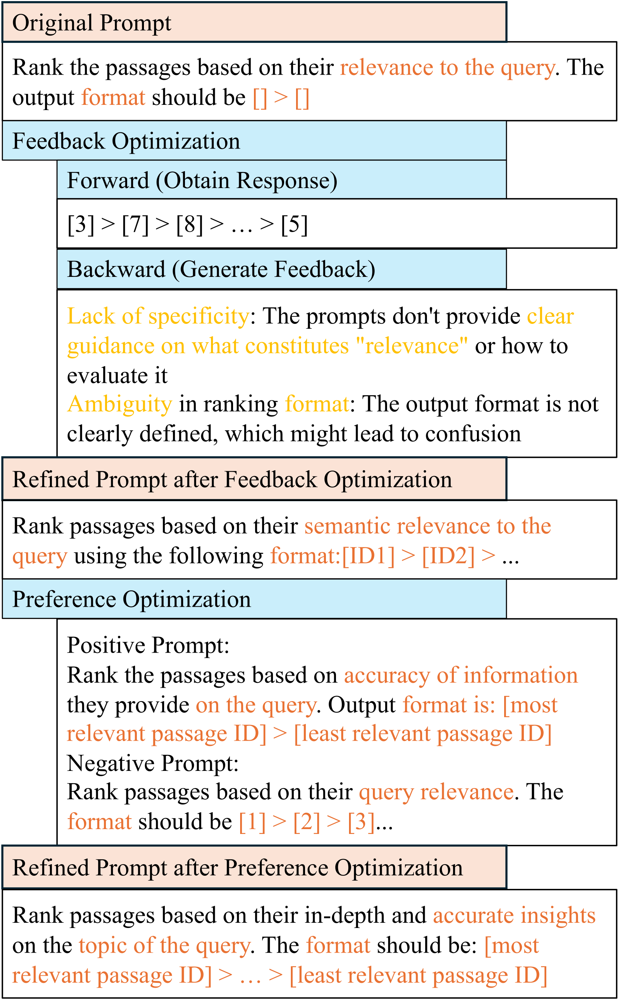

# APEER：自动提示工程技术，显著提升了大型语言模型在文本重排序任务中的性能。

发布时间：2024年06月20日

`RAG

理由：这篇论文主要关注的是信息检索（IR）中的重排序任务，并提出了一种新型的自动提示工程算法（APEER）来优化这一过程。这与RAG（Retrieval-Augmented Generation）模型中的检索和排序机制紧密相关，因为RAG模型也涉及到信息检索和文本生成的结合。虽然论文中提到了大型语言模型（LLMs），但其重点在于改进IR中的排序方法，而不是深入探讨LLMs的理论或应用。因此，将其归类为RAG更为合适。` `信息检索`

> APEER: Automatic Prompt Engineering Enhances Large Language Model Reranking

# 摘要

> 大型语言模型（LLMs）极大地提升了信息检索（IR）中各模块的性能，尤其是在重排序方面。尽管成绩斐然，但目前的零-shot相关性排序仍严重依赖人工设计的提示。现有的自动提示工程算法多聚焦于语言建模和分类任务，对IR领域，尤其是重排序的研究尚显不足。由于输入中查询与长文本对的复杂结合，排序任务的难度远超分类，直接应用现有提示工程算法面临挑战。为此，我们推出了一种名为APEER的新型自动提示工程算法，旨在减少人工干预，并挖掘重排序中提示优化的潜力。APEER通过迭代反馈和偏好优化，不断精炼提示。在四个LLMs和十个数据集上的广泛测试显示，APEER显著超越了当前最先进的手动提示方法。更有甚者，APEER生成的提示在跨任务和跨LLMs的应用中展现出更佳的迁移能力。相关代码已公开于https://github.com/jincan333/APEER。

> Large Language Models (LLMs) have significantly enhanced Information Retrieval (IR) across various modules, such as reranking. Despite impressive performance, current zero-shot relevance ranking with LLMs heavily relies on human prompt engineering. Existing automatic prompt engineering algorithms primarily focus on language modeling and classification tasks, leaving the domain of IR, particularly reranking, underexplored. Directly applying current prompt engineering algorithms to relevance ranking is challenging due to the integration of query and long passage pairs in the input, where the ranking complexity surpasses classification tasks. To reduce human effort and unlock the potential of prompt optimization in reranking, we introduce a novel automatic prompt engineering algorithm named APEER. APEER iteratively generates refined prompts through feedback and preference optimization. Extensive experiments with four LLMs and ten datasets demonstrate the substantial performance improvement of APEER over existing state-of-the-art (SoTA) manual prompts. Furthermore, we find that the prompts generated by APEER exhibit better transferability across diverse tasks and LLMs. Code is available at https://github.com/jincan333/APEER.

[Arxiv](https://arxiv.org/abs/2406.14449)