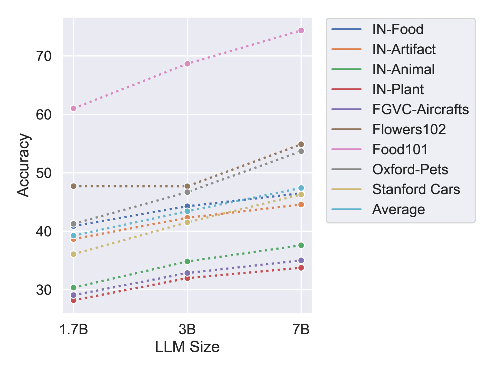

# 非洲燕还是欧洲燕？大型视觉-语言模型在细粒度物体分类上的基准测试

发布时间：2024年06月20日

`LLM应用

这篇论文主要介绍了FOCI基准，这是一个专为细粒度对象分类设计的挑战性多选基准，旨在评估大型视觉-语言模型（LVLMs）在细粒度对象分类任务上的表现。论文通过分析LVLMs在FOCI基准上的表现，指出了这些模型在细粒度对象区分上的不足，并提出了对更精细标注数据的需求。这一研究直接关联到大型语言模型（LLMs）的应用层面，特别是在视觉-语言模型中的应用，因此应归类为LLM应用。` `计算机视觉` `基准测试`

> African or European Swallow? Benchmarking Large Vision-Language Models for Fine-Grained Object Classification

# 摘要

> 近期的大型视觉-语言模型（LVLMs）在图像理解和推理任务上表现出色，但在细粒度对象分类（如动物物种区分）方面的研究尚显不足。为此，我们推出了FOCI——一个专为细粒度对象分类设计的挑战性多选基准，它基于现有数据集，通过多选题形式避免答案模糊，并利用CLIP模型挖掘负标签以维持分类难度。FOCI不仅丰富了五个主流分类数据集，还从ImageNet-21k中提取了四个特定领域子集。我们对12个公开的LVLMs进行了FOCI基准测试，发现它测试了与现有图像理解和推理基准互补的技能。值得注意的是，CLIP模型在此任务上的表现远超LVLMs，这暗示了LVLMs的图像编码器与LLM在细粒度对象区分上的对齐不足，需要更精细的标注数据进行（预）训练。相关代码已发布于https://github.com/gregor-ge/FOCI-Benchmark。

> Recent Large Vision-Language Models (LVLMs) demonstrate impressive abilities on numerous image understanding and reasoning tasks. The task of fine-grained object classification (e.g., distinction between \textit{animal species}), however, has been probed insufficiently, despite its downstream importance. We fill this evaluation gap by creating \texttt{FOCI} (\textbf{F}ine-grained \textbf{O}bject \textbf{C}lass\textbf{I}fication), a difficult multiple-choice benchmark for fine-grained object classification, from existing object classification datasets: (1) multiple-choice avoids ambiguous answers associated with casting classification as open-ended QA task; (2) we retain classification difficulty by mining negative labels with a CLIP model. \texttt{FOCI}\xspace complements five popular classification datasets with four domain-specific subsets from ImageNet-21k. We benchmark 12 public LVLMs on \texttt{FOCI} and show that it tests for a \textit{complementary skill} to established image understanding and reasoning benchmarks. Crucially, CLIP models exhibit dramatically better performance than LVLMs. Since the image encoders of LVLMs come from these CLIP models, this points to inadequate alignment for fine-grained object distinction between the encoder and the LLM and warrants (pre)training data with more fine-grained annotation. We release our code at \url{https://github.com/gregor-ge/FOCI-Benchmark}.

[Arxiv](https://arxiv.org/abs/2406.14496)