# 大型语言模型是否天生擅长于合成表格数据的生成？

发布时间：2024年06月20日

`LLM理论

这篇论文探讨了大型语言模型（LLMs）在生成表格数据方面的局限性，并提出了一种改进方法，以赋予LLMs排列感知能力，从而克服这些局限。这涉及到对LLMs工作原理的深入分析和理论改进，因此属于LLM理论分类。`

> Are LLMs Naturally Good at Synthetic Tabular Data Generation?

# 摘要

> 大型语言模型（LLMs）虽在合成文本和图像生成上表现出色，但在生成表格数据——商业与科学领域最常见的数据类型——的潜力却鲜为人知。本文揭示，未经特殊调整或仅通过传统微调的LLMs，在生成表格方面能力严重不足。由于LLMs的自回归本质，采用随机顺序微调方法与功能依赖建模的关键性相冲突，导致LLMs无法准确模拟现实世界中的条件混合分布。我们提出了一种方法，通过赋予LLMs排列感知能力，使其能够克服这些局限。

> Large language models (LLMs) have demonstrated their prowess in generating synthetic text and images; however, their potential for generating tabular data -- arguably the most common data type in business and scientific applications -- is largely underexplored. This paper demonstrates that LLMs, used as-is, or after traditional fine-tuning, are severely inadequate as synthetic table generators. Due to the autoregressive nature of LLMs, fine-tuning with random order permutation runs counter to the importance of modeling functional dependencies, and renders LLMs unable to model conditional mixtures of distributions (key to capturing real world constraints). We showcase how LLMs can be made to overcome some of these deficiencies by making them permutation-aware.

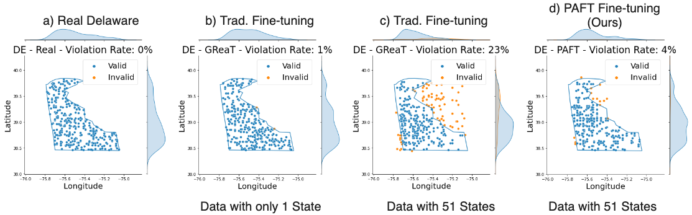

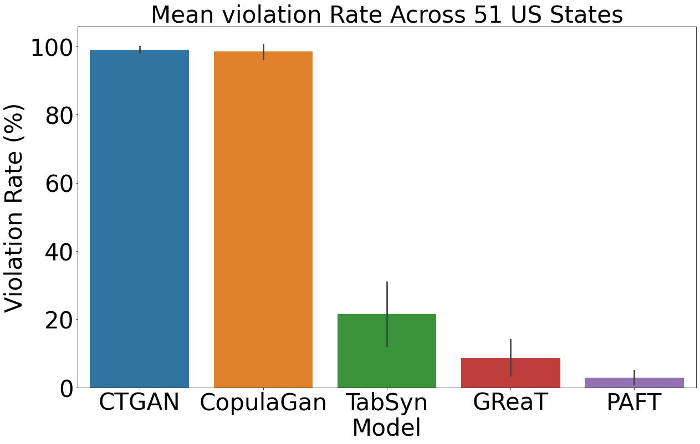

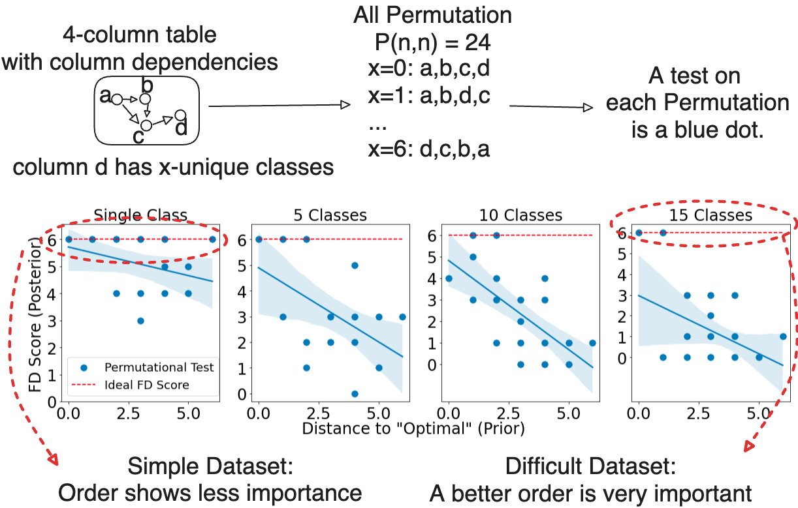

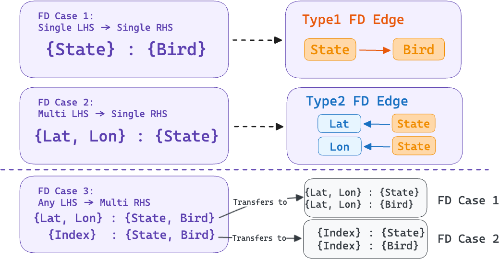

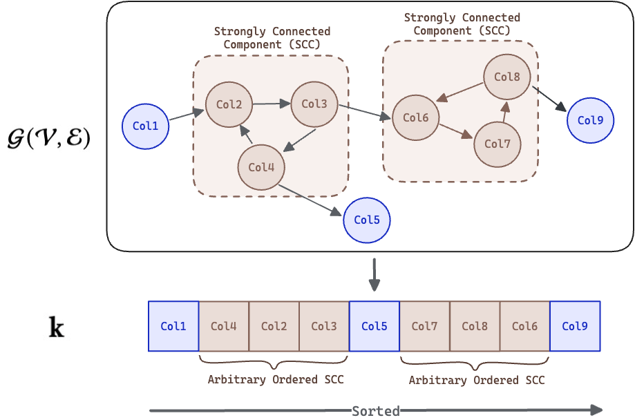

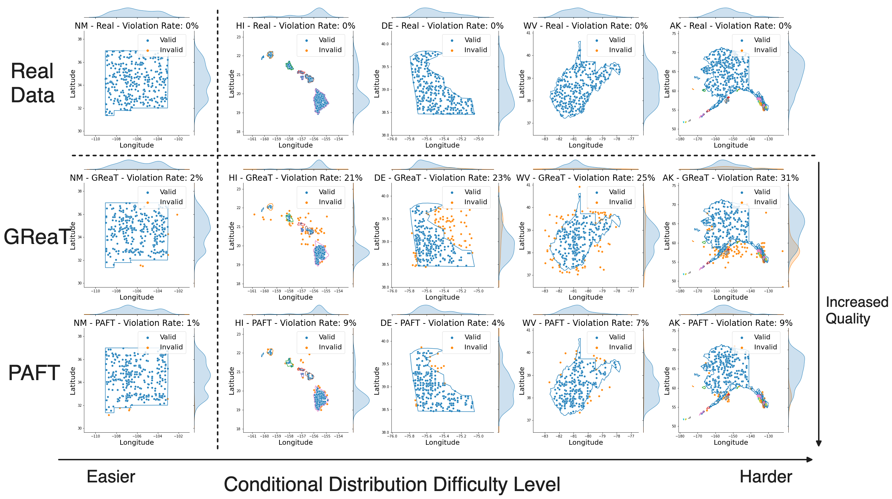

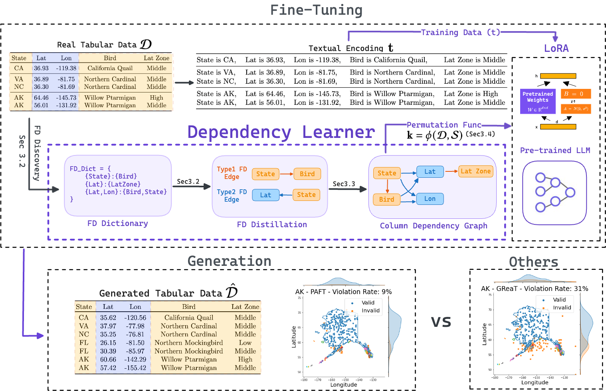

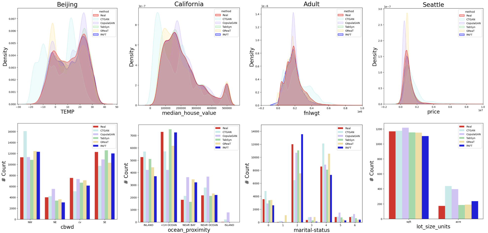

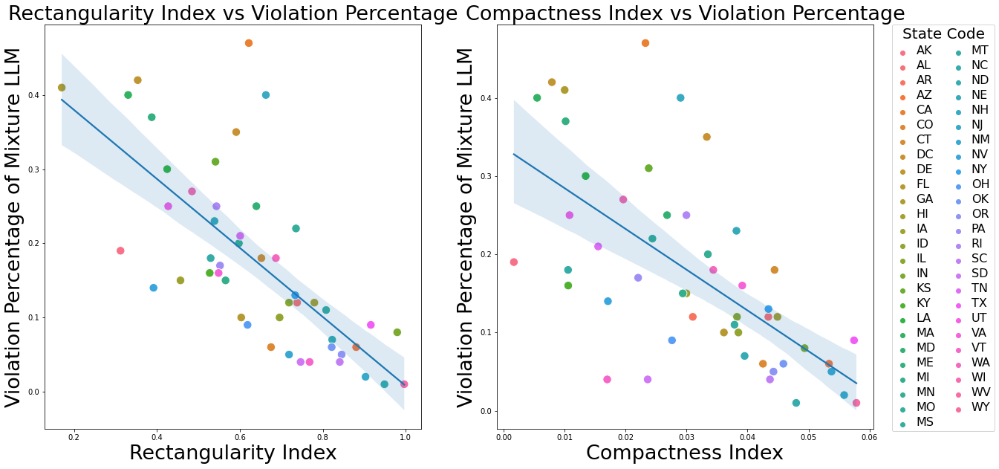

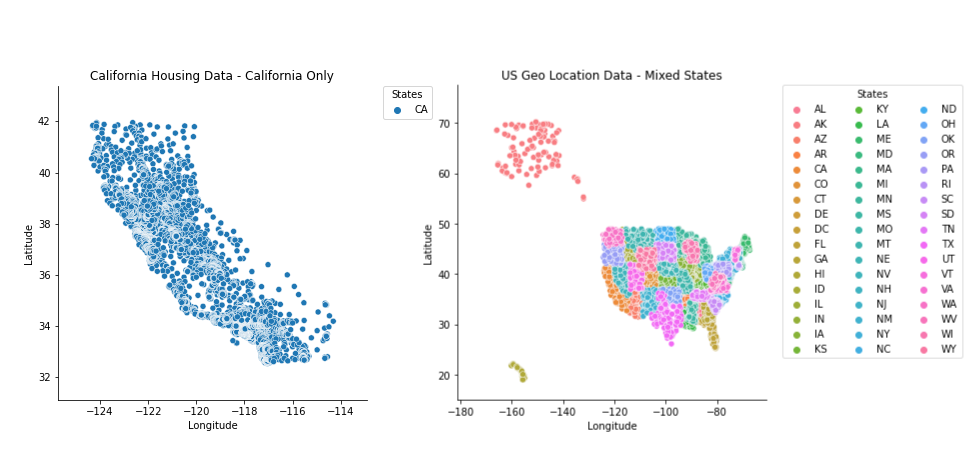

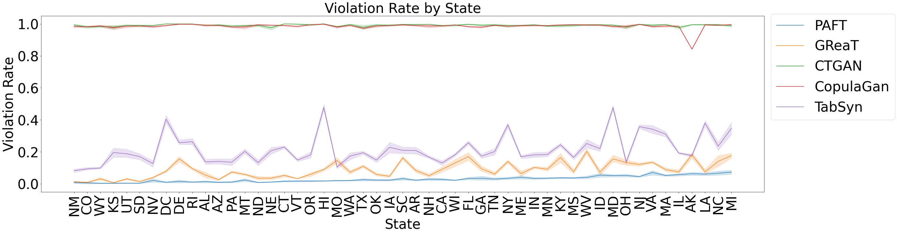

[Arxiv](https://arxiv.org/abs/2406.14541)