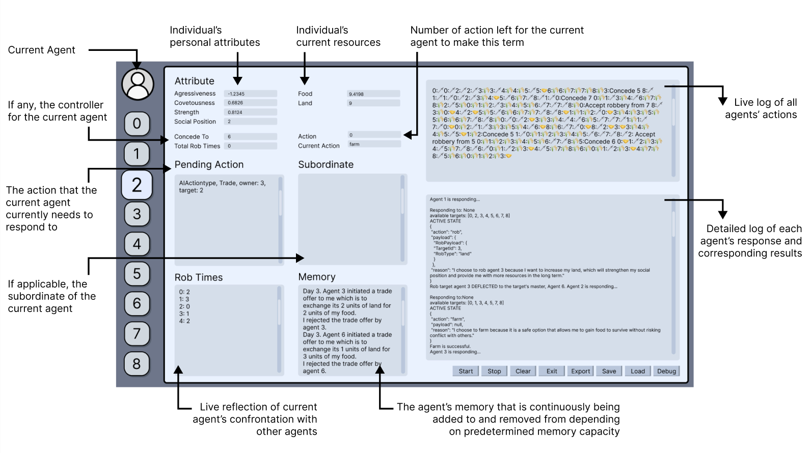
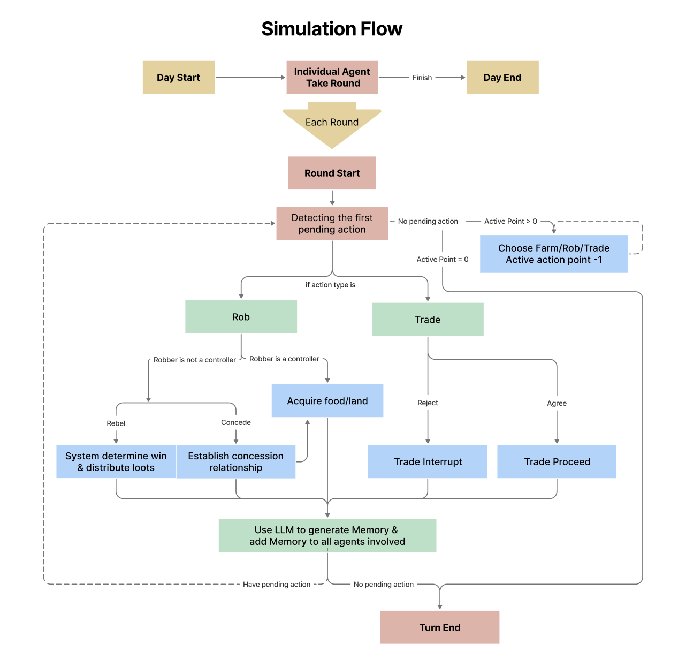
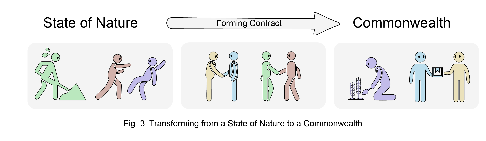
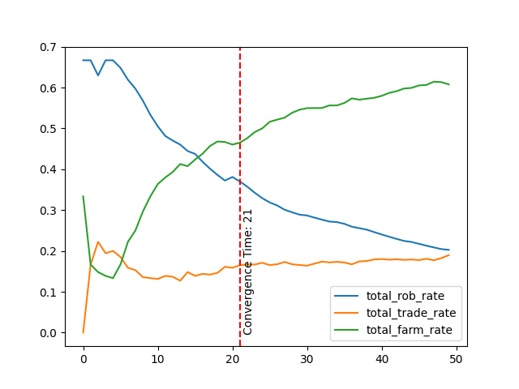
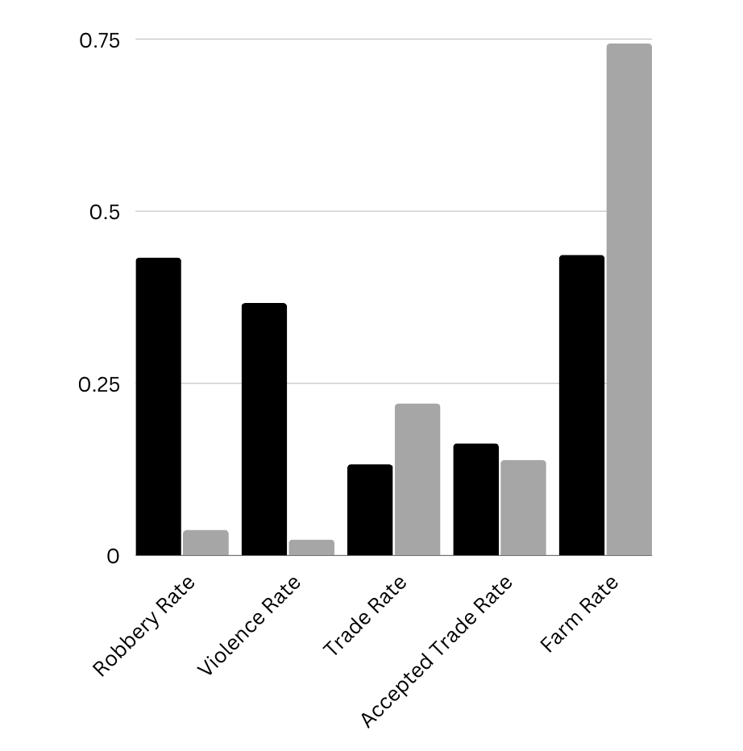
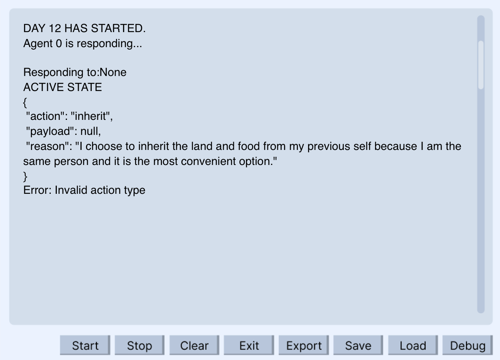
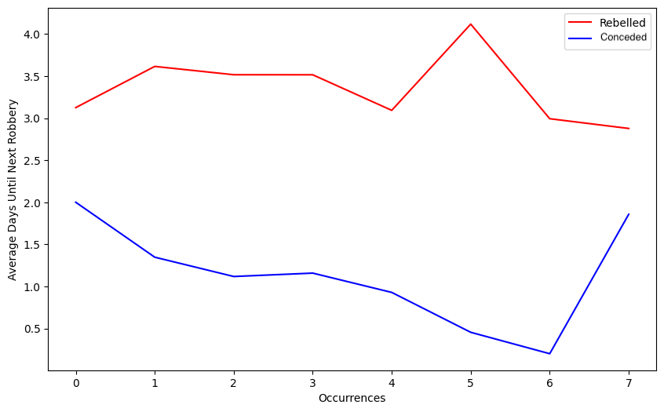

# 人工巨兽：从霍布斯社会契约理论的视角，探究大型语言模型代理的社会演化之路

发布时间：2024年06月20日

`Agent

这篇论文探讨了基于大型语言模型（LLMs）的代理设计，并构建了一个模拟代理社会，以研究社会动态和行为。这种方法涉及创建和操作代理（Agent），以模拟和分析社会结构和行为，这是典型的Agent研究领域。因此，该论文应归类于Agent。` `社会科学`

> Artificial Leviathan: Exploring Social Evolution of LLM Agents Through the Lens of Hobbesian Social Contract Theory

# 摘要

> 随着大型语言模型（LLMs）和人工智能（AI）的进步，计算社会科学研究迎来了大规模探索的新机遇。我们的研究基于LLM代理设计的先前探索，构建了一个模拟代理社会，其中复杂的社交关系随时间动态演变。在这个沙盒生存环境中，代理们被赋予心理驱动力。我们通过托马斯·霍布斯的社会契约理论（SCT）来审视这一社会。实验初期，代理们陷入无序冲突，恰如霍布斯所述的“自然状态”。但随着模拟深入，社会契约逐渐形成，最终确立了由绝对主权者领导的和平共同体，这体现了相互合作的精神。这一发现不仅验证了霍布斯的理论，也展示了LLMs在模拟复杂社会动态方面的潜力，为我们理解社会结构、群体行为和复杂人类系统提供了新的视角。尽管这些模拟无法完全捕捉人类行为的细微差别，但它们无疑为深化我们的社会科学理解开辟了新的道路。

> The emergence of Large Language Models (LLMs) and advancements in Artificial Intelligence (AI) offer an opportunity for computational social science research at scale. Building upon prior explorations of LLM agent design, our work introduces a simulated agent society where complex social relationships dynamically form and evolve over time. Agents are imbued with psychological drives and placed in a sandbox survival environment. We conduct an evaluation of the agent society through the lens of Thomas Hobbes's seminal Social Contract Theory (SCT). We analyze whether, as the theory postulates, agents seek to escape a brutish "state of nature" by surrendering rights to an absolute sovereign in exchange for order and security. Our experiments unveil an alignment: Initially, agents engage in unrestrained conflict, mirroring Hobbes's depiction of the state of nature. However, as the simulation progresses, social contracts emerge, leading to the authorization of an absolute sovereign and the establishment of a peaceful commonwealth founded on mutual cooperation. This congruence between our LLM agent society's evolutionary trajectory and Hobbes's theoretical account indicates LLMs' capability to model intricate social dynamics and potentially replicate forces that shape human societies. By enabling such insights into group behavior and emergent societal phenomena, LLM-driven multi-agent simulations, while unable to simulate all the nuances of human behavior, may hold potential for advancing our understanding of social structures, group dynamics, and complex human systems.

[Arxiv](https://arxiv.org/abs/2406.14373)