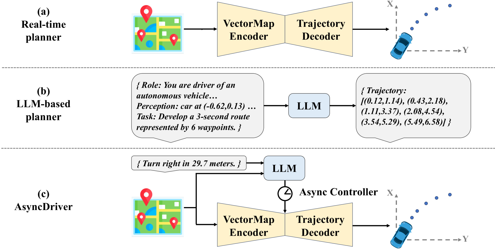
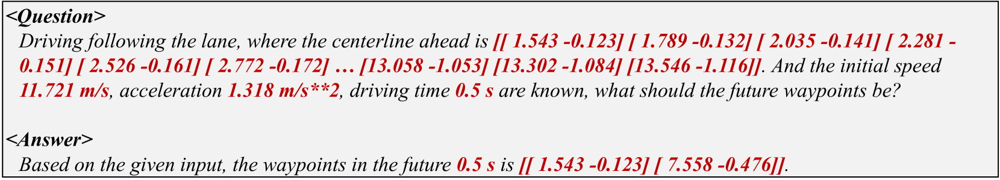

# 自动驾驶中的异步大型语言模型增强规划器

发布时间：2024年06月20日

`Agent

理由：这篇论文介绍了一种名为AsyncDriver的创新框架，它利用大型语言模型（LLMs）来增强实时规划器在自动驾驶领域的性能。该框架通过异步处理LLM和实时规划器的推理过程，降低了计算负担，并提高了性能。这种应用涉及到将LLM作为智能代理（Agent）的一部分，用于处理和理解场景数据，并生成指令以辅助实时规划器。因此，这篇论文更符合Agent分类，因为它描述了一个具体的应用场景，其中LLM被用作智能系统的一部分来执行特定的任务。` `自动驾驶` `运动规划`

> Asynchronous Large Language Model Enhanced Planner for Autonomous Driving

# 摘要

> 尽管实时规划器在自动驾驶领域表现卓越，但大型语言模型（LLMs）的深入研究为提升运动规划的透明度和控制性提供了新思路。然而，基于LLM的规划器仍面临资源消耗大和推理时间长的难题，严重影响了其实际应用。为此，我们推出了AsyncDriver，一种创新的异步LLM增强闭环框架，它利用LLM生成的场景相关指令特征，精准引导实时规划器进行轨迹预测。一方面，该方法展示了LLMs在处理矢量场景数据和路线指令时的强大理解与推理能力，有效辅助实时规划器。另一方面，AsyncDriver通过异步处理LLM和实时规划器的推理过程，显著降低了计算负担，同时保持了性能。实验结果显示，我们的方法在nuPlan的复杂场景中实现了闭环评估的优异表现。

> Despite real-time planners exhibiting remarkable performance in autonomous driving, the growing exploration of Large Language Models (LLMs) has opened avenues for enhancing the interpretability and controllability of motion planning. Nevertheless, LLM-based planners continue to encounter significant challenges, including elevated resource consumption and extended inference times, which pose substantial obstacles to practical deployment. In light of these challenges, we introduce AsyncDriver, a new asynchronous LLM-enhanced closed-loop framework designed to leverage scene-associated instruction features produced by LLM to guide real-time planners in making precise and controllable trajectory predictions. On one hand, our method highlights the prowess of LLMs in comprehending and reasoning with vectorized scene data and a series of routing instructions, demonstrating its effective assistance to real-time planners. On the other hand, the proposed framework decouples the inference processes of the LLM and real-time planners. By capitalizing on the asynchronous nature of their inference frequencies, our approach have successfully reduced the computational cost introduced by LLM, while maintaining comparable performance. Experiments show that our approach achieves superior closed-loop evaluation performance on nuPlan's challenging scenarios.

[Arxiv](https://arxiv.org/abs/2406.14556)