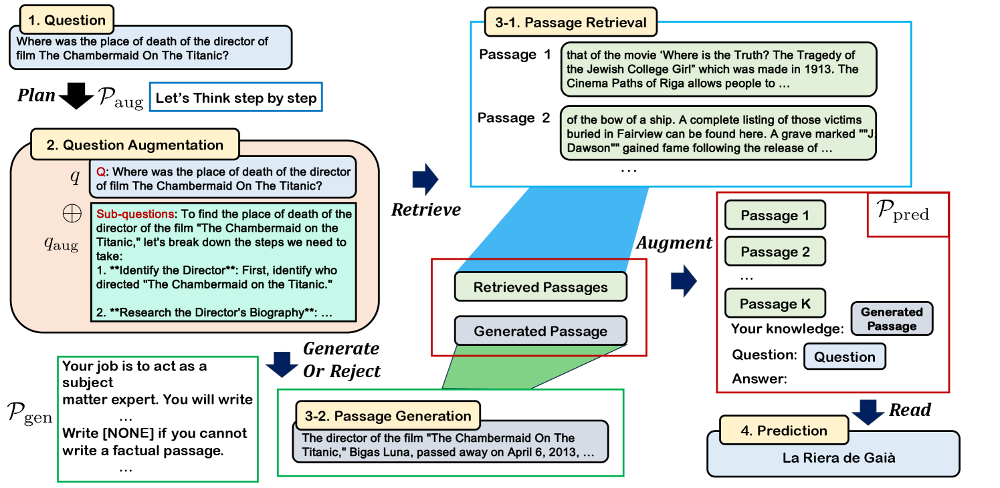

# 利用LLMs优化查询与段落，提升开放域问答中的检索增强生成能力

发布时间：2024年06月20日

`RAG

理由：这篇论文主要探讨了检索增强生成（RAG）技术在开放域问答（ODQA）任务中的应用，特别是在如何通过大型语言模型（LLMs）来增强问题与文本，以优化问答过程。论文提出了一种新的方法，通过细化问题和增强检索文本，来提高RAG方法的性能。这与RAG技术的核心目标和应用场景紧密相关，因此归类为RAG。` `问答系统`

> Augmenting Query and Passage for Retrieval-Augmented Generation using LLMs for Open-Domain Question Answering

# 摘要

> 检索增强生成（RAG）因其能弥补大型语言模型（LLMs）的参数知识而在开放域问答（ODQA）任务中备受瞩目。以往方法虽致力于过滤检索文本中的无关内容，但仍高度依赖检索文本的质量，一旦问题含糊或复杂，质量便可能受损。本文提出一种简洁高效的方法——通过LLMs增强问题与文本，以优化开放域问答。首先，我们将原始问题细化为一系列子问题，并结合详细规划，使查询更精准，从而提升检索效率。针对检索文本中可能出现的干扰信息或观点分歧，我们利用LLMs生成的内容对其进行增强，以精准引导答案提取。实验证明，该方法超越了现有技术，显著提升了RAG方法的性能。

> Retrieval-augmented generation (RAG) has received much attention for Open-domain question-answering (ODQA) tasks as a means to compensate for the parametric knowledge of large language models (LLMs). While previous approaches focused on processing retrieved passages to remove irrelevant context, they still rely heavily on the quality of retrieved passages which can degrade if the question is ambiguous or complex. In this paper, we propose a simple yet efficient method called question and passage augmentation via LLMs for open-domain QA. Our method first decomposes the original questions into multiple-step sub-questions. By augmenting the original question with detailed sub-questions and planning, we are able to make the query more specific on what needs to be retrieved, improving the retrieval performance. In addition, to compensate for the case where the retrieved passages contain distracting information or divided opinions, we augment the retrieved passages with self-generated passages by LLMs to guide the answer extraction. Experimental results show that the proposed scheme outperforms the previous state-of-the-art and achieves significant performance gain over existing RAG methods.

[Arxiv](https://arxiv.org/abs/2406.14277)