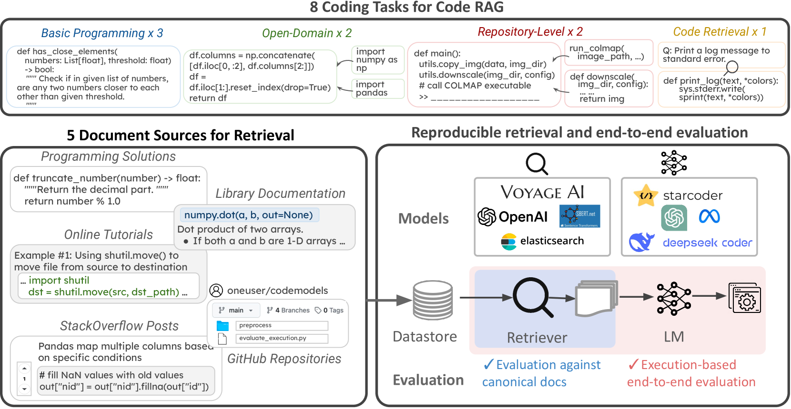
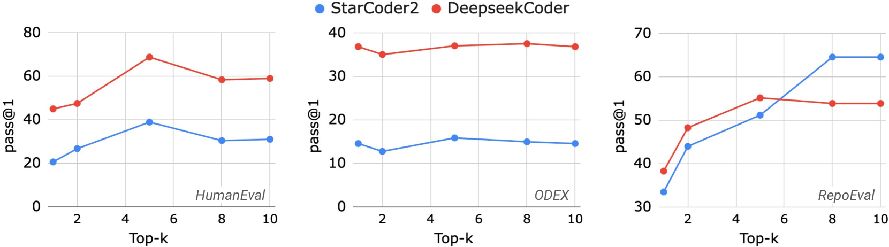
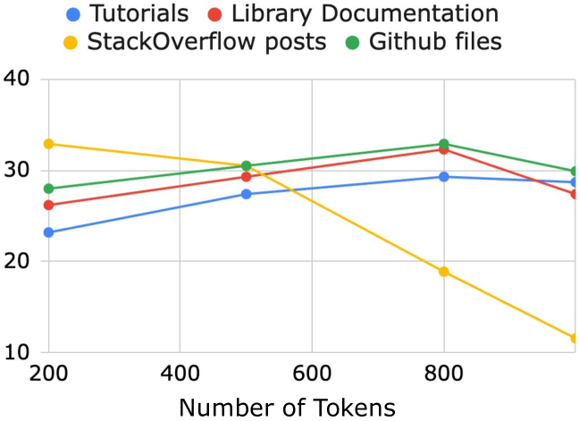
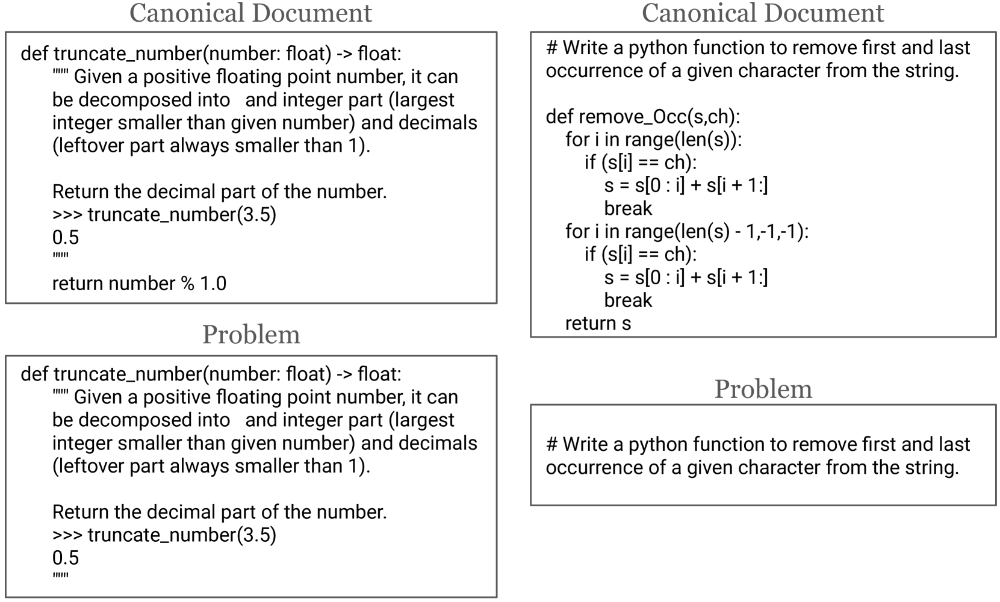
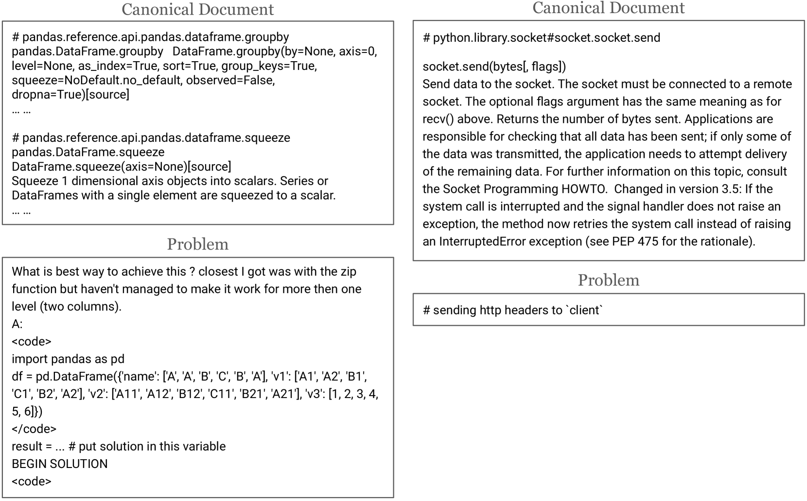
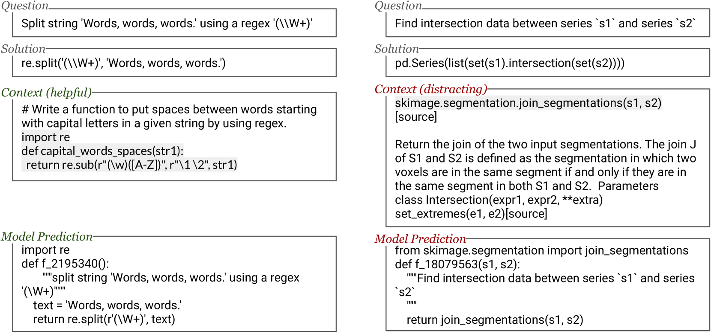

# CodeRAG-Bench：探索检索增强技术在代码生成中的潜力。

发布时间：2024年06月20日

`RAG

这篇论文主要探讨了检索增强生成（RAG）技术在代码生成领域的应用和挑战。通过构建CodeRAG-Bench评估基准，研究了在不同编程任务中引入外部上下文（如库文档）对代码生成质量的影响。论文关注的是RAG技术在特定应用场景（代码生成）中的实际效果和存在的问题，因此属于RAG分类。` `代码生成`

> CodeRAG-Bench: Can Retrieval Augment Code Generation?

# 摘要

> 语言模型虽擅长生成代码，但许多程序仅依赖其内置知识难以完成。引入外部上下文，如库文档，能助其产出更精确、实用的代码。尽管检索增强生成（RAG）在文本任务中已显成效，其在代码生成上的潜力却鲜为人知。本研究深入探讨：何时检索能助力代码生成？又面临哪些挑战？我们构建了CodeRAG-Bench评估基准，覆盖基础编程、开放领域及仓库级代码生成三大任务，并整合了来自竞赛、教程、文档、论坛及代码库的五类文档资源。我们测试了顶尖模型，通过提供单一或多元来源的检索上下文，发现高质量上下文的引入显著提升了代码质量，但仍存在改进空间：检索器在词汇重叠有限时难以获取有用信息，生成器在上下文受限或整合能力不足时表现不佳。我们期待CodeRAG-Bench成为推动高级代码生成RAG技术发展的有力平台。

> While language models (LMs) have proven remarkably adept at generating code, many programs are challenging for LMs to generate using their parametric knowledge alone. Providing external contexts such as library documentation can facilitate generating accurate and functional code. Despite the success of retrieval-augmented generation (RAG) in various text-oriented tasks, its potential for improving code generation remains under-explored. In this work, we conduct a systematic, large-scale analysis by asking: in what scenarios can retrieval benefit code generation models? and what challenges remain? We first curate a comprehensive evaluation benchmark, CodeRAG-Bench, encompassing three categories of code generation tasks, including basic programming, open-domain, and repository-level problems. We aggregate documents from five sources for models to retrieve contexts: competition solutions, online tutorials, library documentation, StackOverflow posts, and GitHub repositories. We examine top-performing models on CodeRAG-Bench by providing contexts retrieved from one or multiple sources. While notable gains are made in final code generation by retrieving high-quality contexts across various settings, our analysis reveals room for improvement -- current retrievers still struggle to fetch useful contexts especially with limited lexical overlap, and generators fail to improve with limited context lengths or abilities to integrate additional contexts. We hope CodeRAG-Bench serves as an effective testbed to encourage further development of advanced code-oriented RAG methods.

[Arxiv](https://arxiv.org/abs/2406.14497)