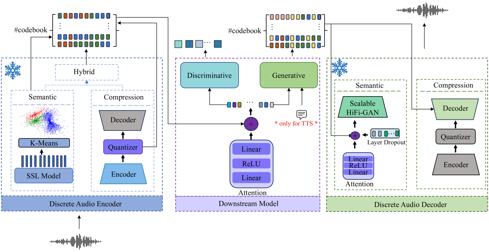
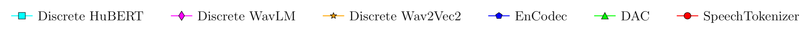
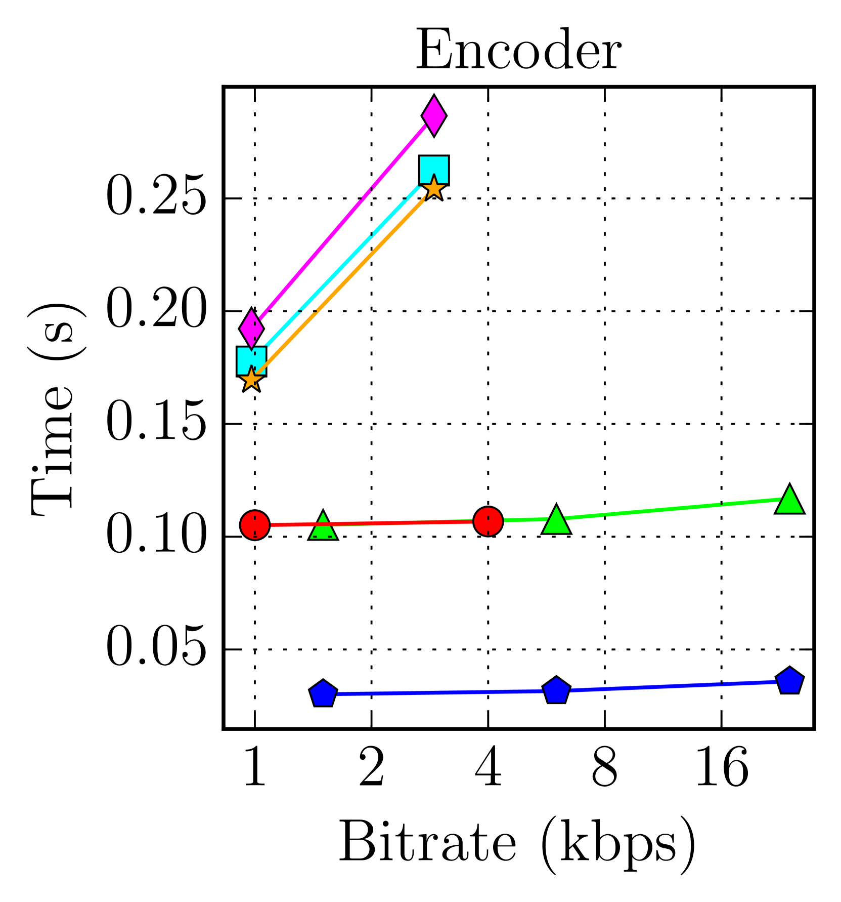
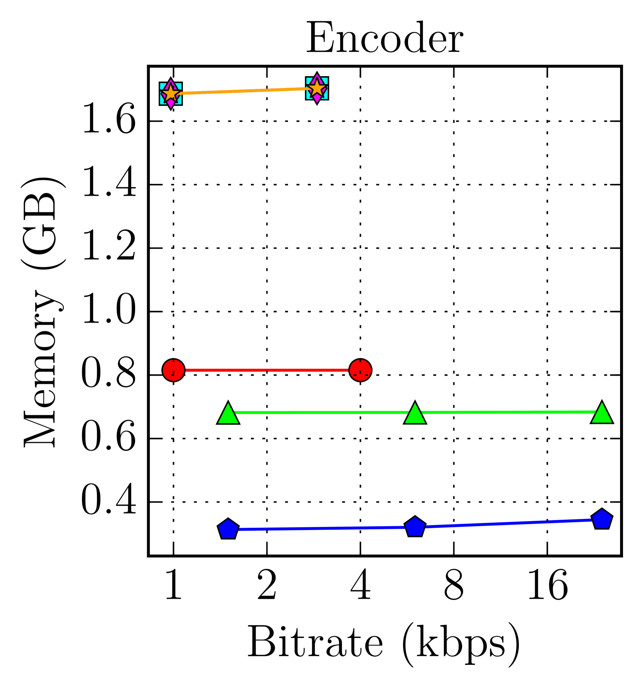
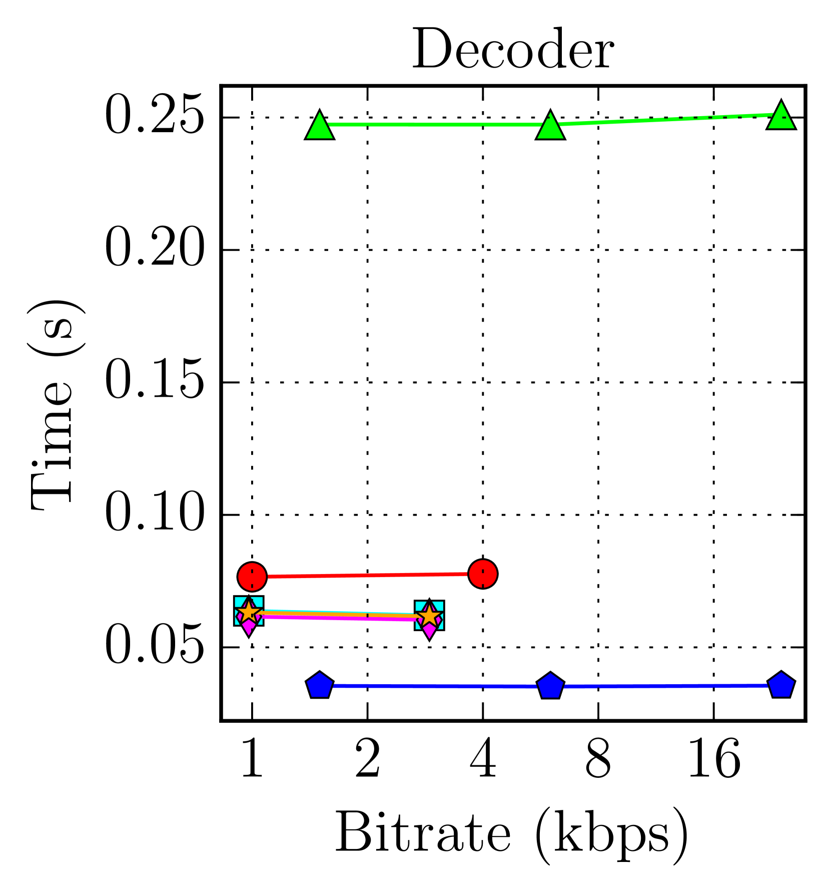
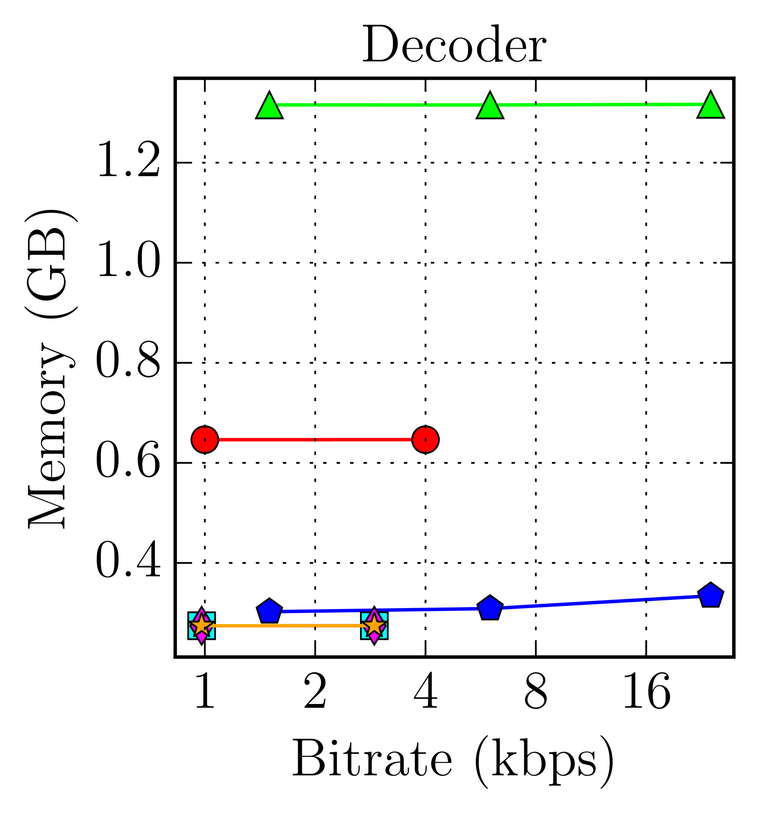

# DASB - 离散音频与语音评测标准

发布时间：2024年06月20日

`LLM应用

这篇论文主要关注离散音频令牌在多模态大型语言模型中的应用，并提出了一个全面的基准（DASB）来评估不同音频令牌化器在多个任务上的表现。虽然涉及到音频令牌的理论和应用，但其核心贡献在于推动多模态大型语言模型的发展，特别是在音频处理方面，因此更适合归类为LLM应用。` `音频处理` `多模态学习`

> DASB -- Discrete Audio and Speech Benchmark

# 摘要

> 近期，离散音频令牌因其连接音频与语言处理、推动现代多模态大型语言模型发展的潜力而备受瞩目。理想的音频令牌需高效保留语音、语义内容及副语言信息、说话者身份等细节。尽管已有多种音频令牌被提出，但因现有研究评估设置不一，为各类任务选定最佳令牌化器仍具挑战。为此，我们推出了离散音频与语音基准（DASB），一个全面排行榜，涵盖语音识别、说话者识别与验证、情感识别、关键词检测、意图分类等区分性任务，以及语音增强、分离、文本转语音等生成任务。结果显示，在多数任务中，语义令牌平均表现优于压缩令牌。然而，语义令牌与传统连续表示间的性能差距依然显著，表明该领域亟需深入研究。

> Discrete audio tokens have recently gained considerable attention for their potential to connect audio and language processing, enabling the creation of modern multimodal large language models. Ideal audio tokens must effectively preserve phonetic and semantic content along with paralinguistic information, speaker identity, and other details. While several types of audio tokens have been recently proposed, identifying the optimal tokenizer for various tasks is challenging due to the inconsistent evaluation settings in existing studies. To address this gap, we release the Discrete Audio and Speech Benchmark (DASB), a comprehensive leaderboard for benchmarking discrete audio tokens across a wide range of discriminative tasks, including speech recognition, speaker identification and verification, emotion recognition, keyword spotting, and intent classification, as well as generative tasks such as speech enhancement, separation, and text-to-speech. Our results show that, on average, semantic tokens outperform compression tokens across most discriminative and generative tasks. However, the performance gap between semantic tokens and standard continuous representations remains substantial, highlighting the need for further research in this field.

[Arxiv](https://arxiv.org/abs/2406.14294)