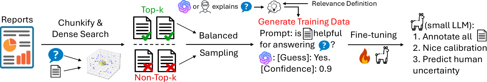
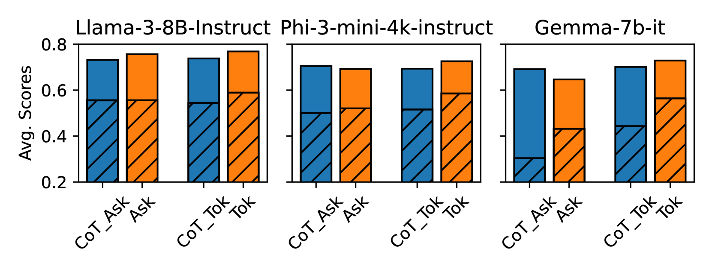
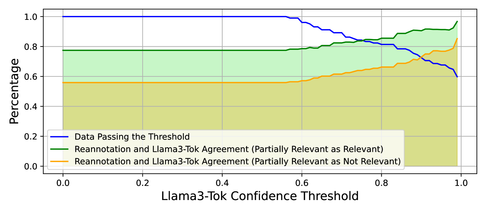
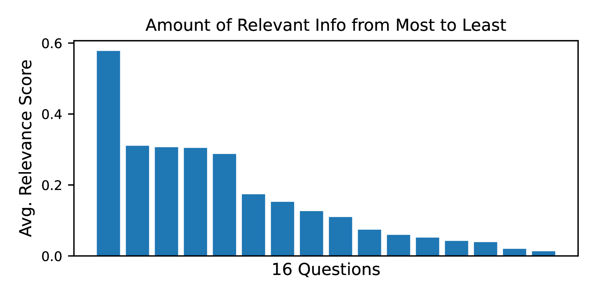
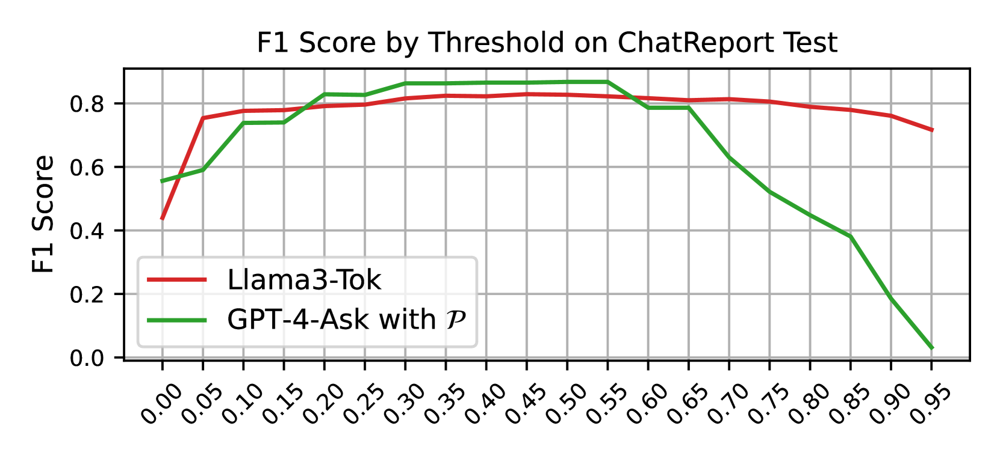
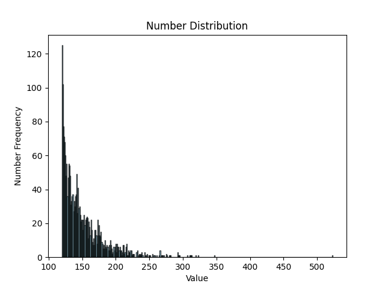
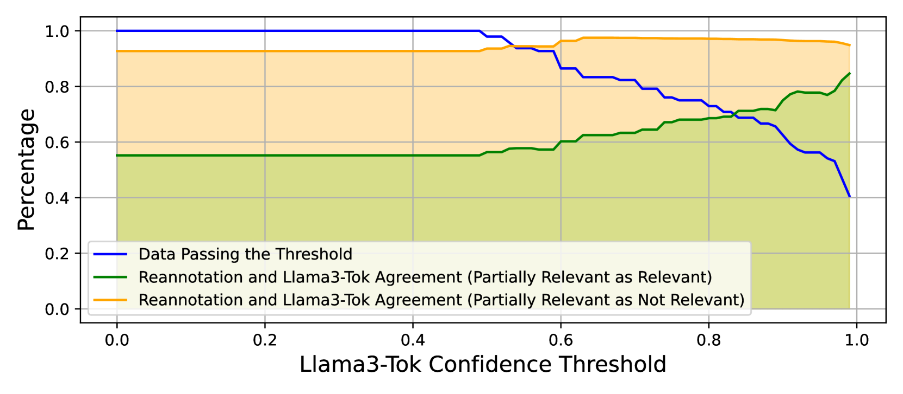
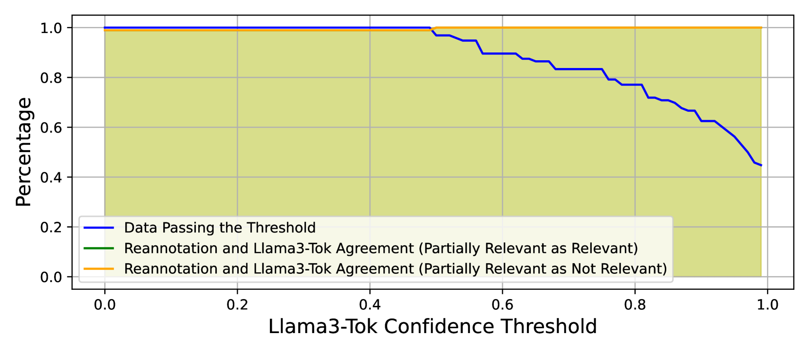

# DIRAS：借助大型语言模型，高效标注检索增强生成中的文档相关性

发布时间：2024年06月20日

`RAG

理由：这篇论文主要关注的是Retrieval Augmented Generation (RAG) 系统中的信息检索性能评估问题，并提出了一种新的标注方案DIRAS来解决这一问题。虽然涉及到了微调开源LLMs，但这主要是为了实现高效的标注过程，而不是探讨LLM的理论或应用。因此，这篇论文更符合RAG分类，因为它直接关联到RAG系统的改进和优化。` `信息检索`

> DIRAS: Efficient LLM-Assisted Annotation of Document Relevance in Retrieval Augmented Generation

# 摘要

> Retrieval Augmented Generation (RAG) 常用于基于特定领域文档生成查询响应，但其是否遗漏关键信息或包含过多无关内容？为解决此问题，我们需对特定领域基准进行标注，以评估信息检索性能，因相关性定义随查询和领域变化，且标注过程应高效避免偏差。本文提出 DIRAS（特定领域信息检索可扩展标注），一种无需人工的标注方案，通过微调开源 LLMs 来精确标注相关性，并校准概率。评估显示，DIRAS 微调模型在处理未知（查询，文档）对时表现卓越，对 RAG 实际开发大有裨益。

> Retrieval Augmented Generation (RAG) is widely employed to ground responses to queries on domain-specific documents. But do RAG implementations leave out important information or excessively include irrelevant information? To allay these concerns, it is necessary to annotate domain-specific benchmarks to evaluate information retrieval (IR) performance, as relevance definitions vary across queries and domains. Furthermore, such benchmarks should be cost-efficiently annotated to avoid annotation selection bias. In this paper, we propose DIRAS (Domain-specific Information Retrieval Annotation with Scalability), a manual-annotation-free schema that fine-tunes open-sourced LLMs to annotate relevance labels with calibrated relevance probabilities. Extensive evaluation shows that DIRAS fine-tuned models achieve GPT-4-level performance on annotating and ranking unseen (query, document) pairs, and is helpful for real-world RAG development.

[Arxiv](https://arxiv.org/abs/2406.14162)