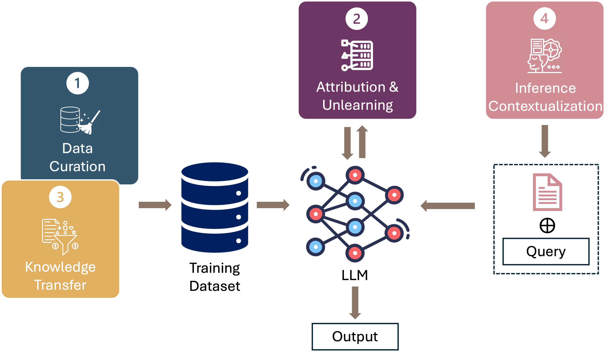

# 在大语言模型时代，数据中心AI的新篇章

发布时间：2024年06月20日

`LLM理论

这篇论文关注的是大型语言模型（LLMs）中数据的核心作用，并提出了以数据为中心的研究视角。它探讨了数据在LLMs预训练、微调及情境学习等阶段的重要性，并识别了与数据相关的四个关键场景。这些讨论和建议主要集中在理论层面，强调了数据在LLM研究中的重要性，并提出了新的研究方向。因此，这篇论文更适合归类于LLM理论，因为它主要是在理论层面上探讨和分析数据在LLMs中的作用和影响。` `人工智能研究` `数据管理`

> Data-Centric AI in the Age of Large Language Models

# 摘要

> 本文提出了一种以数据为核心的AI研究视角，特别关注大型语言模型（LLMs）。我们首先观察到，数据在LLMs的预训练、微调及情境学习等关键阶段扮演着重要角色，然而研究界对此关注不足。我们围绕数据识别了四个关键场景，涉及数据基准、数据管理、数据归属、知识转移和推理情境化。在每个场景中，我们强调数据的重要性，并指出了研究的新方向及其对学术界乃至社会的潜在影响。例如，我们主张建立一套针对LLMs数据特性的数据中心基准，以促进新数据管理方法的开发，并记录研究进展，从而提升AI和LLM研究的开放性与透明度。

> This position paper proposes a data-centric viewpoint of AI research, focusing on large language models (LLMs). We start by making the key observation that data is instrumental in the developmental (e.g., pretraining and fine-tuning) and inferential stages (e.g., in-context learning) of LLMs, and yet it receives disproportionally low attention from the research community. We identify four specific scenarios centered around data, covering data-centric benchmarks and data curation, data attribution, knowledge transfer, and inference contextualization. In each scenario, we underscore the importance of data, highlight promising research directions, and articulate the potential impacts on the research community and, where applicable, the society as a whole. For instance, we advocate for a suite of data-centric benchmarks tailored to the scale and complexity of data for LLMs. These benchmarks can be used to develop new data curation methods and document research efforts and results, which can help promote openness and transparency in AI and LLM research.

[Arxiv](https://arxiv.org/abs/2406.14473)