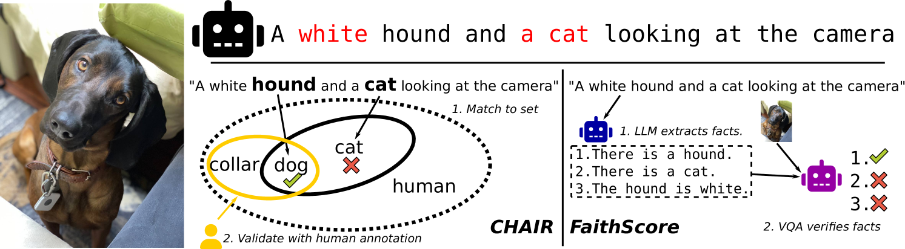
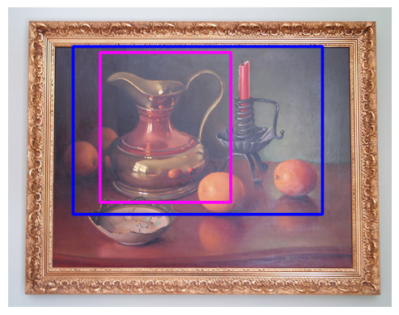
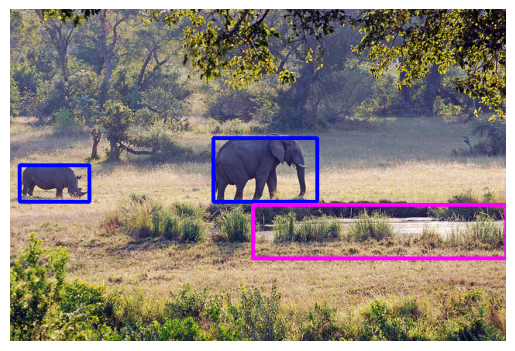
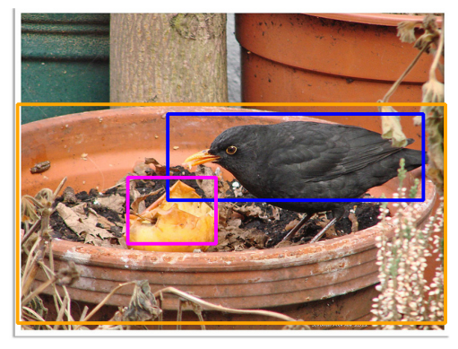

# 对象基础化是否真能减少大型视觉-语言模型中的幻觉现象？

发布时间：2024年06月20日

`LLM应用

这篇论文主要探讨了大型视觉-语言模型（LVLMs）在图像描述任务中的幻觉问题，并分析了通过增加接地目标来减少幻觉的效果。研究关注的是模型的应用层面，即如何改进模型以提高其在实际任务中的表现，因此属于LLM应用分类。` `图像理解` `视觉问答`

> Does Object Grounding Really Reduce Hallucination of Large Vision-Language Models?

# 摘要

> 大型视觉-语言模型（LVLMs）近期在图像描述及多项图像理解任务（如视觉问答）中取得了显著进展。然而，这些模型常产生幻觉，创造出图像中不存在的概念描述，这不仅削弱了模型的可信度，也成为其广泛应用的主要障碍。有研究提出，通过增加接地目标——即将图像元素与文本精确对齐——可以减少幻觉。但这一观点缺乏实证支持，因为现有评估方法存在缺陷，依赖于过度使用的训练数据，且通过问答而非开放式描述来评估幻觉。本研究首次系统地分析了细粒度对象接地对LVLMs在开放生成中幻觉的影响，采用了一种更贴近实际的评估方法。我们的实验结果显示，接地目标对开放式描述中的对象幻觉影响甚微。

> Large vision-language models (LVLMs) have recently dramatically pushed the state of the art in image captioning and many image understanding tasks (e.g., visual question answering). LVLMs, however, often \textit{hallucinate} and produce captions that mention concepts that cannot be found in the image. These hallucinations erode the trustworthiness of LVLMs and are arguably among the main obstacles to their ubiquitous adoption. Recent work suggests that addition of grounding objectives -- those that explicitly align image regions or objects to text spans -- reduces the amount of LVLM hallucination. Although intuitive, this claim is not empirically justified as the reduction effects have been established, we argue, with flawed evaluation protocols that (i) rely on data (i.e., MSCOCO) that has been extensively used in LVLM training and (ii) measure hallucination via question answering rather than open-ended caption generation. In this work, in contrast, we offer the first systematic analysis of the effect of fine-grained object grounding on LVLM hallucination under an evaluation protocol that more realistically captures LVLM hallucination in open generation. Our extensive experiments over three backbone LLMs reveal that grounding objectives have little to no effect on object hallucination in open caption generation.

[Arxiv](https://arxiv.org/abs/2406.14492)