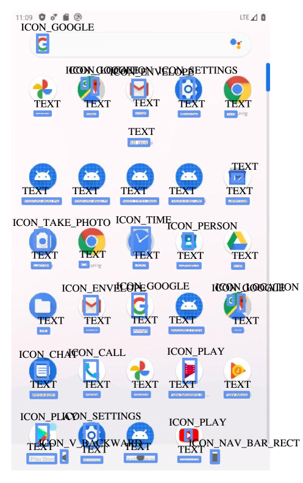

# E-ANT：大型数据集助力高效自动GUI导航

发布时间：2024年06月20日

`LLM应用

这篇论文主要介绍了针对多模态大型语言模型（MLLM）在移动设备上的在线GUI导航应用中，如何通过创建和评估一个新的中文数据集**E-ANT**来提升模型的决策能力。论文的核心贡献在于数据集的开发和使用，这直接关联到LLM在特定应用场景（即GUI导航）的实际应用和性能提升。因此，这篇论文应归类于LLM应用。` `移动应用` `数据集开发`

> E-ANT: A Large-Scale Dataset for Efficient Automatic GUI NavigaTion

# 摘要

> 移动设备上的在线GUI导航近年来备受瞩目，因其对众多实际应用的贡献。随着大型语言模型（LLM）的迅猛发展，多模态大型语言模型（MLLM）在这一领域展现出巨大潜力。但现有MLLMs需依赖高质量数据以提升根据用户输入做出正确导航决策的能力。为此，我们推出了首个中文GUI导航数据集**E-ANT**，它不仅包含近40,000条真实用户轨迹，还附有高质截图和详细标注，覆盖超过5000种微型应用。我们在E-ANT上对多种MLLMs进行了深入评估，并展示了详尽的实验结果。我们坚信，E-ANT数据集将为GUI导航及LLM/MLLM决策能力的研究与开发提供宝贵资源。

> Online GUI navigation on mobile devices has driven a lot of attention recent years since it contributes to many real-world applications. With the rapid development of large language models (LLM), multimodal large language models (MLLM) have tremendous potential on this task. However, existing MLLMs need high quality data to improve its abilities of making the correct navigation decisions according to the human user inputs. In this paper, we developed a novel and highly valuable dataset, named \textbf{E-ANT}, as the first Chinese GUI navigation dataset that contains real human behaviour and high quality screenshots with annotations, containing nearly 40,000 real human traces over 5000+ different tinyAPPs. Furthermore, we evaluate various powerful MLLMs on E-ANT and show their experiments results with sufficient ablations. We believe that our proposed dataset will be beneficial for both the evaluation and development of GUI navigation and LLM/MLLM decision-making capabilities.

[Arxiv](https://arxiv.org/abs/2406.14250)