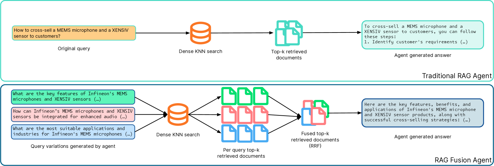
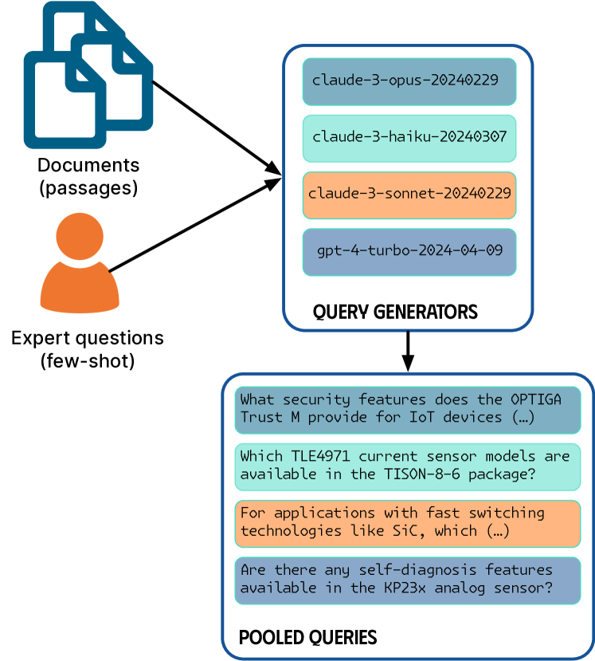
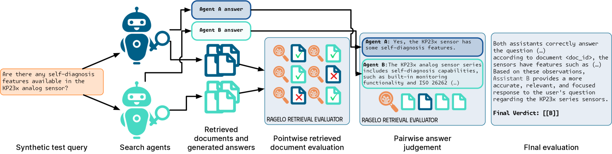
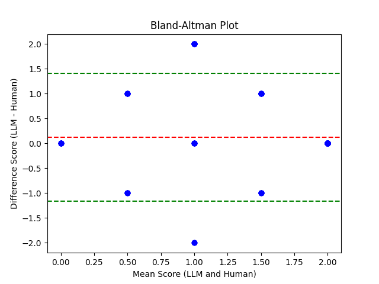

# 利用 RAGElo 自动化框架评估 RAG-Fusion：基于 Elo 的性能分析

发布时间：2024年06月20日

`RAG

这篇论文主要关注的是检索增强生成（RAG）问答系统的评估，特别是在特定领域知识幻觉和缺乏内部任务金标准基准的情况下。论文提出了一种综合评估框架，利用大型语言模型（LLMs）生成合成查询，并使用LLM作为评判来评估检索内容和答案。此外，还使用了RAGElo的自动Elo竞赛来比较不同RAG代理的性能。因此，这篇论文的内容与RAG系统的应用和评估紧密相关，属于RAG分类。` `问答系统` `半导体`

> Evaluating RAG-Fusion with RAGElo: an Automated Elo-based Framework

# 摘要

> 在评估检索增强生成（RAG）问答系统时，我们面临特定领域知识幻觉和缺乏内部任务金标准基准的挑战。这使得在英飞凌科技的产品QA任务中评估RAG变体（如RAG-Fusion）变得复杂。为此，我们提出了一种综合评估框架，它利用大型语言模型（LLMs）生成大量基于真实用户查询和领域文档的合成查询，使用LLM作为评判来评估检索内容和答案，并使用RAGElo的自动Elo竞赛来比较不同RAG代理的性能。LLM的评级与专家在相关性、准确性、完整性和精确性方面的评分显示出适度的正相关。尽管RAGF在Elo评分上超越了RAG，但在精确性方面表现不佳。英飞凌的RAGF助手在文档相关性方面表现更佳。RAGElo与人类注释者的偏好相符，但需谨慎。最终，RAGF的方法根据专家注释和RAGElo标准，提供了更完整和更优质的答案。

> Challenges in the automated evaluation of Retrieval-Augmented Generation (RAG) Question-Answering (QA) systems include hallucination problems in domain-specific knowledge and the lack of gold standard benchmarks for company internal tasks. This results in difficulties in evaluating RAG variations, like RAG-Fusion (RAGF), in the context of a product QA task at Infineon Technologies. To solve these problems, we propose a comprehensive evaluation framework, which leverages Large Language Models (LLMs) to generate large datasets of synthetic queries based on real user queries and in-domain documents, uses LLM-as-a-judge to rate retrieved documents and answers, evaluates the quality of answers, and ranks different variants of Retrieval-Augmented Generation (RAG) agents with RAGElo's automated Elo-based competition. LLM-as-a-judge rating of a random sample of synthetic queries shows a moderate, positive correlation with domain expert scoring in relevance, accuracy, completeness, and precision. While RAGF outperformed RAG in Elo score, a significance analysis against expert annotations also shows that RAGF significantly outperforms RAG in completeness, but underperforms in precision. In addition, Infineon's RAGF assistant demonstrated slightly higher performance in document relevance based on MRR@5 scores. We find that RAGElo positively aligns with the preferences of human annotators, though due caution is still required. Finally, RAGF's approach leads to more complete answers based on expert annotations and better answers overall based on RAGElo's evaluation criteria.

[Arxiv](https://arxiv.org/abs/2406.14783)