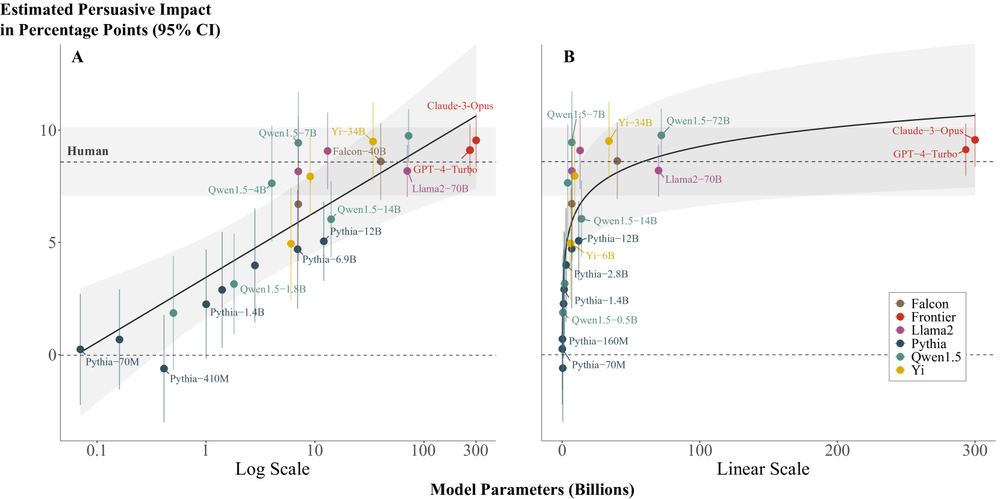
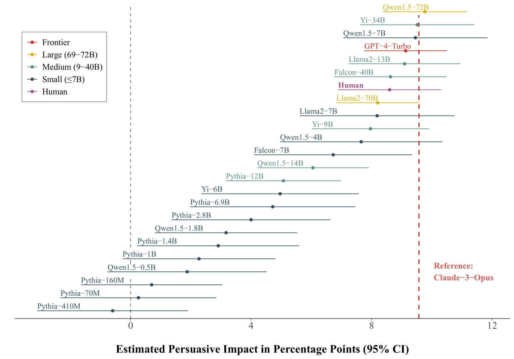
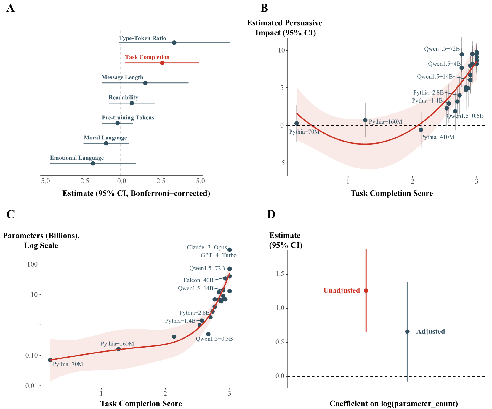
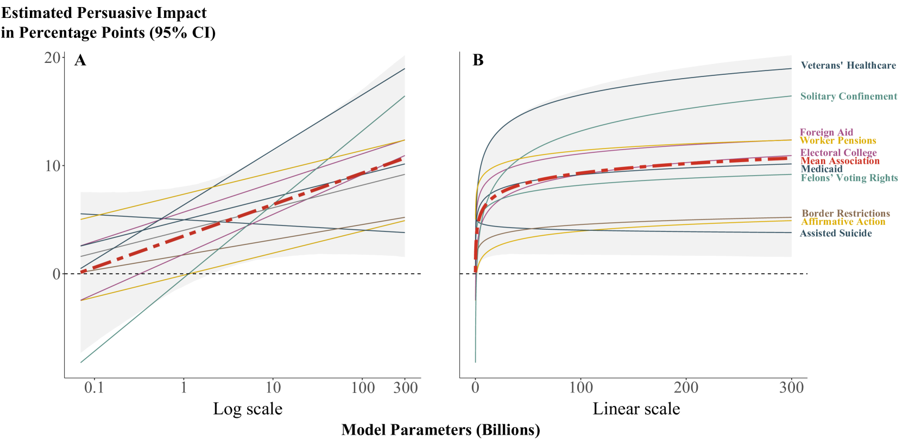

# 大型语言模型揭示了政治说服能力的对数缩放定律

发布时间：2024年06月20日

`LLM理论

这篇论文主要探讨了大型语言模型（LLM）在生成政治信息时的说服力，并研究了模型规模与说服力之间的关系。通过实验和分析，论文揭示了对数缩放定律，并讨论了模型规模对说服力的影响。这些内容属于对LLM理论的探讨，特别是关于模型规模与性能之间的关系，因此应归类为LLM理论。` `社会科学`

> Evidence of a log scaling law for political persuasion with large language models

# 摘要

> 大型语言模型如今能产出与人类无异的政治信息，其说服力之强引发了对模型规模扩大后说服力可能持续增强的担忧。为此，我们利用24个不同规模的语言模型，针对10个美国政治议题生成了720条有说服力的信息，并通过一项涉及25,982人的大规模随机调查实验来评估各模型的说服力。研究发现双管齐下：一是揭示了对数缩放定律，表明模型的说服力回报急剧减少，当前顶尖模型与小一个数量级以上的模型相比，说服力提升微乎其微；二是大模型之所以更具说服力，主要在于其任务完成度（如内容的连贯性和主题相关性）。这表明，单纯扩大模型规模对提升静态LLM生成信息的说服力效果有限。

> Large language models can now generate political messages as persuasive as those written by humans, raising concerns about how far this persuasiveness may continue to increase with model size. Here, we generate 720 persuasive messages on 10 U.S. political issues from 24 language models spanning several orders of magnitude in size. We then deploy these messages in a large-scale randomized survey experiment (N = 25,982) to estimate the persuasive capability of each model. Our findings are twofold. First, we find evidence of a log scaling law: model persuasiveness is characterized by sharply diminishing returns, such that current frontier models are barely more persuasive than models smaller in size by an order of magnitude or more. Second, mere task completion (coherence, staying on topic) appears to account for larger models' persuasive advantage. These findings suggest that further scaling model size will not much increase the persuasiveness of static LLM-generated messages.

[Arxiv](https://arxiv.org/abs/2406.14508)