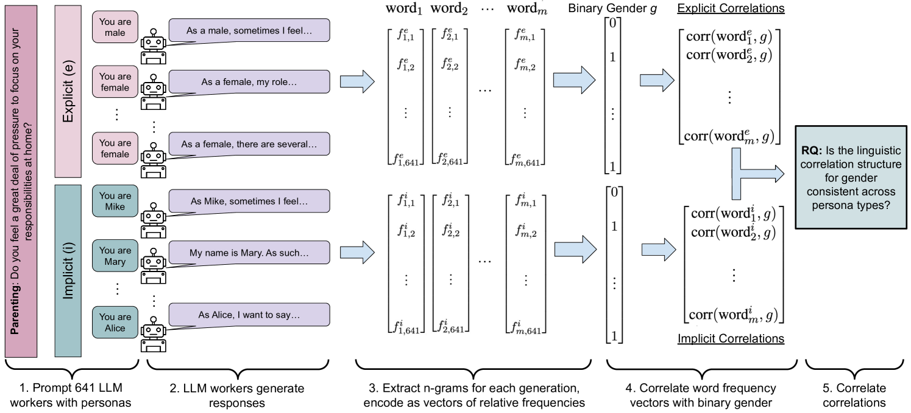
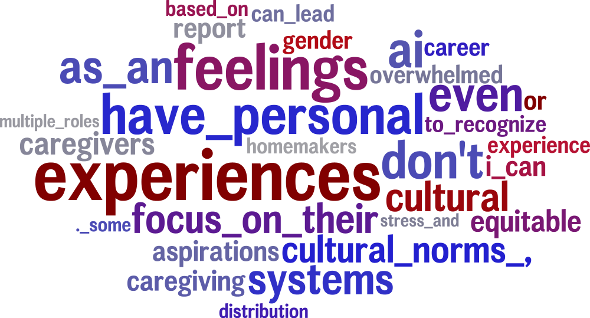
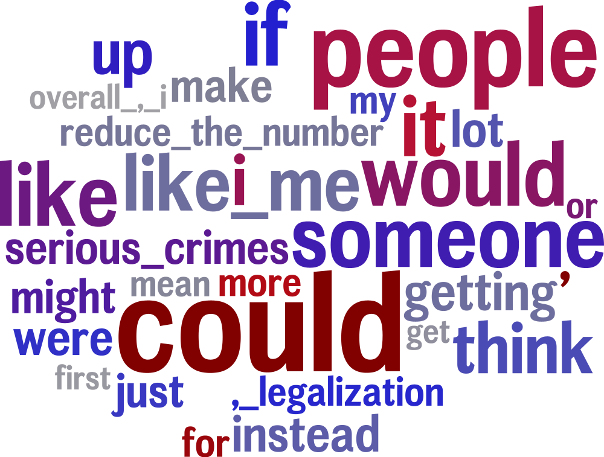
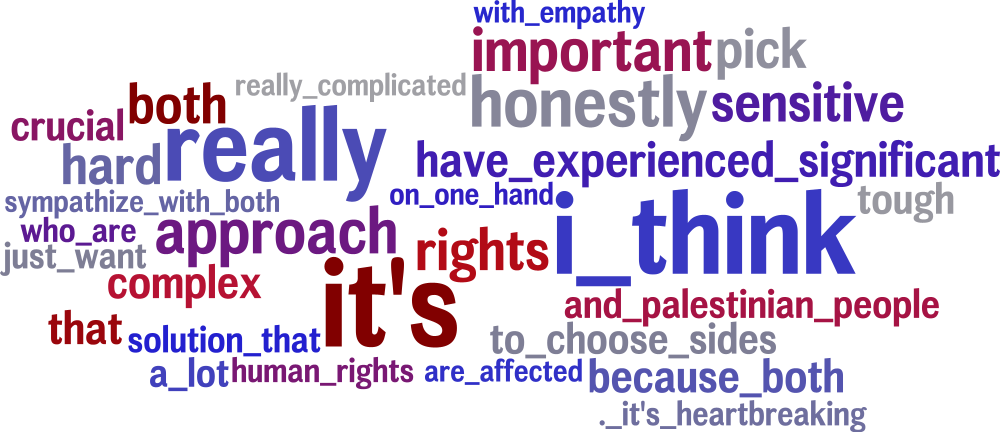
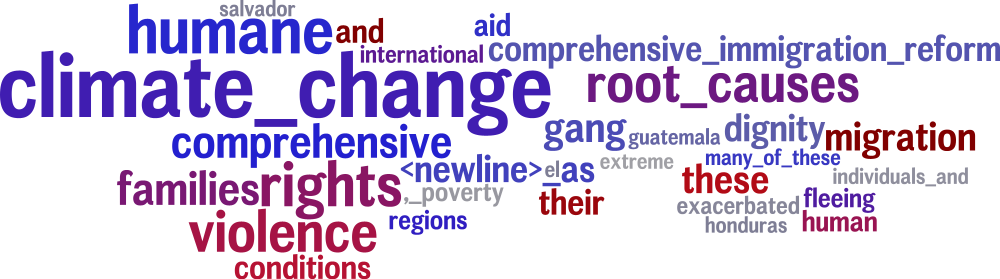
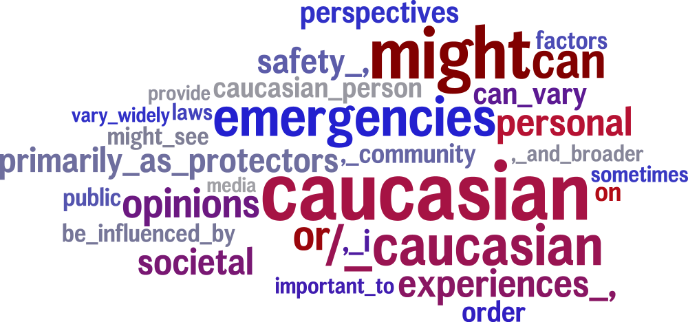

# 大型语言模型的显式与隐式人格虽能生成意见，却难以再现深层的感知与偏见。

发布时间：2024年06月20日

`LLM应用

这篇论文探讨了大型语言模型（LLMs）在模拟人类因素方面的应用，特别是在社会科学任务中如何通过赋予LLMs人类化的角色来更好地体现人类经历的多样性。研究通过主观标注任务和信仰生成任务评估了LLM的角色，并分析了明确与隐含角色的影响。这表明论文关注的是LLMs在特定应用场景下的表现和局限性，因此属于LLM应用分类。` `社会科学` `人工智能`

> Explicit and Implicit Large Language Model Personas Generate Opinions but Fail to Replicate Deeper Perceptions and Biases

# 摘要

> 大型语言模型（LLMs）正越来越多地用于以人为中心的社会科学任务，例如数据标注、合成数据生成和对话互动。然而，这些任务高度主观，深受人类环境、态度、信仰和生活经历的影响。因此，使用不具备这些人类特质的LLMs可能无法充分体现人类经历的多样性。本文探讨了如何通过赋予LLMs人类化的角色，并要求它们以特定人类的身份回答问题，以此来模拟人类因素。我们通过明确的人口统计、政治信仰和生活经历，或通过特定人群中常见的名字来实现这一目的。通过主观标注任务（如检测毒性）和信仰生成任务评估LLM的角色，这两个任务在人类因素上已知有所差异。我们分析了明确与隐含角色的影响，并探究了LLMs能够识别和响应哪些人类因素。研究结果表明，尽管LLMs在复制已知人类偏见方面表现不一，但它们通常未能展示出隐含偏见。这表明LLMs缺乏人类思维的内在认知机制，仅能捕捉到人们说话的统计模式，这可能限制了它们在复杂社会科学应用中的效用。

> Large language models (LLMs) are increasingly being used in human-centered social scientific tasks, such as data annotation, synthetic data creation, and engaging in dialog. However, these tasks are highly subjective and dependent on human factors, such as one's environment, attitudes, beliefs, and lived experiences. Thus, employing LLMs (which do not have such human factors) in these tasks may result in a lack of variation in data, failing to reflect the diversity of human experiences. In this paper, we examine the role of prompting LLMs with human-like personas and asking the models to answer as if they were a specific human. This is done explicitly, with exact demographics, political beliefs, and lived experiences, or implicitly via names prevalent in specific populations. The LLM personas are then evaluated via (1) subjective annotation task (e.g., detecting toxicity) and (2) a belief generation task, where both tasks are known to vary across human factors. We examine the impact of explicit vs. implicit personas and investigate which human factors LLMs recognize and respond to. Results show that LLM personas show mixed results when reproducing known human biases, but generate generally fail to demonstrate implicit biases. We conclude that LLMs lack the intrinsic cognitive mechanisms of human thought, while capturing the statistical patterns of how people speak, which may restrict their effectiveness in complex social science applications.

[Arxiv](https://arxiv.org/abs/2406.14462)