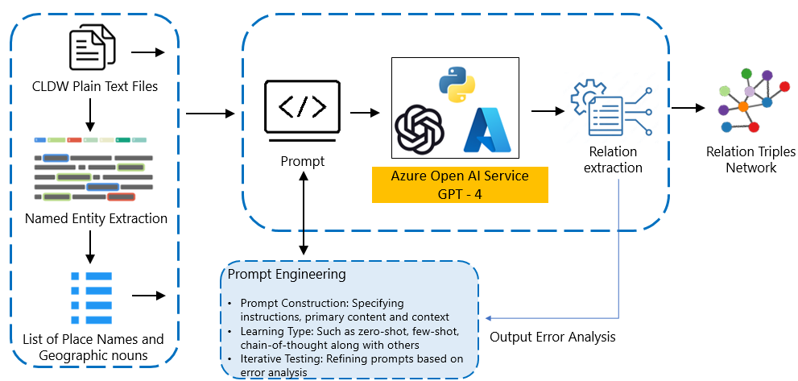
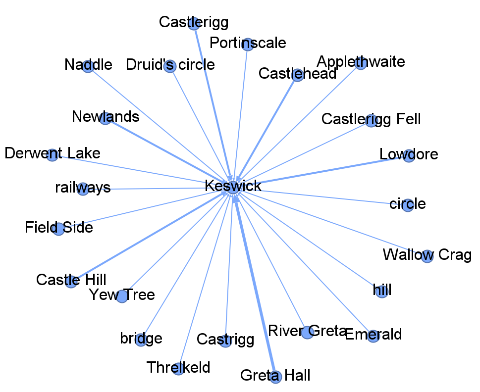

# 借助LLM的关系抽取技术，深入挖掘历史湖区文本中的空间信息

发布时间：2024年06月20日

`LLM应用

这篇论文摘要描述了使用大型语言模型（LLM）来分析和提取文本中的空间关系，特别是在历史叙事中的应用。通过生成预训练转换器模型，研究者能够从文本数据中提取语义三元组，这些三元组描述了实体与位置之间的联系，并通过网络可视化技术展示了这些关系。这种方法不仅加深了对特定地理区域（如英国湖区）空间纹理的理解，还为历史研究中的空间分析提供了新的工具和视角。因此，这项工作属于LLM在特定应用领域的使用，即在历史研究和空间分析中的应用。` `历史研究` `地理信息系统`

> Exploring Spatial Representations in the Historical Lake District Texts with LLM-based Relation Extraction

# 摘要

> 探索历史叙事，揭示过去景观的空间复杂性，是一项挑战。本研究聚焦于英国湖区，借助湖区写作语料库，运用生成预训练转换器模型，从文本中提取空间关系。通过大型语言模型，我们得以全面洞察历史叙事中的空间维度。研究成果以语义三元组展现，细腻描绘了实体与位置间的联系，并通过网络可视化，为空间叙事绘制了一幅生动的图景。这不仅深化了对英国湖区空间纹理的理解，也为揭示多变历史背景下的空间关系开辟了新径。

> Navigating historical narratives poses a challenge in unveiling the spatial intricacies of past landscapes. The proposed work addresses this challenge within the context of the English Lake District, employing the Corpus of the Lake District Writing. The method utilizes a generative pre-trained transformer model to extract spatial relations from the textual descriptions in the corpus. The study applies this large language model to understand the spatial dimensions inherent in historical narratives comprehensively. The outcomes are presented as semantic triples, capturing the nuanced connections between entities and locations, and visualized as a network, offering a graphical representation of the spatial narrative. The study contributes to a deeper comprehension of the English Lake District's spatial tapestry and provides an approach to uncovering spatial relations within diverse historical contexts.

[Arxiv](https://arxiv.org/abs/2406.14336)