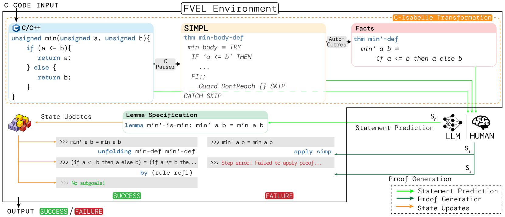
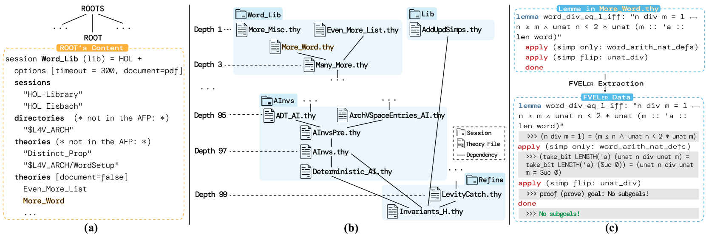
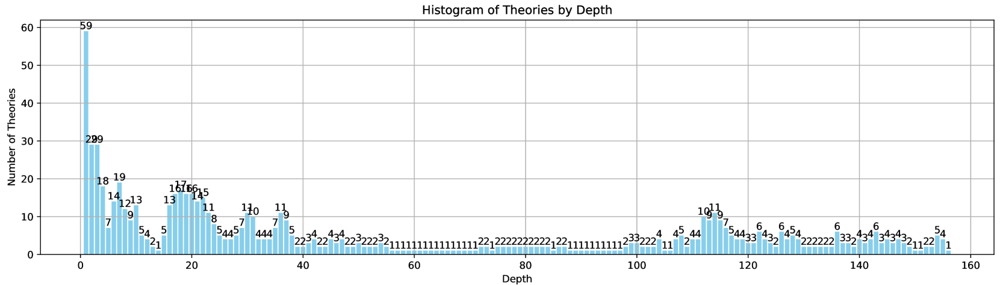
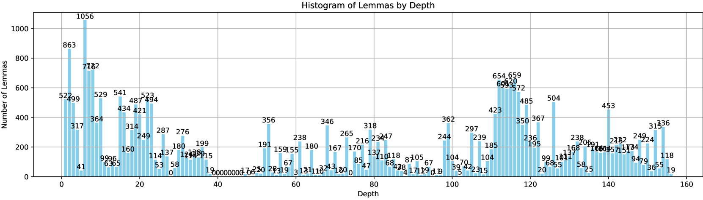
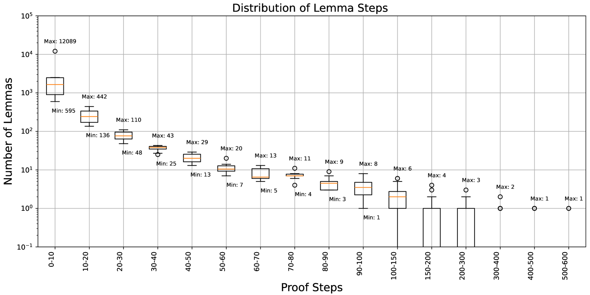

# FVEL：借助定理证明，打造大型语言模型的交互式形式验证环境

发布时间：2024年06月20日

`LLM应用

这篇论文介绍了FVEL，一个与大型语言模型（LLMs）互动的形式验证环境。它通过将待验证代码转换为Isabelle格式，并利用神经网络自动定理证明与LLM进行验证，展示了LLMs在形式验证领域的应用。这种结合利用了Isabelle的严格规则，并便于引入和调整最新的LLMs，从而在程序合成领域提高了形式验证的灵活性和广泛性。因此，这篇论文属于LLM应用分类。` `软件开发` `形式验证`

> FVEL: Interactive Formal Verification Environment with Large Language Models via Theorem Proving

# 摘要

> 随着大型语言模型（LLMs）的进步，形式验证（FV）在程序合成领域的重要性日益凸显。然而，现有的形式验证方法多依赖于符号验证器或手工规则，这在灵活性和广泛性上存在局限。另一方面，如Isabelle这样的形式语言，作为自动定理证明的另一严格验证途径，拥有全面的规则和定理体系。本文介绍了FVEL，一个与LLMs互动的形式验证环境。FVEL将待验证代码转换为Isabelle格式，并利用神经网络自动定理证明与LLM进行验证。这种结合不仅利用了Isabelle的严格规则，还便于引入和调整最新的LLMs。为此，我们创建了FVELER3数据集，包含758个理论、29,125个引理及200,646个证明步骤，详细记录了代码依赖和验证过程。在FVEL环境中，我们首先使用FVELER对LLMs进行微调，然后在Code2Inv和SV-COMP上进行评估。结果表明，经过FVELER微调的Llama3-8B在SV-COMP上解决了17.39%的额外问题，Mistral-7B解决了12%的额外问题，同时减少了证明错误的比例。项目详情请访问：https://fveler.github.io/。

> Formal verification (FV) has witnessed growing significance with current emerging program synthesis by the evolving large language models (LLMs). However, current formal verification mainly resorts to symbolic verifiers or hand-craft rules, resulting in limitations for extensive and flexible verification. On the other hand, formal languages for automated theorem proving, such as Isabelle, as another line of rigorous verification, are maintained with comprehensive rules and theorems. In this paper, we propose FVEL, an interactive Formal Verification Environment with LLMs. Specifically, FVEL transforms a given code to be verified into Isabelle, and then conducts verification via neural automated theorem proving with an LLM. The joined paradigm leverages the rigorous yet abundant formulated and organized rules in Isabelle and is also convenient for introducing and adjusting cutting-edge LLMs. To achieve this goal, we extract a large-scale FVELER3. The FVELER dataset includes code dependencies and verification processes that are formulated in Isabelle, containing 758 theories, 29,125 lemmas, and 200,646 proof steps in total with in-depth dependencies. We benchmark FVELER in the FVEL environment by first fine-tuning LLMs with FVELER and then evaluating them on Code2Inv and SV-COMP. The results show that FVEL with FVELER fine-tuned Llama3- 8B solves 17.39% (69 -> 81) more problems, and Mistral-7B 12% (75 -> 84) more problems in SV-COMP. And the proportion of proof errors is reduced. Project page: https://fveler.github.io/.

[Arxiv](https://arxiv.org/abs/2406.14408)